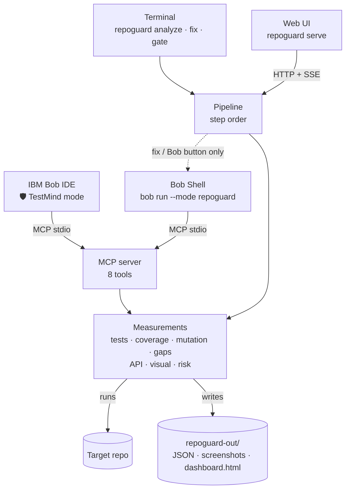
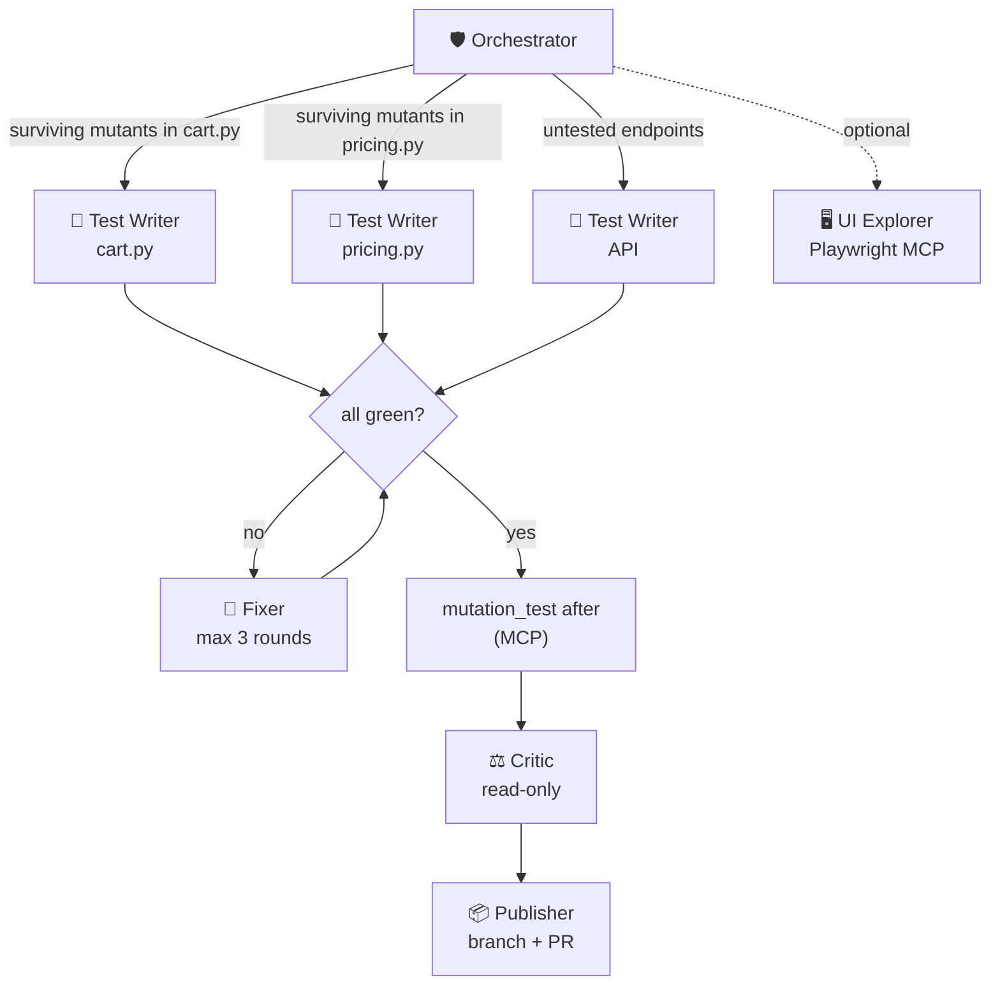

[](https://ibm.com)
[](https://modelcontextprotocol.io/)
[](https://fastapi.tiangolo.com/)

# TestMind AI

**A QA agent swarm for IBM Bob that proves whether your tests catch bugs, then writes the ones that are missing.**

[](https://bob.ibm.com)
[](https://modelcontextprotocol.io/)
[](https://fastapi.tiangolo.com/)

> Coverage tells you which lines ran. It doesn't tell you whether your tests would notice a bug.
> TestMind AI injects bugs into your code on purpose and measures how many your tests catch.

## Results on the bundled demo repo

<picture>
  <source media="(prefers-color-scheme: dark)" srcset="docs/img/results-en-dark.png">
  
</picture>

| demo-repo | Before | After |
|---|---|---|
| Tests | 9 | 66 |
| Line coverage | 74.5% | 100% |
| **Bugs caught (mutation score)** | **23.6%** (17/72) | **94.4%** (68/72) |
| API endpoints with tests | 2 of 8 | 8 of 8 |
| Visual regression | baseline saved | catches a button color change |

The demo's tests covered 74.5% of the lines but caught fewer than 1 in 4 injected bugs.
"After" was measured with the reference tests in [`docs/expected-after-tests/`](docs/expected-after-tests/).

## What it does

- 🧬 **Mutation testing.** Injects one small bug at a time (flipped comparisons, swapped operators, changed constants, `return None`, removed `raise`) with its own AST engine, then reruns your suite. Every mutant that survives is a bug your tests would miss.
- 🧪 **Writes the missing tests.** Inside IBM Bob, an orchestrator hands each file's surviving mutants to parallel Test Writer subagents. A Fixer repairs red tests without touching source code, and a Critic audits tests it didn't write.
- 🌐 **API checks.** Reads the OpenAPI schema of a FastAPI app, flags endpoints no test calls, and smoke-tests every `GET` endpoint for 5xx errors.
- 👁️ **Visual regression.** Starts the app, takes screenshots at desktop (1280 px) and mobile (390 px) widths, and diffs them pixel by pixel against a baseline. Also reports console errors and basic accessibility issues.
- 📊 **Risk ranking and report.** Ranks functions by `complexity × git churn × (1 − detection rate)` and builds an HTML dashboard.

**Design principle:** the AI decides what to test, and deterministic tools do the measuring. No number in the report is estimated by a model.

## How it works

One engine, three ways to use it.



## Is it multi-agent?

**Yes, when it runs in Bob.** The orchestrator splits the work across specialized subagents, and the ones that write tests run in parallel. Measurement never uses AI.



| Entry point | Multi-agent? | Agents |
|---|---|---|
| Bob IDE, 🛡️ TestMind mode | Yes | Orchestrator + parallel Test Writers + Fixer + Critic + Publisher + UI Explorer (optional) |
| `repoguard fix` / "Improve with Bob" button | Yes | The same team, launched through Bob Shell |
| `repoguard analyze` / "Measure" button | No | Deterministic pipeline (mutants run in 4 parallel processes) |
| `repoguard gate` (CI) | No | Deterministic pipeline |

| Agent | Role | Can edit |
|---|---|---|
| 🛡️ Orchestrator | Runs the pipeline, prioritizes by risk, writes the final report | What it needs |
| 🧪 Test Writer | Writes tests that kill specific mutants | `tests/` only |
| 🔧 Fixer | Repairs failing tests, never source code | `tests/` only |
| ⚖️ Critic | Audits tests it didn't write | Nothing (read-only) |
| 📦 Publisher | Branch, commit and pull request | Git |
| 🖥️ UI Explorer | E2E tests with Playwright MCP (optional) | `tests/` only |

## Quick start

```bash
pip install -e .                    # installs the `repoguard` command
playwright install chromium         # only needed for visual checks

repoguard analyze ./demo-repo       # measure: tests, coverage, mutation, API, visual
repoguard serve                     # web UI at http://127.0.0.1:8765
```

## Commands

| Command | What it does |
|---|---|
| `repoguard analyze <path \| git-url>` | Measures tests, coverage, mutation score, API and visual. No AI. |
| `repoguard fix <path \| git-url>` | Measures, has Bob write the missing tests through Bob Shell, then measures again |
| `repoguard gate <path> --min-score 80` | CI gate: exits with code 1 if the mutation score is below the minimum |
| `repoguard serve [--port 8765]` | Web UI with live progress, metrics and the report |
| `repoguard mcp` | Starts the MCP server that Bob uses |

`analyze` and `fix` accept `--no-api` and `--no-visual`.

## Using it in IBM Bob

1. Open this folder in Bob. `.bob/mcp.json` already points to `repoguard mcp`.
2. In **Settings → Modes**, check that the six modes load.
3. Pick **🛡️ TestMind** and ask: `Audit and improve the tests in ./demo-repo.`

The Bob setup lives in `.bob/`: custom modes (`custom_modes.yaml`), rules (tests only, measure don't guess, assert quality, token budget) and skills (`pytest-conventions`, `mutation-hunting`).

## Requirements

| Dependency | Used for | Required |
|---|---|---|
| Python ≥ 3.10, pytest, coverage | Running and measuring the suite | Yes |
| mcp | MCP server for Bob | For Bob |
| fastapi, uvicorn, httpx | Web UI and API checks | For UI and API |
| playwright + Chromium, pillow | Screenshots and visual diffs | For visual checks |
| git | Churn for the risk score; cloning by URL | Recommended |
| IBM Bob IDE / Bob Shell 2.x | Writing tests with agents | For `fix` and the Bob mode |

The mutation engine is built on Python's standard `ast` module. It doesn't depend on mutmut or Stryker.

## Project structure

```
ibm-bob-mcp-agent-guard/
├── .bob/                           Bob IDE configuration
│   ├── custom_modes.yaml           Six agent mode definitions (Orchestrator, Analyzer, Fixer, Gate, Visual, Reporter)
│   ├── mcp.json                    MCP server config — points Bob to `repoguard mcp`
│   ├── rules/
│   │   ├── 01-tests-only.md        Fixer may only write files under tests/
│   │   ├── 02-measure-dont-guess.md  Always measure before proposing a fix
│   │   └── 03-test-quality.md      Mutation-resistant assertion standards
│   └── skills/
│       ├── mutation-hunting/SKILL.md   Patterns for killing surviving mutants
│       └── pytest-conventions/SKILL.md Fixture, parametrize, and conftest conventions
│
├── repoguard_engine/               Core library + all entry points
│   ├── __init__.py
│   ├── core.py                     Coverage measurement, gap detection, mutation testing, risk score, dashboard
│   ├── api_check.py                FastAPI endpoint discovery (AST) + HTTP smoke tests
│   ├── visual.py                   Playwright screenshots, pixel diff, console logs, axe-core a11y
│   ├── pipeline.py                 Ordered pipeline: measure → gaps → risk → gate
│   ├── cli.py                      CLI entry point: analyze | fix | gate | serve | mcp
│   ├── mcp_server.py               8 MCP tools via FastMCP (stdio transport)
│   └── web/
│       ├── __init__.py
│       ├── server.py               FastAPI app — REST + SSE stream
│       └── static/index.html       Web dashboard UI
│
├── demo-repo/                      Fixture: intentionally under-tested e-commerce shop
│   ├── pytest.ini
│   ├── shop/
│   │   ├── __init__.py
│   │   ├── api.py                  FastAPI routes (8 endpoints)
│   │   ├── cart.py                 Cart logic
│   │   ├── inventory.py            Inventory management
│   │   └── pricing.py              Pricing and discount rules
│   ├── tests/
│   │   ├── __init__.py
│   │   ├── test_api.py             Weak baseline API tests
│   │   ├── test_cart.py            Weak baseline cart tests
│   │   └── test_pricing.py         Weak baseline pricing tests
│   └── web/index.html              Simple shop UI (for visual checks)
│
├── docs/
│   ├── ARCHITECTURE.md             Layer diagram, data flow, MCP tool list
│   ├── DEMO.md                     3-minute demo script
│   ├── BUILD_WITH_BOB.md           Phase-by-phase prompts used to build this project with Bob
│   ├── make_results_chart.py       Generates the before/after results chart
│   ├── expected-after-tests/       Reference tests (copy here to verify "after" numbers)
│   └── img/                        README badge images
│
├── bob-evidence/                   Exported Bob task session reports
│   └── README.md
│
├── AGENTS.md                       Agent context and coding rules for Bob
├── RUNBOOK.md                      Operational runbook (install, run, troubleshoot)
├── README.md                       This file
├── pyproject.toml                  Package metadata and dependencies
├── .gitignore
└── .bobignore
```

## Documentation

- [Architecture](docs/ARCHITECTURE.md): diagrams, the sequence of a run, MCP tools and the data contract
- [Demo script](docs/DEMO.md): 3-minute pitch and backup plan
- [Building with Bob](docs/BUILD_WITH_BOB.md): phase-by-phase prompts for building the project with Bob
- [Bob usage evidence](bob-evidence/README.md)

## Limitations

- Python + pytest only. API checks support FastAPI only.
- Equivalent mutants (changes with no observable effect) are reported, not filtered out automatically.
- The accessibility check is basic. Use axe-core for a full audit.
- `repoguard fix` and the Bob button in the web UI need Bob Shell (`bob run`). Without it, use the Bob IDE.