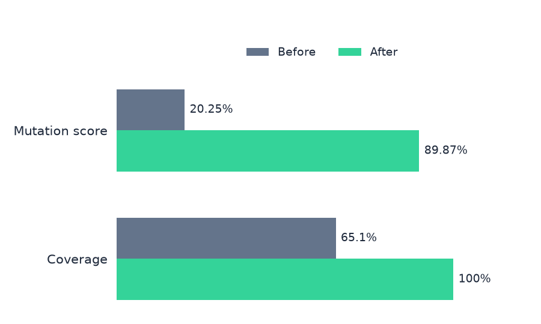
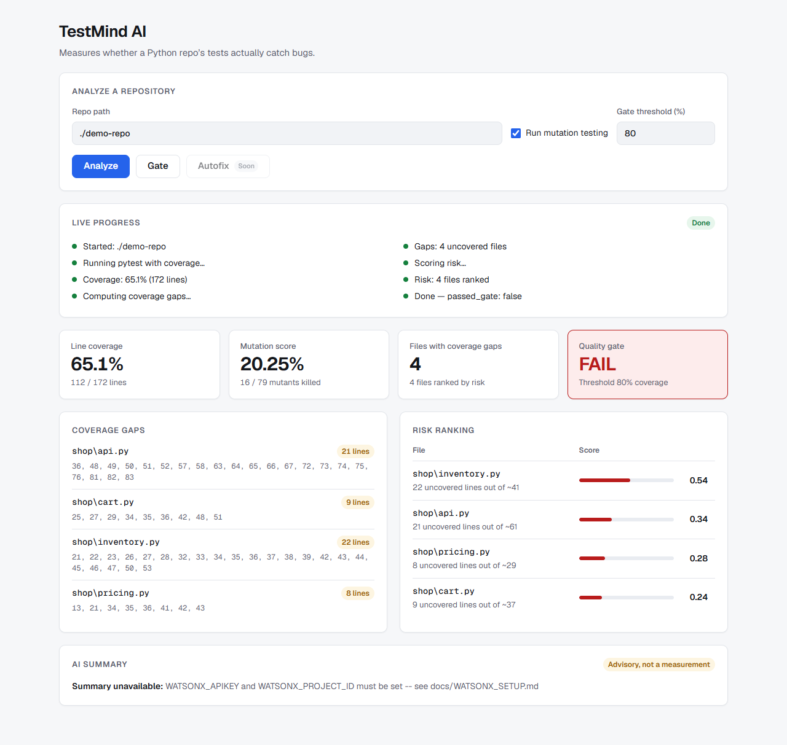
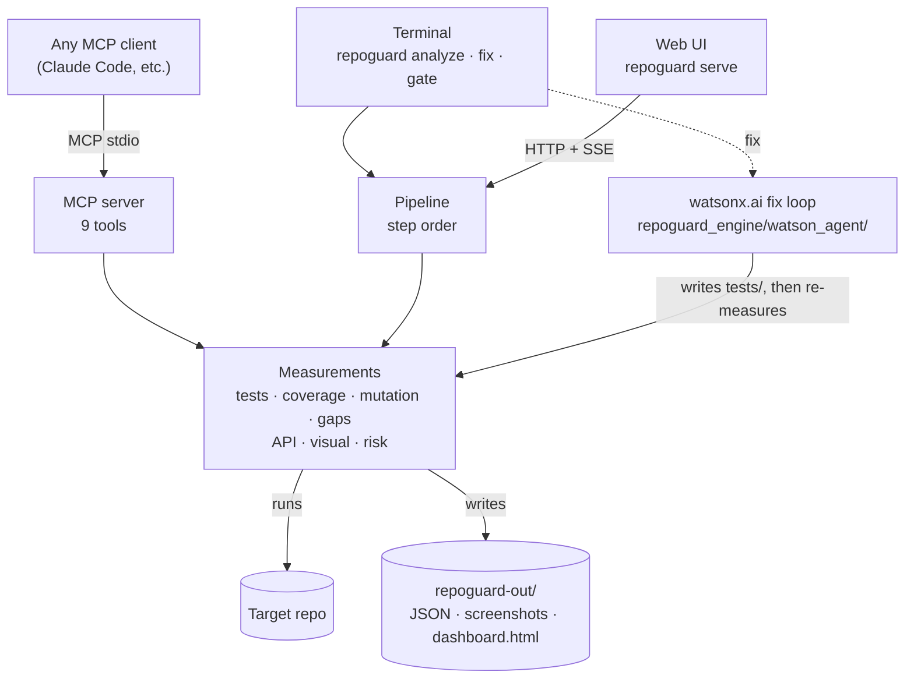
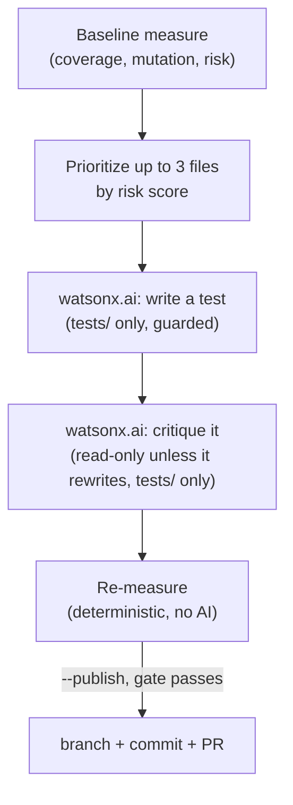
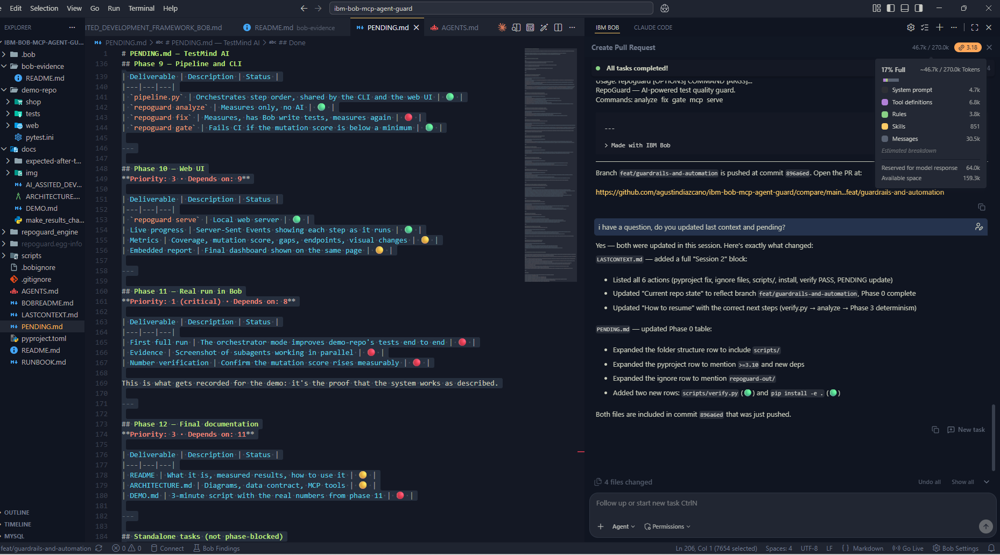
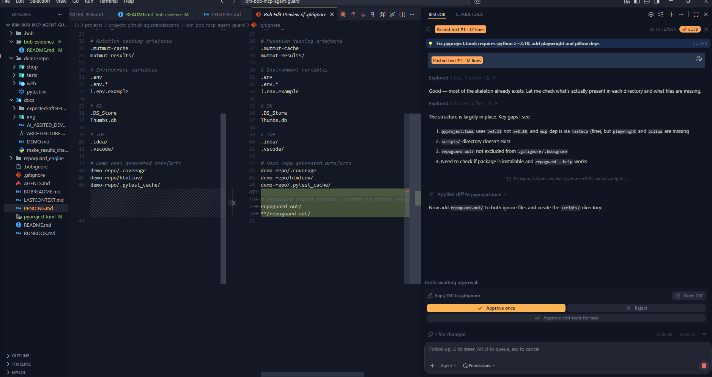
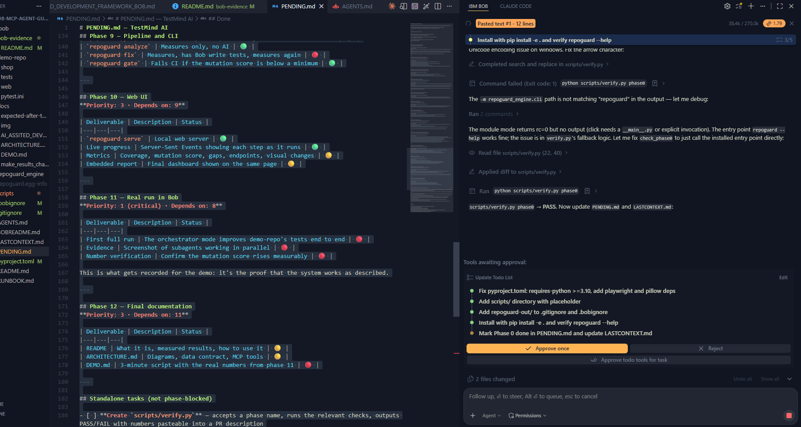
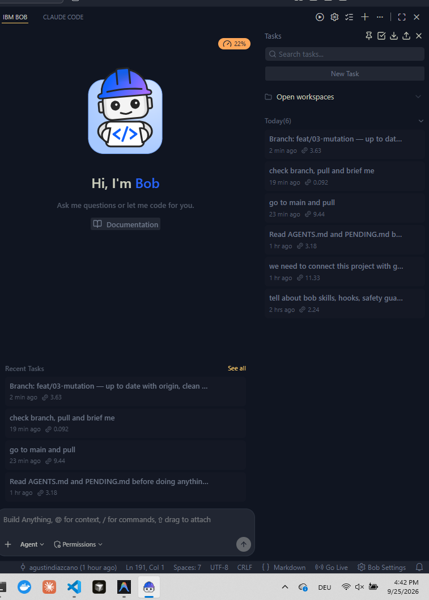
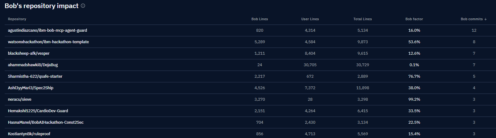

# TestMind AI

**A test-quality tool that proves whether your tests catch bugs, then runs two IBM watsonx.ai agents (a test writer and a critic) to write the ones that are missing. Its measurement engine is also an MCP server, so any MCP-capable AI agent can drive it.**

> Coverage tells you which lines ran. It doesn't tell you whether your tests would notice a bug.
> TestMind AI injects bugs into your code on purpose and measures how many your tests catch.

[](https://www.ibm.com/watsonx)
[](https://modelcontextprotocol.io/)
[](https://fastapi.tiangolo.com/)

# Built with Bob IDE (bobalytics, updated 09/25/2026)
Bob's repository impact for this repo specifically:

| Repository | Bob lines | User lines | Total lines | Bob factor | Bob commits |
|---|---|---|---|---|---|
| `agustindiazcano/ibm-bob-mcp-agent-guard` | 820 | 4,314 | 5,134 | 16.0% | 12 |

IBM Bob Hackaton Ranking (Bob IDE ussage):

| Metric | Value | Ranking |
|---|---|---|
| Bob commits | 12 | 1st |
| Bob lines | 820 | 14th |
| Bob factor | 16.0% | 21st |

## Table of Contents

- [Results on the bundled demo repo](#results-on-the-bundled-demo-repo)
- [What it does](#what-it-does)
- [How it works](#how-it-works)
- [Is it multi-agent?](#is-it-multi-agent)
- [Multi-agent swarm (planned)](#multi-agent-swarm-planned)
- [Quick start](#quick-start)
- [Commands](#commands)
- [Using the watsonx.ai fix loop](#using-the-watsonxai-fix-loop)
- [Requirements](#requirements)
- [Tech stack](#tech-stack)
- [Project structure](#project-structure)
- [CI/CD](#cicd)
- [Deploy to Google Cloud](#deploy-to-google-cloud)
- [Database (planned)](#database-planned)
- [Infrastructure as code (planned)](#infrastructure-as-code-planned)
- [IBM Bob Usage](#ibm-bob-usage)
- [AI-Assisted Development](#ai-assisted-development)
- [Documentation](#documentation)
- [Roadmap](#roadmap)
- [Limitations](#limitations)

## Results on the bundled demo repo

<picture>
  <source media="(prefers-color-scheme: dark)" srcset="docs/img/results-en-dark.png">
  
</picture>

| demo-repo | Before | After |
|---|---|---|
| Tests | 5 | 71 |
| Line coverage | 65.1% | 100% |
| **Bugs caught (mutation score)** | **20.25%** (16/79) | **89.87%** (71/79) |
| API endpoints with tests | 1 of 7 | 7 of 7 |
| Visual regression | baseline saved | catches a button color change |

The demo's tests covered 65.1% of the lines but caught roughly 1 in 5 injected bugs;
the reference tests in [`docs/expected-after-tests/`](docs/expected-after-tests/) catch
9 in 10. Both measured with RepoGuard's own AST mutation engine (see `AGENTS.md §7`);
the earlier figures on this page came from an interim `mutmut`-based engine and are
superseded. The 8 mutants still surviving after "After" are equivalent mutants, not
gaps: an `is_member` field `api.py` never reads, and `round(x, 2)` precision changes
that don't affect the tested inputs — see `AGENTS.md §9`.

### The same "Before" run in the dashboard

<picture>
  <source media="(prefers-color-scheme: dark)" srcset="docs/img/dashboard-dark.png">
  
</picture>

A real capture of the [`web-next/`](web-next/) dashboard (deployed at
https://ibm-bob-mcp-agent-guard.vercel.app/) running against a local
`repoguard serve` — every number on it comes straight from the engine. The AI
summary panel shows "unavailable" because no AI credentials were configured
for the capture; that's its normal state without them. How to retake it:
[`docs/img/README.md`](docs/img/README.md).

## What it does

- 🧬 **Mutation testing.** Injects one small bug at a time (flipped comparisons, swapped operators, changed constants, `return None`, removed `raise`) with its own AST engine, then reruns your suite. Every mutant that survives is a bug your tests would miss.
- 🧪 **Writes the missing tests.** `repoguard fix` hands each file's surviving mutants to IBM watsonx.ai, one file at a time, through a guarded tool that can only write under `tests/` — never source. A second watsonx.ai call critiques the new test before the suite is re-measured for real.
- 🌐 **API checks.** Finds a FastAPI app's routes by parsing its source (AST), flags endpoints no test calls, and smoke-tests `GET` endpoints for 5xx errors.
- 👁️ **Visual regression.** Takes a screenshot of a running page (Playwright/Chromium, any viewport, 1280×720 by default) and diffs it pixel by pixel against a baseline. Also reports console errors and basic accessibility issues. Available as MCP tools, not yet as a CLI command.
- 📊 **Risk ranking and report.** Ranks files by the share of their lines left uncovered (`uncovered lines / non-blank lines`) and builds an HTML dashboard. Extra terms such as git churn are planned only if stored run history shows they predict surviving mutants better — see [`docs/DATA_PLATFORM.md` §5](docs/DATA_PLATFORM.md#5-risk-model-v2--calibrated-not-invented).

**Design principle:** the AI decides what to test, and deterministic tools do the measuring. No number in the report is estimated by a model.

## How it works

One engine, three ways to use it.



## Is it multi-agent?

**Yes: two agents working in sequence. It is not a parallel swarm.** `repoguard fix` runs an orchestrator that, for each of up to 3 files prioritized by risk, runs two agents one after the other:

- **Test writer agent:** its own system prompt, and a tool-calling loop over `read_source_file` and `write_test_file`. The write tool is hard-guarded to `tests/`.
- **Critic agent:** a separate system prompt, with the same guarded tools, reviewing what the writer produced.

After both, the orchestrator re-measures deterministically. Both agents use the same configured AI provider (watsonx.ai by default, or Google Vertex AI), and measurement itself never uses AI.

The engine is also exposed through **MCP** (9 tools), so external agents such as Claude Code or any other MCP client can call the same measurements. The fix loop itself calls the engine directly rather than through MCP.

**What it is not (yet):**
- **Not a parallel swarm yet.** A parallel multi-agent design for IBM Bob exists in `.bob/`, but it was retired before its first full run (`.bob/DEPRECATED.md`). Its return, rebuilt on watsonx.ai, is planned: see [Multi-agent swarm (planned)](#multi-agent-swarm-planned).
- **Multicloud, for real.** The `ChatProvider` abstraction (`repoguard_engine/ai_providers/`) is implemented; both watsonx.ai and Google Vertex AI (Gemini) run through it, `REPOGUARD_AI_PROVIDER`/`--provider` select which — see [`docs/MULTICLOUD_AI.md`](docs/MULTICLOUD_AI.md) (`PENDING.md` Phase 16).



| Entry point | Uses AI? | What runs |
|---|---|---|
| `repoguard fix` | Yes | The watsonx.ai loop above (write → critique → re-measure) |
| `repoguard analyze [--summarize]` | Only with `--summarize` | Deterministic pipeline; `--summarize` adds one watsonx.ai call for prose, never a metric |
| `repoguard gate` (CI) | No | Deterministic pipeline |

## Multi-agent swarm (planned)

> Design only (`PENDING.md` Phase 18). Full plan: [`docs/MULTI_AGENT_SWARM.md`](docs/MULTI_AGENT_SWARM.md).

The swarm IBM Bob was designed to run (`.bob/custom_modes.yaml`: Orchestrator, Test Writer, Critic, Gate, Publisher…), rebuilt in-process on watsonx.ai. Instead of one loop working file by file, the Orchestrator opens **one lane per source file** and runs the lanes **in parallel**. Each lane has three agents:

- **Test Writer (LLM):** writes tests aimed at that file's surviving mutants, in its own sandbox copy of the repo. It can only write its own test file.
- **Verifier (deterministic):** runs mutation testing on that file and reports which mutants the new tests killed.
- **Critic (LLM, read-only):** reviews the tests and returns APPROVED or NEEDS_WORK. NEEDS_WORK triggers one revision round.

After all lanes finish, their files are merged, and the **Gate** re-measures the whole repo once. That number is the only one reported. The **Publisher** opens a PR if the score improved. Agents talk through files in `repoguard-out/swarm/<run_id>/`, like Bob's subagents did, so every run is auditable. Mutation testing itself also runs in parallel.

The swarm has to earn its place with two measurements: it must be faster than the sequential loop, and reach at least the same final mutation score. Until then, `repoguard fix` keeps the sequential loop as its default, and the swarm runs behind `--swarm`.

| Doc section | What it covers |
|---|---|
| [§2](docs/MULTI_AGENT_SWARM.md#2-bob-then-today-target) | Bob's modes mapped one by one to the new agents |
| [§3](docs/MULTI_AGENT_SWARM.md#3-problems-in-todays-loop-the-swarm-must-fix) | Six problems in today's loop the swarm fixes |
| [§5](docs/MULTI_AGENT_SWARM.md#5-parallelism) | Two levels of parallelism, and per-lane isolation |
| [§6](docs/MULTI_AGENT_SWARM.md#6-communication-contract-the-blackboard) | The file contract between agents |
| [§10](docs/MULTI_AGENT_SWARM.md#10-build-order) | Build order and cut line |
| [§11](docs/MULTI_AGENT_SWARM.md#11-verification-scriptsverifypy-phase18) | Verification, including a credential-free end-to-end test |

## Quick start

```bash
pip install -e .                    # installs the `repoguard` command
playwright install chromium         # only needed for visual checks

repoguard analyze ./demo-repo --mutation   # coverage, gaps, risk + mutation score (slow)
repoguard serve                     # web UI at http://127.0.0.1:8765
```

## Commands

| Command | What it does |
|---|---|
| `repoguard analyze <path> [--mutation] [--endpoints] [--summarize]` | Runs the tests and measures coverage, gaps and risk. `--mutation` adds the mutation score (slow), and `--endpoints` flags untested FastAPI endpoints. No AI unless `--summarize` is passed. Visual checks are MCP tools only. |
| `repoguard fix <path> [--publish] [--threshold N]` | Measures, has watsonx.ai write the missing tests (guarded to `tests/`), critiques them, measures again |
| `repoguard gate <path> --threshold 80` | CI gate: exits with code 1 if coverage is below the threshold |
| `repoguard serve [--port 8000]` | Web UI with live progress, metrics and the report |
| `repoguard mcp` | Starts the MCP server (9 tools) for any MCP client |

## Using the AI fix loop

TestMind AI is multicloud: the fix loop and the advisory summary run against
whichever provider `REPOGUARD_AI_PROVIDER` selects (`watsonx`, the default,
or `vertex`), or per call via `--provider` — see
[`docs/MULTICLOUD_AI.md`](docs/MULTICLOUD_AI.md). Both are built and
live-verified; for Vertex AI, install `pip install -e ".[vertex]"` and see
[`docs/VERTEX_SETUP.md`](docs/VERTEX_SETUP.md) instead of step 1 below.

1. Get IBM Cloud credentials and install the optional extra — see [`docs/WATSONX_SETUP.md`](docs/WATSONX_SETUP.md):
   ```bash
   pip install -e ".[ai]"
   export WATSONX_APIKEY="<your IBM Cloud API key>"
   export WATSONX_PROJECT_ID="<your watsonx project id>"
   ```
2. Run it:
   ```bash
   repoguard fix demo-repo
   repoguard fix demo-repo --provider watsonx   # equivalent, explicit
   ```
3. Without credentials, `fix` fails immediately with a clear error — it never
   silently skips the AI stages or fabricates a result.

`repoguard_engine/ai_providers/` holds the provider abstraction
(`base.py`'s `ChatProvider` protocol, `watsonx.py` and `vertex.py`
implementations) behind `get_provider()`.
`repoguard_engine/watson_agent/` is the rest of the fix loop: `tools.py` (the
one write tool, hard-guarded to `tests/`), `prompts.py` (the writer/critic
system prompts), and `orchestrator.py` (the loop itself, provider-agnostic).
It calls `pipeline`/`core` directly, the same way `web/server.py` does — no
MCP round-trip needed for its own use.

## Requirements

| Dependency | Used for | Required |
|---|---|---|
| Python ≥ 3.10, pytest, coverage | Running and measuring the suite | Yes |
| fastmcp | MCP server for external MCP clients | For `repoguard mcp` |
| fastapi, uvicorn, httpx | Web UI and API checks | For UI and API |
| playwright + Chromium, pillow, axe-playwright-python | Screenshots, visual diffs and accessibility | For visual checks |
| git | `repoguard fix` creates a branch, commits and pushes the new tests | For `repoguard fix` |
| `ibm-watsonx-ai` (`pip install -e ".[ai]"`) + IBM Cloud credentials | Writing tests (`repoguard fix`) and the optional `--summarize` prose | For AI features only — measurement never needs it |

The mutation engine is built on Python's standard `ast` module. It doesn't depend on mutmut or Stryker.

## Tech stack

Status key: ✅ implemented and running in this repo · ⚠️ implemented but not verified end to end · 🗺️ planned (design doc only, no code yet)

| Area | Technology | Used for | Status |
|---|---|---|---|
| Language | Python ≥ 3.10 | Engine, CLI, API, MCP server | ✅ |
| Test execution | pytest, pytest-cov | Running the target repo's suite | ✅ |
| Coverage | coverage.py | Line coverage per file | ✅ |
| Mutation testing | Python stdlib `ast` (own engine, 6 operators) | Injecting bugs, mutation score (16/79 on demo-repo, deterministic) | ✅ |
| CLI | Click, Rich | `repoguard analyze · fix · gate · serve · mcp` | ✅ |
| Web API | FastAPI 0.141.1, Starlette 1.7.0 (pinned together), Uvicorn | `repoguard serve`: `/api/analyze`, `/api/summary` | ✅ |
| Live progress | Server-Sent Events (`StreamingResponse` → browser `EventSource`) | `/api/stream` step-by-step progress | ✅ |
| API checks | stdlib `ast` + httpx | Finding FastAPI routes, flagging untested ones, `GET` smoke tests | ✅ |
| Visual checks | Playwright (Chromium), Pillow | Screenshots and pixel diff (MCP tools) | ✅ locally · not in the Docker image (no Chromium) |
| Accessibility | axe-playwright-python (axe-core) | Accessibility violations (MCP tool) | ✅ locally · not in the Docker image |
| Agent protocol | MCP via FastMCP (stdio) | 9 tools for any MCP client | ✅ |
| AI agents | IBM watsonx.ai (`ibm-watsonx-ai`), default model `mistralai/mistral-small-3-1-24b-instruct-2503` | Writer and critic agents with tool calling (`repoguard fix`), `--summarize` prose | ✅ live-verified with real credentials — `--summarize` returns real generated text; `repoguard fix`'s tool-calling round trip runs for real, though this default model doesn't reliably invoke tools (a model-choice quality gap, not an SDK/plumbing issue — see `PENDING.md` Phase 16) |
| Multi-agent swarm | Parallel agent lanes (`ThreadPoolExecutor`), per-lane sandboxes, file-based agent contract | Parallel Test Writer / Verifier / Critic per file, parallel mutation workers | 🗺️ Phase 18 ([design](docs/MULTI_AGENT_SWARM.md)) |
| AI provider abstraction | `ChatProvider` protocol (`repoguard_engine/ai_providers/`) | Switching between providers without touching the agents (`REPOGUARD_AI_PROVIDER` / `--provider`) | ✅ Phase 16 Stage A ([details](docs/MULTICLOUD_AI.md)) |
| AI (second provider) | Google Vertex AI (`google-genai`, Gemini) | Alternative model provider — no free-tier rate limits, unlike watsonx.ai's shared pool | ✅ live-verified: real text generation and a full tool-calling round trip against a real GCP project ([details](docs/VERTEX_SETUP.md)) |
| Frontend | Next.js 16.3.6, React 19.2.8, TypeScript 5, ESLint 9 | `web-next/` dashboard | ✅ (lint + build pass; end-to-end checked in a browser locally) |
| Legacy UI | Static HTML served by FastAPI | `repoguard serve` dashboard | ✅ |
| Charts (docs) | matplotlib (`[docs]` extra) | README before/after image | ✅ |
| Charts (dashboard) | Recharts | Trend, survival-by-operator and fix-effect charts | 🗺️ Phase 17 ([design](docs/DATA_PLATFORM.md#6-charts-web-next-dashboard)) |
| Container | Docker (`python:3.11-slim`) | Single image for Cloud Run | ⚠️ Dockerfile written; the served command was tested directly, the image build hasn't run yet |
| CI | GitHub Actions: `ci.yml`, `frontend-ci.yml` | Verify checks, tests, coverage gate, mutation determinism, frontend lint/build | ✅ green on `main` |
| CD | GitHub Actions: `cd.yml` | Build → Artifact Registry → Cloud Run | ⚠️ fails at the Google auth step on every push to `main` until the one-time GCP setup is done ([`docs/DEPLOY.md`](docs/DEPLOY.md)) |
| Cloud (backend) | Google Cloud Run, Artifact Registry | Hosting the API + dashboard | ⚠️ not deployed yet (human GCP setup pending) |
| Cloud (frontend) | Vercel | Hosting `web-next/` | ✅ deployed: https://ibm-bob-mcp-agent-guard.vercel.app/ — `NEXT_PUBLIC_REPOGUARD_API_BASE` still points at `localhost:8000` until the backend (row above) is deployed |
| Database | PostgreSQL 16 on Cloud SQL; SQLite locally | Run history per commit | 🗺️ Phase 17 ([design](docs/DATA_PLATFORM.md#4-database-design)) |
| Data access | SQLAlchemy 2 (Core), psycopg 3 | One code path for SQLite and Postgres | 🗺️ Phase 17 |
| Infrastructure as code | Terraform (google, random providers), GCS remote state | Provisioning GCP | 🗺️ Phase 17 ([design](docs/DATA_PLATFORM.md#8-infrastructure-as-code-terraform)) |
| Secrets | Google Secret Manager | Database password | 🗺️ Phase 17 |
| CD authentication | Workload Identity Federation (GitHub OIDC) | Replacing the JSON service-account key | 🗺️ Phase 17 |
| User accounts | Google Identity Platform | Optional sign-in for the dashboard | 🗺️ Phase 17, below the cut line |
| Version control | git | `repoguard fix --publish`: branch, commit, push | ✅ |
| Diagrams | Mermaid | Architecture and ER diagrams in the docs | ✅ |
| Built with | IBM Bob IDE | Authored Phases 0–8 ([evidence](docs/IBM_BOB_USAGE.md)) | ✅ (retired afterwards) |
| Built with | Claude Code | Authored Phase 13 onward | ✅ |

## Project structure

```
ibm-bob-mcp-agent-guard/
├── .bob/                           Where IBM Bob built Phases 0–8 (docs/IBM_BOB_USAGE.md); config kept for history
├── .github/workflows/
│   ├── ci.yml                      Backend CI: verify.py checks, demo-repo tests, coverage gate, mutation determinism
│   ├── frontend-ci.yml             web-next/ lint + build (path-filtered)
│   └── cd.yml                      Build image → Artifact Registry → deploy to Cloud Run on push to main
├── Dockerfile                      Single image: `repoguard serve` + bundled demo-repo/
│
├── repoguard_engine/               Core library + all entry points
│   ├── __init__.py
│   ├── core.py                     Coverage measurement, gap detection, mutation testing, risk score, dashboard
│   ├── api_check.py                FastAPI endpoint discovery (AST) + HTTP smoke tests
│   ├── visual.py                   Playwright screenshots, pixel diff, console logs, axe-core a11y
│   ├── narrative.py                AI prose summary of an already-measured dashboard (never a metric source)
│   ├── ai_providers/               ChatProvider abstraction: base.py, watsonx.py, vertex.py
│   ├── watson_agent/               AI fix loop: guarded tools, prompts, orchestrator
│   ├── pipeline.py                 Ordered pipeline: measure → gaps → risk → gate
│   ├── cli.py                      CLI entry point: analyze | fix | gate | serve | mcp
│   ├── mcp_server.py               9 MCP tools via FastMCP (stdio transport)
│   └── web/
│       ├── __init__.py
│       ├── server.py               FastAPI app — REST + SSE stream
│       └── static/index.html       Web dashboard UI
│
├── demo-repo/                      Fixture: intentionally under-tested e-commerce shop
│   ├── pytest.ini
│   ├── shop/
│   │   ├── __init__.py
│   │   ├── api.py                  FastAPI routes (7 endpoints)
│   │   ├── cart.py                 Cart logic
│   │   ├── inventory.py            Inventory management
│   │   └── pricing.py              Pricing and discount rules
│   ├── tests/
│   │   ├── __init__.py
│   │   ├── test_api.py             Weak baseline API tests
│   │   ├── test_cart.py            Weak baseline cart tests
│   │   └── test_pricing.py         Weak baseline pricing tests
│   └── web/index.html              Simple shop UI (for visual checks)
│
├── docs/
│   ├── ARCHITECTURE.md             Layer diagram, data flow, MCP tool list
│   ├── DEMO.md                     3-minute demo script
│   ├── DEPLOY.md                   One-time GCP setup for the Cloud Run deploy
│   ├── DATA_PLATFORM.md            Design (Phase 17): run history on Postgres, Terraform, data-driven charts
│   ├── WATSONX_SETUP.md            Getting IBM Cloud credentials for narrative.py / watson_agent
│   ├── AI_ASSISTED_DEVELOPMENT_FRAMEWORK.md  How this project itself is built (Claude, file-based contract)
│   ├── make_results_chart.py       Generates the before/after results chart
│   ├── expected-after-tests/       Reference tests (copy here to verify "after" numbers)
│   └── img/                        README badge images
│
├── bob-evidence/                   Template for exporting IBM Bob session reports (never populated — see docs/IBM_BOB_USAGE.md
│                                    for the real evidence instead); repoguard fix now writes its own run report to
│                                    <target-repo>/watson-evidence/, same convention as repoguard-out/ (AGENTS.md §4)
│
├── AGENTS.md                       Agent context and coding rules (kept byte-identical to CLAUDE.md)
├── RUNBOOK.md                      Operational runbook (install, run, troubleshoot)
├── README.md                       This file
├── pyproject.toml                  Package metadata and dependencies
├── .gitignore
└── .bobignore
```

## CI/CD

Three GitHub Actions workflows, split so a frontend-only change never
triggers the Python/mutation pipeline or a Cloud Run deploy:

| Workflow | Trigger | What it runs |
|---|---|---|
| [`ci.yml`](.github/workflows/ci.yml) | Push to `main`, every PR (ignores `web-next/**`) | `verify.py phase0` + `phase7`, demo-repo pytest, `repoguard gate demo-repo --threshold 60`; a separate slower job runs `verify.py phase3` (two full mutation runs, must match 16/79) |
| [`frontend-ci.yml`](.github/workflows/frontend-ci.yml) | Changes under `web-next/**` | `npm run lint` + `npm run build` |
| [`cd.yml`](.github/workflows/cd.yml) | Push to `main` (ignores `web-next/**`), or manual | Builds the `Dockerfile`, pushes to Artifact Registry, deploys to Cloud Run |

The coverage gate threshold (60%) sits just under the measured 65.1%
baseline, so it fails on a real regression instead of always or never.

## Deploy to Google Cloud

The backend (`repoguard serve`: API + dashboard + bundled `demo-repo/`)
deploys to **Cloud Run** through `cd.yml`. The one-time GCP setup (project,
Artifact Registry, service account, Workload Identity Federation) is done —
see [`docs/DEPLOY.md`](docs/DEPLOY.md) for exactly what was created. Auth
uses WIF, not a long-lived JSON key: GitHub Actions exchanges its own OIDC
token for short-lived Google credentials at run time, so no GCP secret is
ever stored in the repo. `cd.yml` deploys on every push to `main` once the
GitHub repo variables (`WIF_PROVIDER`, `DEPLOYER_SA`, etc. — see
`docs/DEPLOY.md` §2) are set.

Known limits of today's deploy: the service is public
(`--allow-unauthenticated`, fine for a judged demo), and the container's
filesystem is ephemeral, so results in `repoguard-out/` are lost when an
instance stops. The next section plans a fix for that.

The Next.js dashboard (`web-next/`) is a separate Vercel project — see
[`docs/ARCHITECTURE-front.md`](docs/ARCHITECTURE-front.md).

## Database (planned)

> Design only (`PENDING.md` Phase 17). Nothing below exists in code yet.

Today every run writes `repoguard-out/*.json` and keeps no history. The
plan stores every measured run per commit in **PostgreSQL** (Cloud SQL on
GCP, SQLite locally and in tests, one SQLAlchemy code path), so trends,
persistent surviving mutants, flaky tests and the fix loop's before/after
effect become queryable. Rules carried over from `AGENTS.md §4`:

- The engine measures; the database only stores. Deltas and trends are SQL views, never stored numbers.
- Persistence is off unless `REPOGUARD_DATABASE_URL` is set, and cannot change a measured number.
- Runs are compared only when they used the same mutation operator set.

Before the schema can hold anything useful, the engine must stop discarding
two things: the outcome of each mutant (today only the positional IDs of
surviving mutants are kept) and the outcome of each test.

| Topic | Link |
|---|---|
| Why a database, and what "data-driven" QA uses history for | [§1](docs/DATA_PLATFORM.md#1-why-a-database-now) |
| Engine changes the schema depends on | [§4.1](docs/DATA_PLATFORM.md#41-engine-changes-the-schema-depends-on) |
| ER diagram (12 tables) | [§4.2](docs/DATA_PLATFORM.md#42-entity-relationship-diagram) |
| SQL views behind every chart | [§4.4](docs/DATA_PLATFORM.md#44-views-all-derived-values-live-here) |
| Risk model v2 — calibrated against stored data | [§5](docs/DATA_PLATFORM.md#5-risk-model-v2--calibrated-not-invented) |
| Dashboard charts | [§6](docs/DATA_PLATFORM.md#6-charts-web-next-dashboard) |
| API additions | [§7](docs/DATA_PLATFORM.md#7-api-additions-webserverpy-thin-over-store) |
| Build order and cut line | [§10](docs/DATA_PLATFORM.md#10-build-steps-two-day-hackathon-order) |
| Verification (`verify.py phase17`) | [§11](docs/DATA_PLATFORM.md#11-verification) |

## Infrastructure as code (planned)

> Design only (`PENDING.md` Phase 17, blocks B1–B2).

**Terraform** (`infra/terraform/`, not created yet) will replace the manual
`gcloud` steps in `docs/DEPLOY.md` and add the database: Artifact Registry,
Cloud SQL PostgreSQL 16, Secret Manager for the DB password, the Cloud Run
service (with the Cloud SQL socket and a 900 s timeout for mutation runs),
and Workload Identity Federation so `cd.yml` no longer needs a JSON key.
Terraform owns the service definition; CD keeps deploying the image.
Terraform covers the backend only: the frontend stays on Vercel.
`terraform apply` needs a person with GCP access and billing, the same as
today's `docs/DEPLOY.md`. Full layout and decisions:
[`docs/DATA_PLATFORM.md` §8](docs/DATA_PLATFORM.md#8-infrastructure-as-code-terraform).

## IBM Bob Usage

TestMind AI was built with **IBM Bob**, which authored the project's
foundation and all of Phases 0–8: the initial engine (`core.py`,
`api_check.py`, `visual.py`, `cli.py`, `pipeline.py`, `mcp_server.py`), the
`demo-repo/` fixture, and its own `.bob/` swarm configuration, then
completed the mutation engine (Phase 3), MCP compact responses (Phase 7)
and the Test Writer/Critic/Publisher subagent modes (Phase 8). Full
PR-by-PR and commit-by-commit evidence — including the exact "Made with IBM
Bob" / "PR description generated by IBM Bob" footers — is in
[`docs/IBM_BOB_USAGE.md`](docs/IBM_BOB_USAGE.md); the raw dashboard export
is in [`bob-evidence/README.md`](bob-evidence/README.md).

### Bob's own dashboard numbers (Bobalytics)

Team Argentina, hackathon ranking position:

| Metric | Value | Ranking |
|---|---|---|
| Bob commits | 12 | 1st of 6 |
| Bob lines | 820 | 14th of 14 |
| Bob factor | 16.0% | 21st of 21 |

Bob's repository impact for this repo specifically:

| Repository | Bob lines | User lines | Total lines | Bob factor | Bob commits |
|---|---|---|---|---|---|
| `agustindiazcano/ibm-bob-mcp-agent-guard` | 820 | 4,314 | 5,134 | 16.0% | 12 |

<table>
<tr>
<td><br/><sub>IBM Bob IDE, this project's workspace</sub></td>
<td><br/><sub>Bob drafting a PR description</sub></td>
<td><br/><sub>Phase 0 closed, verify.py PASS</sub></td>
</tr>
<tr>
<td><br/><sub>Phase 8: Test Writer subagent mode</sub></td>
<td><br/><sub>Ranked 1st by Bob commits (12)</sub></td>
<td align="center"><a href="bob-evidence/bob-images/"><sub>32 screenshots total →<br/>bob-evidence/bob-images/</sub></a></td>
</tr>
</table>

### Phases 0–8

| Phase | What | Built by |
|---|---|---|
| 0 — Project skeleton | `pyproject.toml`, `AGENTS.md`, `scripts/verify.py` | IBM Bob |
| 1 — demo-repo fixture | `shop/*.py`, `tests/*`, `web/index.html` | IBM Bob |
| 2 — Core measurement | `core.py` (tests, coverage, gaps) | IBM Bob |
| 3 — Mutation engine | Own AST engine, replacing `mutmut` | IBM Bob |
| 4 — Risk score & dashboard | `compute_risk()` | IBM Bob |
| 5 — API check | `api_check.py` | IBM Bob |
| 6 — Visual testing | `visual.py` | IBM Bob |
| 7 — MCP server | `mcp_server.py`, compact responses | IBM Bob |
| 8 — Bob modes, rules, skills | `.bob/custom_modes.yaml`, guardrail hooks, subagent modes | IBM Bob |

### Bob's PRs

| PR | Title | Footer (exact) | Commits |
|---|---|---|---|
| #1 | feat(guardrails): safety hook, evidence export, verify-before-pr skill & AI dev framework | 🤖 *Created with IBM Bob* | 3 |
| #2 | feat(skeleton): Phase 0 — project skeleton verified | "Made with IBM Bob" (commit + PR body) | 1 |
| #4 | feat(engine): replace mutmut with own AST mutation engine; MCP compact responses | 🤖 *PR description generated by IBM Bob* | 2 |
| #6 | feat(modes): Phase 8 — Test Writer, Critic and Publisher subagent modes + test-writer skill | 🤖 *PR description generated by IBM Bob* | 3 |

Full commit-level breakdown (including 3 pre-PR-#1 direct pushes and the
initial commit) is in [`docs/IBM_BOB_USAGE.md`](docs/IBM_BOB_USAGE.md).

From Phase 13 onward (containerization, reference tests, the results chart,
and this session's watsonx.ai fix loop), Claude continued the build — see
[AI-Assisted Development](#ai-assisted-development) below for how that
handoff is documented and how the repo is built today.

## AI-Assisted Development

Two separate things in this project use AI, and it's worth being precise about which is which:

- **Building this repo**: IBM Bob authored Phases 0–8 (above); Claude has authored every engine/docs change from Phase 13 onward, working under the same explicit, file-based contract Bob used rather than ad-hoc prompting.
- **The product's own AI feature** is IBM watsonx.ai, used at runtime for two things: `repoguard fix` (writes tests, guarded to `tests/` only) and `repoguard analyze --summarize` (plain-English prose from already-measured numbers, never a metric source). See [Using the watsonx.ai fix loop](#using-the-watsonxai-fix-loop) above.

The rest of this section is about the first one — how the repo itself gets built.

### The contract: context files in the repo

| File | Role |
|---|---|
| `AGENTS.md` (kept byte-identical to `CLAUDE.md`) | Architecture rules, layer boundaries, the token budget, and the actions that need human sign-off (Section 8). Loaded on every task. |
| `PENDING.md` | The prioritized roadmap, phase by phase. Read to pick the next task; items are checked off as they land. Never delete or empty it. |
| `LASTCONTEXT.md` | Current state, kept short: which phase is done, which is in progress, decisions in force, what's waiting on the user, known gotchas (e.g. "mutation score flakes without `PYTHONDONTWRITEBYTECODE`"). A new session reads this instead of re-deriving context. |
| `docs/ARCHITECTURE.md` | Operational knowledge — the data contract in `repoguard-out/`, the MCP tool list, the watsonx.ai fix loop. |

### What happens end to end
- **Verify before claiming done:** every phase in `PENDING.md` has a matching check in `scripts/verify.py`. The relevant check's output is pasted into the PR before marking a phase complete — a claim without a PASS doesn't count.
- **Git workflow:** one short-lived branch per phase (`feat/03-mutation`, `feat/15-watsonx-migration`, …), Conventional Commits, a PR description with the verify output as the test plan. Every commit carries a `Co-Authored-By` trailer.
- **Documentation:** keeps README, `AGENTS.md`/`CLAUDE.md`, `PENDING.md` and the measured numbers in `docs/` in sync with each change — a number in the docs must always match what `verify.py` just measured.
- **Diagnosis:** when a check fails (e.g. the mutation score isn't deterministic), the job is to find the real cause before patching around it — see `AGENTS.md` Section 9, "Known pitfalls," for the ones already found (bytecode caching, animation timing, ambient-PATH subprocess calls, missing watsonx.ai credentials).

## Documentation

- [IBM Bob Usage](docs/IBM_BOB_USAGE.md): full PR- and commit-level evidence for Phases 0–8
- [Hackathon submission status](docs/HACKATHON_SUBMISSION_STATUS.md): checklist tracking against the lablab.ai submission requirements
- [Architecture](docs/ARCHITECTURE.md): diagrams, the sequence of a run, MCP tools and the data contract
- [Demo script](docs/DEMO.md): 3-minute pitch and backup plan
- [Deploy to Cloud Run](docs/DEPLOY.md): one-time GCP setup for the CD workflow
- [Data platform (design)](docs/DATA_PLATFORM.md): run history on Postgres, Terraform on GCP, data-driven charts
- [Multi-agent swarm (design)](docs/MULTI_AGENT_SWARM.md): parallel Test Writer / Verifier / Critic lanes per file, the return of IBM Bob's swarm design on watsonx.ai
- [Frontend architecture](docs/ARCHITECTURE-front.md): the Next.js dashboard on Vercel
- [watsonx.ai setup](docs/WATSONX_SETUP.md): IBM Cloud credentials for the default AI provider
- [Multicloud AI](docs/MULTICLOUD_AI.md): the `ChatProvider` abstraction, watsonx.ai + Vertex AI (both built), and model benchmarking (planned)
- [Vertex AI setup](docs/VERTEX_SETUP.md): GCP credentials for the second AI provider
- [AI-Assisted Development Framework](docs/AI_ASSISTED_DEVELOPMENT_FRAMEWORK.md): how this repo itself is built — contract files and git workflow

## Roadmap

**Next.js dashboard on Vercel: built, deployed, backend not wired yet.**
`web-next/` is on `main` and deployed at
https://ibm-bob-mcp-agent-guard.vercel.app/ — `RepoForm`/`ActionBar` drive
`/api/analyze`, `StreamLog` renders `/api/stream` live,
`StatCards`/`GapsList`/`RiskTable` render the measured numbers verbatim, and
`SummaryPanel` shows the advisory AI summary from `POST /api/summary`,
labeled with the provider that wrote it. Checked end to end in a real browser
against a local `repoguard serve`. The current web UI (`repoguard serve`,
`web/static/index.html`) stays as the reference implementation — the new
frontend consumes the same endpoints rather than replacing them.

Still open: the Vercel deployment's `NEXT_PUBLIC_REPOGUARD_API_BASE` points
at a `localhost` placeholder until the backend is deployed to Cloud Run
(Phase 13); and the
"Autofix" button stays disabled until there's a `POST /api/fix`, which waits
on a verified live fix-loop run (Phase 11). The frontend gets no Terraform or
GCP infrastructure: it ships as a plain Vercel project, with its own
path-filtered CI (`.github/workflows/frontend-ci.yml`). See `PENDING.md`
Phase 14 and `docs/ARCHITECTURE-front.md`.

**Also planned: run history, Postgres and Terraform for the backend.** See
[Database](#database-planned) and
[Infrastructure as code](#infrastructure-as-code-planned) above
(`PENDING.md` Phase 17). Design only.

**Also planned: a real multi-agent swarm.** Parallel Test Writer / Verifier /
Critic lanes, one per file, bringing back IBM Bob's swarm design on
watsonx.ai. See [Multi-agent swarm (planned)](#multi-agent-swarm-planned)
(`PENDING.md` Phase 18). Design only.

**Multicloud AI: built; model benchmarking still planned.** See
[`docs/MULTICLOUD_AI.md`](docs/MULTICLOUD_AI.md) (`PENDING.md` Phase 16) —
`repoguard_engine/ai_providers/` holds a `ChatProvider` abstraction with
watsonx.ai and Google Vertex AI behind it (`REPOGUARD_AI_PROVIDER` /
`--provider` select the backend), both live-verified. Still planned: a
benchmark script to compare models by measured mutation-score deltas rather
than opinion, which needs live credentials for both clouds at once.

## Limitations

- Python + pytest only. API checks support FastAPI only.
- Equivalent mutants (changes with no observable effect) are reported, not filtered out automatically.
- The accessibility check is basic. Use axe-core for a full audit.
- `repoguard fix` needs real credentials for the selected provider (`docs/WATSONX_SETUP.md` or `docs/VERTEX_SETUP.md`); without them it fails with a clear error rather than degrading silently. Live-verified this session with real watsonx.ai credentials: `--summarize` generates real text, and the fix loop's tool-calling round trip runs for real — though watsonx.ai's default model doesn't reliably invoke tools (see `PENDING.md` Phase 16), which is why Vertex AI was added as a second provider.

## Author

**Agustin Diaz-Cano** M.Sc. Candidate, Information Systems Engineering - [UTN](https://frba.utn.edu.ar/)

[LinkedIn](https://www.linkedin.com/in/agustindiazcano/) · [Portfolio](http://www.agustindiazcano.com/) · [ORCID](https://orcid.org/0009-0001-4336-490X) · [Google Scholar](https://scholar.google.com/citations?user=qUcRD6UAAAAJ&hl=en)

## Team

Team Argentina
