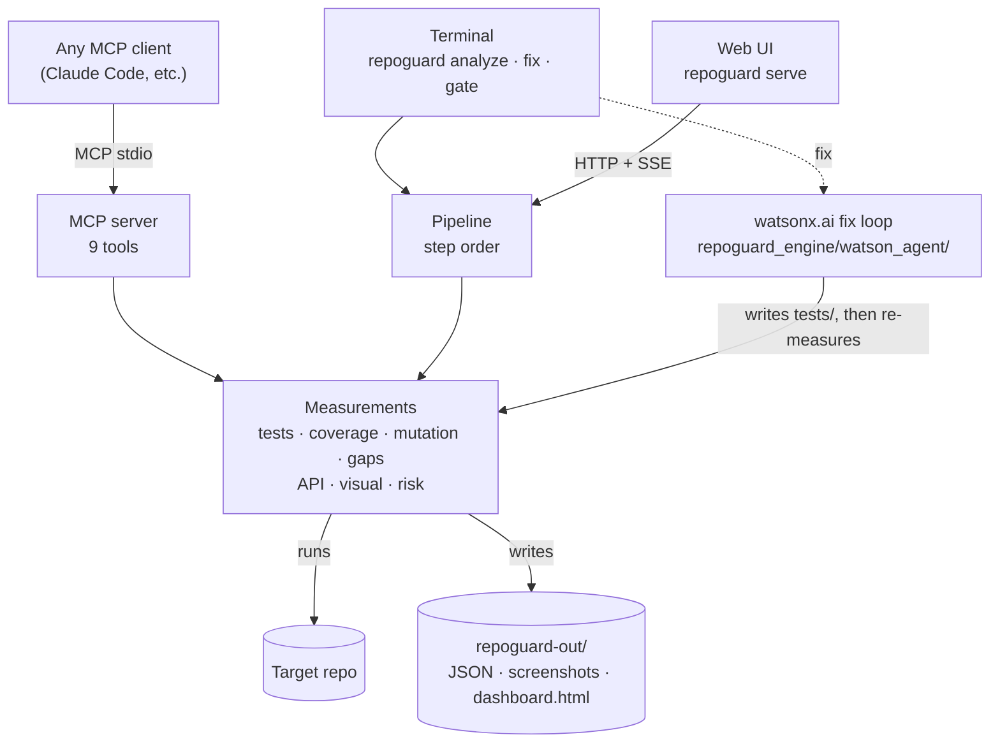
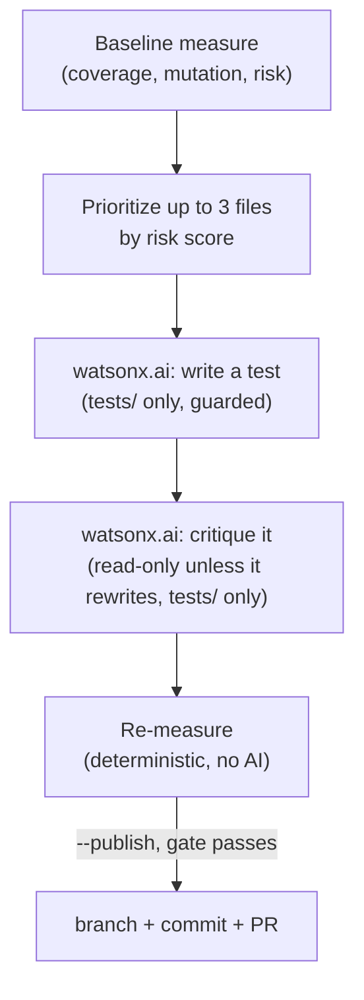
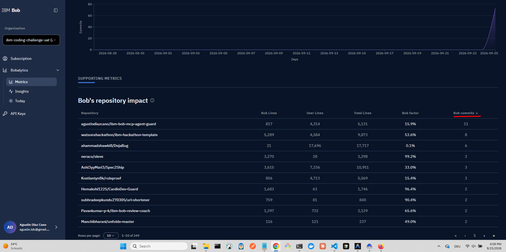

[](https://www.ibm.com/watsonx)
[](https://modelcontextprotocol.io/)
[](https://fastapi.tiangolo.com/)

# TestMind AI

**A test-quality tool that proves whether your tests catch bugs, then uses IBM watsonx.ai to write the ones that are missing.**

> Coverage tells you which lines ran. It doesn't tell you whether your tests would notice a bug.
> TestMind AI injects bugs into your code on purpose and measures how many your tests catch.

## Table of Contents

- [Results on the bundled demo repo](#results-on-the-bundled-demo-repo)
- [What it does](#what-it-does)
- [How it works](#how-it-works)
- [Is it multi-agent?](#is-it-multi-agent)
- [Quick start](#quick-start)
- [Commands](#commands)
- [Using the watsonx.ai fix loop](#using-the-watsonxai-fix-loop)
- [Requirements](#requirements)
- [Project structure](#project-structure)
- [IBM Bob Usage](#ibm-bob-usage)
- [AI-Assisted Development](#ai-assisted-development)
- [Documentation](#documentation)
- [Roadmap](#roadmap)
- [Limitations](#limitations)

## Results on the bundled demo repo

<picture>
  <source media="(prefers-color-scheme: dark)" srcset="docs/img/results-en-dark.png">
  
</picture>

| demo-repo | Before | After |
|---|---|---|
| Tests | 5 | 71 |
| Line coverage | 65.1% | 100% |
| **Bugs caught (mutation score)** | **20.25%** (16/79) | **89.87%** (71/79) |
| API endpoints with tests | 1 of 7 | 7 of 7 |
| Visual regression | baseline saved | catches a button color change |

The demo's tests covered 65.1% of the lines but caught roughly 1 in 5 injected bugs;
the reference tests in [`docs/expected-after-tests/`](docs/expected-after-tests/) catch
9 in 10. Both measured with RepoGuard's own AST mutation engine (see `AGENTS.md §7`);
the earlier figures on this page came from an interim `mutmut`-based engine and are
superseded. The 8 mutants still surviving after "After" are equivalent mutants, not
gaps: an `is_member` field `api.py` never reads, and `round(x, 2)` precision changes
that don't affect the tested inputs — see `AGENTS.md §9`.

## What it does

- 🧬 **Mutation testing.** Injects one small bug at a time (flipped comparisons, swapped operators, changed constants, `return None`, removed `raise`) with its own AST engine, then reruns your suite. Every mutant that survives is a bug your tests would miss.
- 🧪 **Writes the missing tests.** `repoguard fix` hands each file's surviving mutants to IBM watsonx.ai, one file at a time, through a guarded tool that can only write under `tests/` — never source. A second watsonx.ai call critiques the new test before the suite is re-measured for real.
- 🌐 **API checks.** Reads the OpenAPI schema of a FastAPI app, flags endpoints no test calls, and smoke-tests every `GET` endpoint for 5xx errors.
- 👁️ **Visual regression.** Starts the app, takes screenshots at desktop (1280 px) and mobile (390 px) widths, and diffs them pixel by pixel against a baseline. Also reports console errors and basic accessibility issues.
- 📊 **Risk ranking and report.** Ranks functions by `complexity × git churn × (1 − detection rate)` and builds an HTML dashboard.

**Design principle:** the AI decides what to test, and deterministic tools do the measuring. No number in the report is estimated by a model.

## How it works

One engine, three ways to use it.



## Is it multi-agent?

**No — one process, two AI calls per file.** `repoguard fix` is a single orchestrator loop, not parallel subagents: for each of up to 3 prioritized files it asks watsonx.ai to write a test (through a tool that can only write under `tests/`), then asks watsonx.ai again to critique that test, then re-measures for real. Measurement itself never uses AI.



| Entry point | Uses AI? | What runs |
|---|---|---|
| `repoguard fix` | Yes | The watsonx.ai loop above (write → critique → re-measure) |
| `repoguard analyze [--summarize]` | Only with `--summarize` | Deterministic pipeline; `--summarize` adds one watsonx.ai call for prose, never a metric |
| `repoguard gate` (CI) | No | Deterministic pipeline |

## Quick start

```bash
pip install -e .                    # installs the `repoguard` command
playwright install chromium         # only needed for visual checks

repoguard analyze ./demo-repo       # measure: tests, coverage, mutation, API, visual
repoguard serve                     # web UI at http://127.0.0.1:8765
```

## Commands

| Command | What it does |
|---|---|
| `repoguard analyze <path \| git-url> [--summarize]` | Measures tests, coverage, mutation score, API and visual. No AI unless `--summarize` is passed. |
| `repoguard fix <path> [--publish] [--threshold N]` | Measures, has watsonx.ai write the missing tests (guarded to `tests/`), critiques them, measures again |
| `repoguard gate <path> --threshold 80` | CI gate: exits with code 1 if coverage is below the threshold |
| `repoguard serve [--port 8000]` | Web UI with live progress, metrics and the report |
| `repoguard mcp` | Starts the MCP server (9 tools) for any MCP client |

## Using the watsonx.ai fix loop

1. Get IBM Cloud credentials and install the optional extra — see [`docs/WATSONX_SETUP.md`](docs/WATSONX_SETUP.md):
   ```bash
   pip install -e ".[ai]"
   export WATSONX_APIKEY="<your IBM Cloud API key>"
   export WATSONX_PROJECT_ID="<your watsonx project id>"
   ```
2. Run it:
   ```bash
   repoguard fix demo-repo
   ```
3. Without credentials, `fix` fails immediately with a clear error — it never
   silently skips the AI stages or fabricates a result.

`repoguard_engine/watson_agent/` is the whole implementation: `client.py`
(the watsonx.ai chat connection), `tools.py` (the one write tool, hard-guarded
to `tests/`), `prompts.py` (the writer/critic system prompts), and
`orchestrator.py` (the loop itself). It calls `pipeline`/`core` directly, the
same way `web/server.py` does — no MCP round-trip needed for its own use.

## Requirements

| Dependency | Used for | Required |
|---|---|---|
| Python ≥ 3.10, pytest, coverage | Running and measuring the suite | Yes |
| fastmcp | MCP server for external MCP clients | For `repoguard mcp` |
| fastapi, uvicorn, httpx | Web UI and API checks | For UI and API |
| playwright + Chromium, pillow, axe-playwright-python | Screenshots, visual diffs and accessibility | For visual checks |
| git | Churn for the risk score; cloning by URL | Recommended |
| `ibm-watsonx-ai` (`pip install -e ".[ai]"`) + IBM Cloud credentials | Writing tests (`repoguard fix`) and the optional `--summarize` prose | For AI features only — measurement never needs it |

The mutation engine is built on Python's standard `ast` module. It doesn't depend on mutmut or Stryker.

## Project structure

```
ibm-bob-mcp-agent-guard/
├── .bob/                           Where IBM Bob built Phases 0–8 (docs/IBM_BOB_USAGE.md); config kept for history
│
├── repoguard_engine/               Core library + all entry points
│   ├── __init__.py
│   ├── core.py                     Coverage measurement, gap detection, mutation testing, risk score, dashboard
│   ├── api_check.py                FastAPI endpoint discovery (AST) + HTTP smoke tests
│   ├── visual.py                   Playwright screenshots, pixel diff, console logs, axe-core a11y
│   ├── narrative.py                watsonx.ai prose summary of an already-measured dashboard (never a metric source)
│   ├── watson_agent/               watsonx.ai fix loop: client, guarded tools, prompts, orchestrator
│   ├── pipeline.py                 Ordered pipeline: measure → gaps → risk → gate
│   ├── cli.py                      CLI entry point: analyze | fix | gate | serve | mcp
│   ├── mcp_server.py               9 MCP tools via FastMCP (stdio transport)
│   └── web/
│       ├── __init__.py
│       ├── server.py               FastAPI app — REST + SSE stream
│       └── static/index.html       Web dashboard UI
│
├── demo-repo/                      Fixture: intentionally under-tested e-commerce shop
│   ├── pytest.ini
│   ├── shop/
│   │   ├── __init__.py
│   │   ├── api.py                  FastAPI routes (7 endpoints)
│   │   ├── cart.py                 Cart logic
│   │   ├── inventory.py            Inventory management
│   │   └── pricing.py              Pricing and discount rules
│   ├── tests/
│   │   ├── __init__.py
│   │   ├── test_api.py             Weak baseline API tests
│   │   ├── test_cart.py            Weak baseline cart tests
│   │   └── test_pricing.py         Weak baseline pricing tests
│   └── web/index.html              Simple shop UI (for visual checks)
│
├── docs/
│   ├── ARCHITECTURE.md             Layer diagram, data flow, MCP tool list
│   ├── DEMO.md                     3-minute demo script
│   ├── WATSONX_SETUP.md            Getting IBM Cloud credentials for narrative.py / watson_agent
│   ├── AI_ASSISTED_DEVELOPMENT_FRAMEWORK.md  How this project itself is built (Claude, file-based contract)
│   ├── make_results_chart.py       Generates the before/after results chart
│   ├── expected-after-tests/       Reference tests (copy here to verify "after" numbers)
│   └── img/                        README badge images
│
├── bob-evidence/                   Template for exporting IBM Bob session reports (never populated — see docs/IBM_BOB_USAGE.md
│                                    for the real evidence instead); repoguard fix now writes its own run report to
│                                    <target-repo>/watson-evidence/, same convention as repoguard-out/ (AGENTS.md §4)
│
├── AGENTS.md                       Agent context and coding rules (kept byte-identical to CLAUDE.md)
├── RUNBOOK.md                      Operational runbook (install, run, troubleshoot)
├── README.md                       This file
├── pyproject.toml                  Package metadata and dependencies
├── .gitignore
└── .bobignore
```

## IBM Bob Usage

TestMind AI was built with **IBM Bob**, which authored the project's
foundation and all of Phases 0–8: the initial engine (`core.py`,
`api_check.py`, `visual.py`, `cli.py`, `pipeline.py`, `mcp_server.py`), the
`demo-repo/` fixture, and its own `.bob/` swarm configuration, then
completed the mutation engine (Phase 3), MCP compact responses (Phase 7)
and the Test Writer/Critic/Publisher subagent modes (Phase 8). Bob's own
**Bobalytics** analytics page reports **11 Bob commits, 817 Bob lines out of
5,131 total (15.9% Bob factor)** for this repo — its own platform's number,
not a reconstruction. Full PR-by-PR and commit-by-commit evidence —
including the exact "Made with IBM Bob" / "PR description generated by IBM
Bob" footers — is in [`docs/IBM_BOB_USAGE.md`](docs/IBM_BOB_USAGE.md).

<table>
<tr>
<td><br/><sub>IBM Bob IDE, this project's workspace</sub></td>
<td><br/><sub>Bob drafting a PR description</sub></td>
<td><br/><sub>Phase 0 closed, verify.py PASS</sub></td>
</tr>
<tr>
<td><br/><sub>Phase 8: Test Writer subagent mode</sub></td>
<td><br/><sub>Bob's own analytics: 11 commits, 15.9% Bob factor</sub></td>
<td align="center"><a href="bob-evidence/bob-images/"><sub>29 screenshots total →<br/>bob-evidence/bob-images/</sub></a></td>
</tr>
</table>

| Phase | What | Built by |
|---|---|---|
| 0 — Project skeleton | `pyproject.toml`, `AGENTS.md`, `scripts/verify.py` | IBM Bob |
| 1 — demo-repo fixture | `shop/*.py`, `tests/*`, `web/index.html` | IBM Bob |
| 2 — Core measurement | `core.py` (tests, coverage, gaps) | IBM Bob |
| 3 — Mutation engine | Own AST engine, replacing `mutmut` | IBM Bob |
| 4 — Risk score & dashboard | `compute_risk()` | IBM Bob |
| 5 — API check | `api_check.py` | IBM Bob |
| 6 — Visual testing | `visual.py` | IBM Bob |
| 7 — MCP server | `mcp_server.py`, compact responses | IBM Bob |
| 8 — Bob modes, rules, skills | `.bob/custom_modes.yaml`, guardrail hooks, subagent modes | IBM Bob |

From Phase 13 onward (containerization, reference tests, the results chart,
and this session's watsonx.ai fix loop), Claude continued the build — see
[AI-Assisted Development](#ai-assisted-development) below for how that
handoff is documented and how the repo is built today.

## AI-Assisted Development

Two separate things in this project use AI, and it's worth being precise about which is which:

- **Building this repo**: IBM Bob authored Phases 0–8 (above); Claude has authored every engine/docs change from Phase 13 onward, working under the same explicit, file-based contract Bob used rather than ad-hoc prompting.
- **The product's own AI feature** is IBM watsonx.ai, used at runtime for two things: `repoguard fix` (writes tests, guarded to `tests/` only) and `repoguard analyze --summarize` (plain-English prose from already-measured numbers, never a metric source). See [Using the watsonx.ai fix loop](#using-the-watsonxai-fix-loop) above.

The rest of this section is about the first one — how the repo itself gets built.

### The contract: context files in the repo

| File | Role |
|---|---|
| `AGENTS.md` (kept byte-identical to `CLAUDE.md`) | Architecture rules, layer boundaries, the token budget, and the actions that need human sign-off (Section 8). Loaded on every task. |
| `PENDING.md` | The prioritized roadmap, phase by phase. Read to pick the next task; items are checked off as they land. Never delete or empty it. |
| `LASTCONTEXT.md` | Current state, kept short: which phase is done, which is in progress, decisions in force, what's waiting on the user, known gotchas (e.g. "mutation score flakes without `PYTHONDONTWRITEBYTECODE`"). A new session reads this instead of re-deriving context. |
| `docs/ARCHITECTURE.md` | Operational knowledge — the data contract in `repoguard-out/`, the MCP tool list, the watsonx.ai fix loop. |

### What happens end to end
- **Verify before claiming done:** every phase in `PENDING.md` has a matching check in `scripts/verify.py`. The relevant check's output is pasted into the PR before marking a phase complete — a claim without a PASS doesn't count.
- **Git workflow:** one short-lived branch per phase (`feat/03-mutation`, `feat/15-watsonx-migration`, …), Conventional Commits, a PR description with the verify output as the test plan. Every commit carries a `Co-Authored-By` trailer.
- **Documentation:** keeps README, `AGENTS.md`/`CLAUDE.md`, `PENDING.md` and the measured numbers in `docs/` in sync with each change — a number in the docs must always match what `verify.py` just measured.
- **Diagnosis:** when a check fails (e.g. the mutation score isn't deterministic), the job is to find the real cause before patching around it — see `AGENTS.md` Section 9, "Known pitfalls," for the ones already found (bytecode caching, animation timing, ambient-PATH subprocess calls, missing watsonx.ai credentials).

## Documentation

- [IBM Bob Usage](docs/IBM_BOB_USAGE.md): full PR- and commit-level evidence for Phases 0–8
- [Hackathon submission status](docs/HACKATHON_SUBMISSION_STATUS.md): checklist tracking against the lablab.ai submission requirements
- [Architecture](docs/ARCHITECTURE.md): diagrams, the sequence of a run, MCP tools and the data contract
- [Demo script](docs/DEMO.md): 3-minute pitch and backup plan
- [watsonx.ai setup](docs/WATSONX_SETUP.md): IBM Cloud credentials for `narrative.py` / `watson_agent`
- [Multicloud AI (design)](docs/MULTICLOUD_AI.md): adding Google Vertex AI alongside watsonx.ai, and benchmarking models
- [AI-Assisted Development Framework](docs/AI_ASSISTED_DEVELOPMENT_FRAMEWORK.md): how this repo itself is built — contract files and git workflow

## Roadmap

**Next up: a Next.js dashboard on Vercel.** The current web UI
(`repoguard serve`, `web/static/index.html`) stays as the reference
implementation and keeps serving `/api/analyze` and `/api/stream`. Planned
on top of it: a richer Next.js frontend — charts for coverage/mutation/risk,
a surviving-mutants table, and one-click buttons for "Analyze", "Gate" and
"Autofix (watsonx.ai)" — deployed to Vercel, consuming the same FastAPI
endpoints rather than replacing them.

We're deliberately not adopting Terraform or new GCP infrastructure for
this: the existing Cloud Run deploy (`docs/DEPLOY.md`, Phase 13) is left
as-is, and the new frontend ships as a plain Vercel project (no IaC). See
`PENDING.md` Phase 14 and `docs/ARCHITECTURE.md` for details. Not built yet.

**Also planned: multicloud AI.** watsonx.ai is the only provider today. See
[`docs/MULTICLOUD_AI.md`](docs/MULTICLOUD_AI.md) (`PENDING.md` Phase 16) for
the design — a small `ChatProvider` abstraction so Google Vertex AI can be
added without touching the write-guarded tools or the orchestrator loop,
plus a benchmark script to compare models by measured mutation-score deltas
rather than opinion. Design only; nothing under `ai_providers/` exists yet.

## Limitations

- Python + pytest only. API checks support FastAPI only.
- Equivalent mutants (changes with no observable effect) are reported, not filtered out automatically.
- The accessibility check is basic. Use axe-core for a full audit.
- `repoguard fix` needs real IBM Cloud credentials (`docs/WATSONX_SETUP.md`); without them it fails with a clear error rather than degrading silently. An actual live generation with real credentials hasn't been verified yet — see `PENDING.md` Phase 16.

## Author

**Agustin Diaz-Cano** M.Sc. Candidate, Information Systems Engineering - [UTN](https://frba.utn.edu.ar/)

[LinkedIn](https://www.linkedin.com/in/agustindiazcano/) · [Portfolio](http://www.agustindiazcano.com/) · [ORCID](https://orcid.org/0009-0001-4336-490X) · [Google Scholar](https://scholar.google.com/citations?user=qUcRD6UAAAAJ&hl=en)

## Team

Argentina Team
