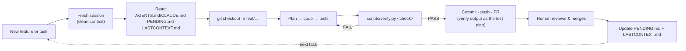

## Development Framework: Building TestMind AI

TestMind AI is built by Claude (Claude Code), running under an explicit,
file-based contract instead of ad-hoc prompting. IBM Bob did this job in
earlier sessions (see `.bob/DEPRECATED.md`); it's no longer available, and
Claude has authored every engine/docs change since. Claude plans the change,
writes the code and tests, reviews its own diff, runs the verification
suite, and drives the git workflow: branch, commit, push, PR. The human sets
direction, approves risky changes, and checks claims against
`scripts/verify.py`'s output — never against a session's own summary of what
it did.

This is about how the repo itself gets built — not to be confused with the
product's own AI feature, IBM watsonx.ai, which runs at request time
(`repoguard fix`, `repoguard analyze --summarize`). See `docs/ARCHITECTURE.md`
for that.

### The session loop

Every unit of work starts the same way, whether it's a new phase or a bug fix:

The context reset is deliberate: a long-running session accumulates dead ends
and half-finished reasoning that cost tokens on every turn. Starting clean
and re-reading three short files is cheaper than carrying that history
forward — and it's what makes the contract files necessary in the first
place, not optional documentation.

### The contract: context files in the repo

| File | Role |
|---|---|
| `AGENTS.md` (kept byte-identical to `CLAUDE.md`) | Architecture rules, layer boundaries, the token budget, and which actions need human sign-off. Loaded on every task — it's the one file that never gets summarized away. |
| `PENDING.md` | The prioritized backlog, phase by phase, with a traffic-light priority. Read to pick the next task; items are checked off as they land. Never delete or empty it. |
| `LASTCONTEXT.md` | The current state, kept short: which phase is done, which is in progress, decisions already made, what's waiting on the user, and any gotcha still in effect (e.g. "mutation score flakes without `PYTHONDONTWRITEBYTECODE=1`"). A new session reads this instead of re-deriving context from the diff history. |
| `docs/ARCHITECTURE.md` | Operational reference — the `repoguard-out/` data contract, the MCP tool list, the watsonx.ai fix loop — for anything a session needs mid-task, not at start. |

### What happens, end to end

| Stage | What happens |
|---|---|
| **Plan** | Reads `PENDING.md` for the next unblocked phase, `AGENTS.md`/`CLAUDE.md` for the rules that apply, `LASTCONTEXT.md` for anything left mid-flight. States which reading it's taking before writing code. |
| **Code** | Implements inside the layer boundaries in `AGENTS.md` §4 — engine code never imports web/MCP/CLI code, and vice versa. |
| **Test** | Runs the matching `scripts/verify.py` check. A claim without a PASS in hand doesn't count as done. |
| **Review** | Re-reads its own diff against `AGENTS.md` §8 (ask-before-editing list) before committing — a self-check, not a substitute for the human's review on the PR. |
| **Commit** | Conventional Commits (`feat(engine): …`), one concern per commit, `Co-Authored-By` trailer so authorship is transparent. |
| **Push & PR** | One short-lived branch per phase (`feat/03-mutation`, `feat/15-watsonx-migration`, `fix/…`, `docs/…`). PR description carries the `verify.py` output as the test plan — not a prose description of what changed. |
| **Merge** | The human merges. `PENDING.md` and `LASTCONTEXT.md` are updated in the same PR, so the next session (or the next person) inherits accurate state. |

### What used to guard IBM Bob specifically

`.bob/hooks/safety-guard.mjs` and `.bob/hooks/evidence-export.mjs` enforced
"tests/ only" and auto-exported session reports for Bob's custom modes. Both
are retired along with the rest of `.bob/` (see `.bob/DEPRECATED.md`). Their
equivalents today are properties of the code itself rather than an external
IDE hook: `watson_agent/tools.py`'s `write_test_file` hard-rejects any write
outside `tests/`, and `watson_agent/orchestrator.py` writes its own run
report to `<target-repo>/watson-evidence/` at the end of every `repoguard
fix` run, unconditionally, with no separate export step.
