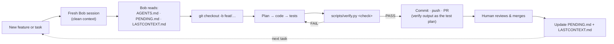

## Development Framework: Working with IBM Bob

TestMind AI is built by a single agent — **IBM Bob** — running under an explicit, file-based contract instead of ad-hoc prompting. Bob plans the change, writes the code and tests, reviews its own diff, runs the verification suite, and drives the full git workflow: branch, commit, push, PR. The human sets direction, approves risky changes, and checks Bob's claims against `scripts/verify.py`'s output — never against Bob's own summary of what it did.

### The session loop

Every unit of work starts the same way, whether it's a new phase or a bug fix:

The context reset is deliberate: a long-running session accumulates dead ends and half-finished reasoning that cost tokens on every turn. Starting clean and re-reading three short files is cheaper than carrying that history forward — and it's what makes the contract files necessary in the first place, not optional documentation.

### The contract: context files in the repo

| File | Role |
|---|---|
| `AGENTS.md` | Architecture rules, layer boundaries, the token budget, and which actions need human sign-off. Bob loads this on every task — it's the one file that never gets summarized away. |
| `PENDING.md` | The prioritized backlog, phase by phase, with a traffic-light priority. Bob reads it to pick the next task and checks items off as they land. Protected from deletion by a hook (below), not just a request. |
| `LASTCONTEXT.md` | The current state, kept short: which phase is done, which is in progress, decisions already made, what's waiting on the user, and any gotcha still in effect (e.g. "mutation score flakes without `PYTHONDONTWRITEBYTECODE=1`"). A new session reads this instead of re-deriving context from the diff history. |
| `docs/worklog/` | The history: each session's decisions and validation results, moved out of `LASTCONTEXT.md` once superseded — so `LASTCONTEXT.md` stays short and worklog stays complete. |
| `docs/BUILD_WITH_BOB.md` | The build runbook: one phase, one prompt, one acceptance check, in dependency order. |
| `docs/ARCHITECTURE.md` | Operational reference — the `repoguard-out/` data contract, the MCP tool list, the agent team — for anything a session needs mid-task, not at start. |

*`LASTCONTEXT.md` and `docs/worklog/` aren't created yet — add them alongside `PENDING.md` before the first multi-session build.*

### What Bob does, end to end

| Stage | What happens |
|---|---|
| **Plan** | Reads `PENDING.md` for the next unblocked phase, `AGENTS.md` for the rules that apply, `LASTCONTEXT.md` for anything left mid-flight. States which reading it's taking before writing code. |
| **Code** | Implements inside the layer boundaries in `AGENTS.md` §4 — engine code never imports web/MCP/CLI code, and vice versa. |
| **Test** | Runs the matching `scripts/verify.py` check (`core`, `mutation`, `api`, `visual`, `mcp`, `cli`, `web`, `after`). A claim without a PASS in hand doesn't count as done. |
| **Review** | Re-reads its own diff against `AGENTS.md` §8 (ask-before-editing list) before committing — this is Bob checking Bob, not a substitute for the human's review on the PR. |
| **Commit** | Conventional Commits (`feat(engine): …`), one concern per commit, `Co-Authored-By` trailer so authorship is transparent. |
| **Push & PR** | One short-lived branch per phase (`feat/03-mutation`, `fix/…`, `docs/…`). PR description carries the `verify.py` output as the test plan — not a prose description of what changed. |
| **Merge** | The human merges. Bob updates `PENDING.md` and `LASTCONTEXT.md` in the same PR, so the next session (or the next person) inherits accurate state. |

### Guardrails on Bob itself

Hooks live in `.bob/hooks/` and run without asking, not as a suggestion:

| Hook | Tier | Blocks |
|---|---|---|
| `safety_guard` | Deny | Deleting or emptying `PENDING.md`; editing `demo-repo/shop/` or `demo-repo/web/` from a test-writing mode |
| `safety_guard` | Ask | Force push, `git reset --hard`, `git clean -f`, renaming or deleting anything under `.bob/` |
| `safety_guard` | Ask before editing | Mutation operators, the visual diff threshold, MCP tool signatures (a breaking change for live agents) |
| `evidence_export` | After each `repoguard`-mode task | Exports the task session report to `bob-evidence/NN-short-name.md` automatically |

Skills live in `.bob/skills/` — procedures Bob must follow for this repo's risky or repetitive operations, rather than reasoning them out fresh each time:

| Skill | Covers |
|---|---|
| `pytest-conventions` | How to write a test that kills a specific mutant, by operator type |
| `mutation-hunting` | How to read `mutation_*.json`, prioritize by risk, and tell an equivalent mutant from a real gap |
| `verify-before-pr` | Run the phase's `scripts/verify.py` check and attach its output before opening a PR |