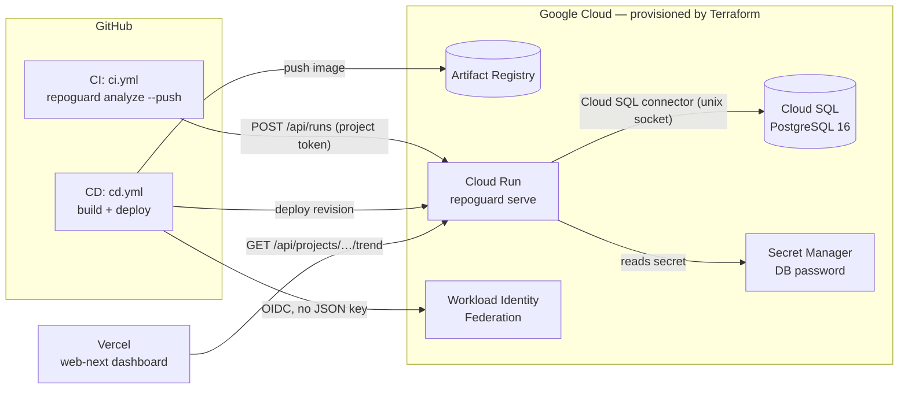
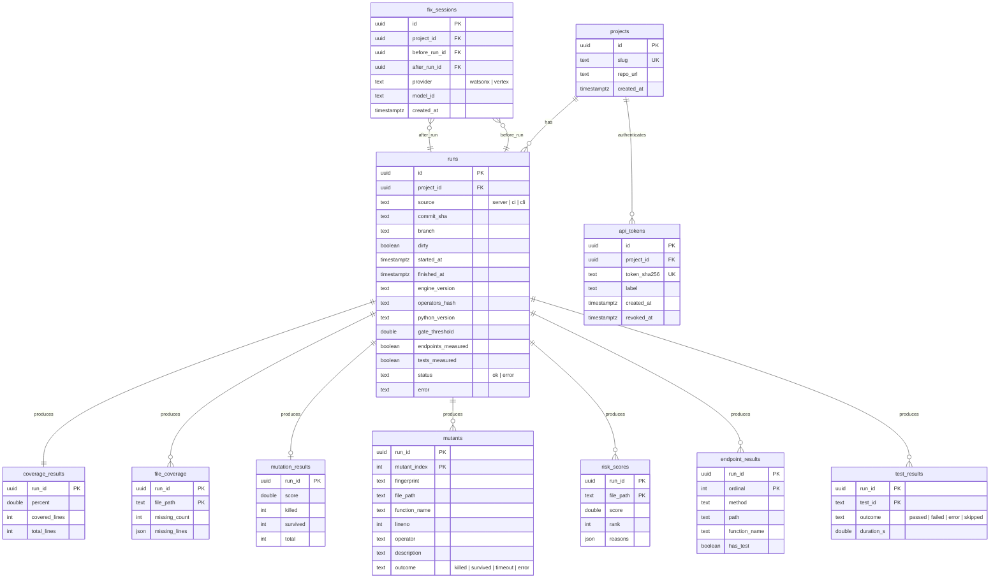

# Data Platform Plan — measurement history, Postgres, Terraform on GCP

> **Status: planned in detail (Phase 17 in `PENDING.md`), nothing built yet.**
> Every number quoted below comes from `CLAUDE.md §7` (measured), and is used
> only as example data. No number in this document is a prediction.
>
> **Session 20 correction pass:** a planning agent read the actual current
> code (`core.py`, `pipeline.py`, `cli.py`, `web/server.py`, `mcp_server.py`)
> against this doc and found ~15 real gaps — several would have made this
> doc's own §11 checks fail, or pass for the wrong reason. Corrections are
> inline below (search "Session 20"); the full step-by-step build plan
> (replacing §10) and 6 open decisions are in the new §13. Note:
> `infra/terraform/` for the CI/CD identity (WIF) already exists and is
> separate from this doc's §8 Terraform plan — see its own README; §8 here
> is about Cloud SQL/the app's own infra, not yet built.

---

## 1. Why a database now

TestMind AI measures one snapshot: coverage, mutation score, gaps, risk.
Each run writes `repoguard-out/*.json` and forgets. That is enough for a
single analysis, and it stays the contract between agents (`CLAUDE.md §4`).

Two facts make a database necessary, not decorative:

1. **Cloud Run's filesystem is ephemeral.** The deployed service
   (`docs/DEPLOY.md`) writes `repoguard-out/` inside a container that
   disappears when the instance scales to zero. On the cloud, history does
   not exist without external storage.
2. **Everything "data-driven" in QA is a time series.** What AI QA tools
   actually use historical data for:

| Practice | What it needs from history | Our equivalent |
|---|---|---|
| Self-healing tests | Past snapshots of a locator/element to match the broken one against | Stable mutant fingerprints: the same weak spot tracked across runs |
| Risk-based test prioritization | Per-file failure/defect rate over time + code churn | `risk_scores` per run + git churn, calibrated against where mutants actually survive |
| Flaky-test detection | Many outcomes of the same test on the same commit | `test_results` per run, keyed by commit |
| Quality trend / regression alerts | A metric per commit | `runs` + `coverage_results` + `mutation_results` per commit |

The product's core claim is *"coverage lies; mutation score tells the
truth"* (demo-repo: 65.1% coverage vs 20.25% mutation). History turns that
from a one-off screenshot into a tracked quantity per commit.

**Scope honesty:** the "self-healing" analogue here is for the *test suite*
(finding where it keeps failing to catch bugs), not DOM-locator healing.
Locator healing would belong to `visual.py` and is out of scope.

---

## 2. Principles (inherited from `CLAUDE.md`, not negotiable)

- **The engine measures; the database only stores.** No metric is computed
  by SQL and written back as a measurement. Derived values (deltas, trends,
  gaps) live in *views*, recomputed from raw rows on every read.
- **Persistence is optional and inert.** With `REPOGUARD_DATABASE_URL`
  unset, the engine behaves byte-for-byte as today. Persistence runs *after*
  measurement and cannot change a number.
- **Layering.** `core.py` gets no DB code. A new `repoguard_engine/store/`
  depends only on `core`'s dataclasses. `pipeline.py` calls it; `cli.py`,
  `web/server.py` and `mcp_server.py` stay thin adapters.
- **Comparability.** Every run stores `engine_version` and
  `operators_hash` (hash of the mutation operator set). Trends are only
  drawn between runs with the same `operators_hash` — a score change caused
  by changing the instrument is not a change in the thing measured.
- **Store raw, derive late.** E.g. the fix-loop "delta" is never stored;
  it is `after.score − before.score` from two stored runs.

---

## 3. Target architecture



Two sources of runs:

| Source | Who measures | How it arrives |
|---|---|---|
| `server` | Cloud Run itself (`/api/analyze?persist=true`) on the bundled `demo-repo` | Direct write |
| `ci` | Any repo's GitHub Actions running `repoguard analyze` on its own code, per commit | `POST /api/runs` with a per-project token |

The `ci` source is the real data-driven story: one measured row per commit,
for any repository, with no code upload to our service.

---

## 4. Database design

### 4.1 Engine changes the schema depends on

The schema can only store what the engine measures. Today the engine
discards two things history needs:

| Gap | Today | Change (small, in `core.py`) |
|---|---|---|
| Per-mutant outcome | `run_mutation` keeps only `surviving_mutant_ids` (positional indexes) | Return `mutants: [{index, file, function, lineno, operator, description, outcome}]`. Kept **out** of the compact MCP response (`CLAUDE.md §4`). **Session 20:** `outcome ∈ {killed, survived, timeout, error}`, not a `killed` bool — `_run_mutant` returns `True` (killed) on *any* exception including timeout, so a bool silently conflates "the mutation was caught" with "something went wrong measuring it." Score is unchanged (both still count as killed); history can now tell them apart. |
| Stable mutant identity | Index depends on file and site order; shifts when code changes | `fingerprint = sha1(file · enclosing function · operator description · ordinal within that function)`. Survives edits elsewhere in the file; changes if that function is edited — accepted, documented limitation. **Session 20:** `file` must be `.as_posix()`, not `str(Path)` — `file_rel = str(py_file.relative_to(repo))` gives backslashes on Windows, so the same mutant would fingerprint differently on a Windows dev machine vs. Linux CI. Safe to change: today file paths only appear inside `description`, never written out on their own. |
| Per-test outcome | `pytest -q --tb=no`, only the exit code is read | Add `--junitxml`, parse with stdlib `xml.etree`. **Session 20, real conflict:** the path can't be a fixed `repoguard-out/junit.xml` — `measure_coverage` deliberately writes into a per-run `TemporaryDirectory` (`core.py`) specifically so concurrent runs don't overwrite each other; a fixed path reintroduces that race. Write `junit.xml` into the *existing* tempdir and parse it there. Also: pytest's default `junit_family=xunit2` has no `nodeid` attribute, only `classname`+`name` — the column here is `test_id = f"{classname}::{name}"`, named honestly as a constructed ID, not claimed to be a real pytest nodeid. (An exact-nodeid pytest plugin is the alternative — more code; **open decision #1**, §13.) |

Both changes must pass the §7 determinism checks unchanged (16/79 twice).
Name the new per-test dataclass `CaseOutcome`, not `TestOutcome` — pytest
collects `Test*`-named classes if one is ever imported into a test module
(Session 20).

### 4.2 Entity-relationship diagram

Corrected per Session 20 (§4.1/§4.3 above): `percent`/`score` are `double`,
not `numeric`, to avoid rounding drift; `mutants.killed` is `outcome`
(killed/survived/timeout/error); `file_coverage.missing_lines` is `json`,
not an array type; `endpoint_results` has a surrogate PK, not
`(method, path)`; `test_results` keys on `test_id`, not a claimed `nodeid`;
`fix_sessions.tests_added` and `runs.passed_gate` are dropped (views
instead); `ai_summaries` is dropped from Block A entirely (no writer
exists yet).



### 4.3 Table notes

| Table | Maps from engine | Notes |
|---|---|---|
| `runs` | `PipelineResult` + git/CI env | One row per measurement. Index `(project_id, started_at DESC)` and `(project_id, commit_sha)`. **Session 20:** add `dirty` (git status non-empty), `endpoints_measured`/`tests_measured` booleans — see below. |
| `coverage_results` | `CoverageResult` | **Session 20, real bug:** `numeric(5,2)` would *round* `measure_coverage`'s raw float (e.g. `65.09…`) — `65.1` is only the CLI's `:.1f` display, and storing it rounded is exactly the "rounding drift" this doc claims to avoid. Store as `Double`; verify `stored == returned` exactly, and `round(stored, 1) == 65.1` as a separate, looser check. |
| `file_coverage` | `CoverageResult.missing_lines` | **Session 20:** plain `JSON` (`JSONB` variant on Postgres) on both backends instead of a custom `int[]`/text-JSON type decorator — simpler, and SQLite has no native array type to decorate around. |
| `mutation_results` | `MutationResult` | Null row when mutation was not requested (`include_mutation=False`). **Session 20:** drop `duration_s` — the engine doesn't measure per-mutant timing today, and adding it to `MutationResult` would break `mutation.json`'s determinism guarantee. Run-level timing goes on `runs.started_at/finished_at` instead. |
| `mutants` | new per-mutant list (§4.1) | Index on `fingerprint` for cross-run tracking. PK `(run_id, mutant_index)`. Column is `outcome`, not a `killed` bool (§4.1 above). |
| `risk_scores` | `list[RiskScore]` | `rank` is the engine's sort order, stored, not recomputed. **Session 20:** `compute_risk` only emits files that *have* missing lines — a fully-covered file has no row, not a zero-score row. The risk-calibration script (§5) must treat a missing row as "engine emitted nothing," not silently backfill 0. |
| `endpoint_results` | `list[EndpointInfo]` | `file`, `function`, `method`, `path`, `has_test`. **Session 20:** surrogate ordinal PK, not `(method, path)` — that pair isn't guaranteed unique. Also: `analyze` has endpoints off by default, so a project with zero `endpoint_results` rows is ambiguous ("not measured" vs. "no endpoints") — `runs.endpoints_measured` (boolean) disambiguates it. **Open decision #6** (§13): whether to even ship this table in the first block, given endpoints are opt-in. |
| `test_results` | new `junit.xml` parse (§4.1) | Enables flaky-test detection. PK `(run_id, test_id)` (not `nodeid` — see §4.1). |
| `fix_sessions` | `repoguard fix` before/after runs | **Session 20:** drop stored `tests_added` — it's derivable from `test_results` counts before/after (a view), same "engine measures, DB only stores" reasoning as `passed_gate` below. |
| `ai_summaries` | `narrative.generate_summary` | **Session 20: dropped from Block A entirely.** No code path writes to it — `narrative.py` runs from `cli.py` *after* the pipeline returns, and the providers (`WatsonxChatProvider`/`VertexChatProvider`) don't expose a public `name`/`model_id` to record (`_model`/`_model_id` are private). A table with no writer is dead weight; revisit once a writer exists. |
| `api_tokens` | — | Only the SHA-256 of the token is stored; plaintext shown once at creation. Nothing in the original design said how a project/token actually gets created — **Session 20** adds a `repoguard db init/create-project/create-token` CLI group (§13, step A3.2). |

**Session 20, dropped column:** `runs.passed_gate` isn't stored at all — it's
just `coverage >= gate_threshold`, a pure function of two already-stored
values, so per this doc's own §2 principle ("derived values live in views")
it becomes a view column, not a table column. `runs.gate_threshold` is
stored; `passed_gate` is computed on read. **Open decision #4** (§13,
recommended: yes, drop it).

**Session 20, import-cycle risk:** `store/` must depend only on `core` +
`api_check` dataclasses, **never** on `pipeline.PipelineResult` — if
`store/` imported `pipeline` while `pipeline.py` imports `store` (to
persist), that's a cycle. The fix is a plain-dict **run record** (schema
`{schema_version, run_id, ...}`) as the one interchange format, built by
`pipeline.py` from its own `PipelineResult` and consumed by both local
`save_record()` and the `POST /api/runs` ingest path — see §13 Part 2 for
the exact module layout this implies.

Schema creation: `metadata.create_all()` at startup (idempotent, creates
only what's missing) — **but this never creates views** (§4.4's Session 20
note). Adopt Alembic the first time a column must change — not before; for
a two-day build it's a part with no job yet.

### 4.4 Views (all derived values live here)

> **Session 20, real bug in every query below:** SQLite (the local/test
> backend, and the one the §11 round-trip check runs against first) has no
> `FILTER`, `BOOL_AND`, or `ARRAY_AGG` — these views as written simply don't
> run on the local backend at all, only on Postgres. Rewritten portably
> below: `SUM(CASE WHEN … THEN 1 ELSE 0 END)` instead of `FILTER`,
> `MAX(CASE WHEN killed THEN 0 ELSE 1 END) = 1` instead of `BOOL_AND`, and an
> outcome-count pair instead of `ARRAY_AGG`. Also: `CREATE VIEW IF NOT
> EXISTS` isn't valid Postgres syntax, and `metadata.create_all()` never
> creates views at all (it only handles `Table` objects) — views are created
> by `init_db()` doing `DROP VIEW IF EXISTS` + `CREATE VIEW` in one
> transaction on every startup. Views hold no data, so recreating them on
> every startup is safe.

```sql
-- Trend per commit: the "coverage lies" gap over time. passed_gate is
-- derived here, not stored (Session 20, §4.3).
CREATE VIEW v_run_trend AS
SELECT r.project_id, r.id AS run_id, r.commit_sha, r.started_at,
       r.operators_hash,
       c.percent                          AS coverage_pct,
       m.score                            AS mutation_pct,
       c.percent - m.score                AS coverage_minus_mutation_pp,
       CASE WHEN c.percent >= r.gate_threshold THEN 1 ELSE 0 END AS passed_gate
FROM runs r
JOIN coverage_results c ON c.run_id = r.id
LEFT JOIN mutation_results m ON m.run_id = r.id
WHERE r.status = 'ok';

-- Which kinds of bugs the suite misses (latest run per project) --
-- portable: SUM(CASE …) instead of COUNT(*) FILTER (…)
CREATE VIEW v_survival_by_operator AS
SELECT r.project_id, mu.operator,
       COUNT(*)                                              AS total,
       SUM(CASE WHEN mu.outcome != 'killed' THEN 1 ELSE 0 END) AS survived,
       ROUND(100.0 * SUM(CASE WHEN mu.outcome != 'killed' THEN 1 ELSE 0 END)
             / COUNT(*), 2)                                   AS survival_pct
FROM mutants mu
JOIN runs r ON r.id = mu.run_id
WHERE r.id = (SELECT id FROM runs r2
              WHERE r2.project_id = r.project_id AND r2.status = 'ok'
              ORDER BY started_at DESC LIMIT 1)
GROUP BY r.project_id, mu.operator;

-- Persistent survivors: weak spots the suite has never caught -- portable:
-- MAX(CASE …) = 1 instead of HAVING BOOL_AND(NOT killed). Excludes runs
-- from a dirty working tree (Session 20 below) so a fix-loop before/after
-- pair sharing one commit sha doesn't get counted as "still surviving."
CREATE VIEW v_persistent_survivors AS
SELECT r.project_id, mu.fingerprint,
       MIN(mu.file_path)      AS file_path,
       MIN(mu.function_name)  AS function_name,
       MIN(mu.description)    AS description,
       COUNT(*)               AS runs_seen,
       MIN(r.started_at)      AS first_seen
FROM mutants mu
JOIN runs r ON r.id = mu.run_id
WHERE r.status = 'ok' AND NOT r.dirty
GROUP BY r.project_id, mu.fingerprint
HAVING MAX(CASE WHEN mu.outcome = 'killed' THEN 1 ELSE 0 END) = 0;

-- Flaky tests: same commit, different outcomes -- portable: count of
-- distinct outcomes instead of ARRAY_AGG. Session 20, real bug: a dirty
-- working tree (the fix loop, or copying reference tests in for
-- verification) reuses the *same* commit sha with different tests --
-- restricted to non-dirty runs or every such session looks flaky.
CREATE VIEW v_flaky_tests AS
SELECT r.project_id, r.commit_sha, t.test_id,
       COUNT(DISTINCT t.outcome) AS distinct_outcomes, COUNT(*) AS runs
FROM test_results t
JOIN runs r ON r.id = t.run_id
WHERE r.commit_sha IS NOT NULL AND NOT r.dirty
GROUP BY r.project_id, r.commit_sha, t.test_id
HAVING COUNT(DISTINCT t.outcome) > 1;

-- Fix-loop effect, from two stored measurements. tests_added is derived
-- here (test_results count diff), not stored (Session 20, §4.3).
CREATE VIEW v_fix_effect AS
SELECT f.id, f.provider, f.model_id,
       mb.score AS before_pct, ma.score AS after_pct,
       ma.score - mb.score AS delta_pp
FROM fix_sessions f
JOIN mutation_results mb ON mb.run_id = f.before_run_id
JOIN mutation_results ma ON ma.run_id = f.after_run_id;
```

Worked example with the measured §7 numbers: before 20.25% (16/79),
after the reference tests 89.87% (71/79) → `delta_pp = 69.62`;
`coverage_minus_mutation_pp` goes from 44.85 to 10.13. (The real Phase 11
Vertex run reached the same ceiling live: 89.87%, 71/79 — see
`docs/MULTI_AGENT_SWARM.md` §1 and `PENDING.md` Phase 11.)

**`runs.dirty`** (Session 20): set from `git status --porcelain` being
non-empty at measurement time. Needed by both views above — without it, a
fix-loop's before/after pair (same commit, different `tests/` contents)
would look like the exact flakiness/false-survival cases these views exist
to catch.

---

## 5. Risk model v2 — calibrated, not invented

Today `compute_risk` is a one-parameter model:
`risk = uncovered_lines / non_blank_lines`. `PENDING.md` Phase 4 describes
`complexity × churn × (1 − detection)`, which is not what the code does.

History allows the model to be *tested* instead of asserted:

1. **Observable to predict:** per file, the fraction of mutants that survive
   in the *next* run (`mutants` table). It is measured, not a proxy.
2. **Baseline:** Spearman rank correlation between today's `risk` and that
   observable, across all stored runs.
3. **Candidate terms**, added one at a time: git churn (commits touching the
   file in the last N days, from `git log`), mutant density (mutants per
   line).
4. **Acceptance rule (parsimony):** a term stays only if it raises the rank
   correlation on held-out runs by a margin fixed *before* looking at the
   result. Otherwise the simpler model stays.

**Honest limit:** with only `demo-repo` (4 files) there is not enough data
to calibrate anything. During the hackathon this ships as the *pipeline*
that makes calibration possible — not as a calibrated model. Any claim of
improved prediction waits for real multi-repo data.

---

## 6. Charts (web-next dashboard)

Six views, each backed by one view from §4.4. Numbers shown are always
read from the API, never computed in the browser beyond formatting.

| # | Chart | Type | Source | Question it answers |
|---|---|---|---|---|
| 1 | Coverage vs mutation score per commit | Two-line chart, shaded gap | `v_run_trend` | Is the suite getting better at catching bugs, or just running more lines? |
| 2 | Survival by mutation operator | Horizontal bars, sorted | `v_survival_by_operator` | Which bug kinds (boundary `<`/`<=`, arithmetic, `return None`…) slip through? |
| 3 | File risk over time | Heatmap (file × run) | `risk_scores` | Where is risk concentrating? |
| 4 | Before/after fix loop | Slope chart per `fix_sessions` row | `v_fix_effect` | Did the AI-written tests actually move the score? By how much? |
| 5 | Persistent survivors | Table, sorted by `runs_seen` | `v_persistent_survivors` | Which weak spots have never been caught? (feeds the fix loop's priorities) |
| 6 | Flaky tests | Table | `v_flaky_tests` | Which tests are untrustworthy signals? |

Rules: a trend line breaks (new series) when `operators_hash` changes;
empty states say "no runs yet", never a zero.

Library: web-next has no chart dependency today. **Recharts** for charts
1–4 (saves hand-writing axes/tooltips under a deadline; confirm React 19
compatibility at install). Charts 5–6 are plain tables. Follow the repo's
dataviz guidance for colors and light/dark themes when implementing.

---

## 7. API additions (`web/server.py`, thin over `store/`)

| Method | Path | Auth | Returns |
|---|---|---|---|
| `GET` | `/api/analyze?…&persist=true&project=<slug>` | — | Same body as today, plus `run_id` when persisted |
| `POST` | `/api/runs` | `Authorization: Bearer <project token>` | `{run_id}` — ingests a CI-measured result |
| `GET` | `/api/projects` | — | Project list |
| `GET` | `/api/projects/{slug}/runs?limit=50` | — | Run list |
| `GET` | `/api/projects/{slug}/trend` | — | Chart 1 |
| `GET` | `/api/projects/{slug}/operators` | — | Chart 2 |
| `GET` | `/api/projects/{slug}/risk-heatmap` | — | Chart 3 |
| `GET` | `/api/projects/{slug}/fix-effect` | — | Chart 4 |
| `GET` | `/api/projects/{slug}/survivors` | — | Chart 5 |
| `GET` | `/api/projects/{slug}/flaky` | — | Chart 6 |

`POST /api/runs` stores what the client measured; it never recomputes.
Rows keep `source='ci'` and `engine_version` so client-reported and
server-measured runs are always distinguishable. **Session 20:** the
record's own client-generated `run_id` (a UUID, part of the run record —
see §13 Part 2) doubles as an idempotency key, so a CI retry posting the
same body twice returns the same row instead of duplicating it. Validate
`schema_version`, `killed + survived == total`, and size caps before
accepting a body (§13 step A3.2).

**Session 20, real risk:** `/api/analyze?persist=true` as originally
scoped would let *any* caller persist a row for an arbitrary
server-side `repo_path` with no auth — unauthenticated write
amplification on the public demo URL. `run_pipeline(..., persist:
bool | None = None)` should default persistence to "on iff
`REPOGUARD_DATABASE_URL` is set" for **trusted callers only** (CLI, `gate`,
MCP), while `web/server.py`'s `/api/analyze` takes its own explicit
`persist: bool = Query(False)` — off by default even when the env var is
set, decoupling "the server has a database" from "this specific public
request should write to it." **Open decision #5** (§13): whether to also
require a token on `persist=true` itself, not just on `/api/runs`.

CLI: `repoguard analyze <repo> --push <url>` reads the token from
`REPOGUARD_TOKEN` and git metadata from `GITHUB_SHA` / `GITHUB_REF_NAME`
(or `git rev-parse` locally).

MCP: optionally one new tool `get_history(project, limit)` with a compact
response. Existing tools are not renamed or removed (`CLAUDE.md §8`).

---

## 8. Infrastructure as code (Terraform)

Today `docs/DEPLOY.md` is a sequence of manual `gcloud` commands and CD
authenticates with a long-lived JSON key. Terraform codifies that setup,
adds the database, and removes the key.

```
infra/terraform/
├── versions.tf      providers: hashicorp/google, hashicorp/random (pin at init)
├── backend.tf       GCS remote state (bucket created once by hand — see step B1)
├── variables.tf     project_id, region, service_name, db_tier, github_repo
├── apis.tf          run, artifactregistry, sqladmin, secretmanager, iam, iamcredentials, sts
├── registry.tf      Artifact Registry (docker)
├── sql.tf           Cloud SQL Postgres 16, database, user
├── secrets.tf       random_password → Secret Manager
├── iam.tf           runtime SA (cloudsql.client, secretAccessor) + deployer SA
├── wif.tf           Workload Identity pool + GitHub OIDC provider, restricted to this repo
├── run.tf           Cloud Run v2 service, Cloud SQL volume, env, public invoker
└── outputs.tf       service_url, sql_connection_name, wif_provider, deployer_sa
```

Key decisions:

| Decision | Choice | Why |
|---|---|---|
| DB network path | Public IP, **no authorized networks**, Cloud SQL connector via unix socket `/cloudsql/<conn>` | No VPC connector to pay for or wire; still unreachable except through IAM-authenticated connector |
| Tier | `db-f1-micro` (Enterprise edition), `deletion_protection = false` | Cheapest shared-core tier for a demo; confirm current price in the GCP pricing calculator; `terraform destroy` after the event |
| Image ownership | Terraform owns the service; CD owns the image. `lifecycle { ignore_changes = [template[0].containers[0].image] }` | Otherwise every `terraform apply` rolls back CD's latest deploy |
| Request timeout | 900 s, 2 vCPU / 2 GiB | A full mutation run on demo-repo takes several minutes (`CLAUDE.md §9`); the 300 s default would cut it |
| CD auth | Workload Identity Federation; `cd.yml` uses `workload_identity_provider` + `service_account` | **Already done** as part of Phase 13, ahead of this phase — see `docs/DEPLOY.md`. Terraform (B1 below) should import the existing pool/provider, not recreate them |
| Frontend | Stays on Vercel, no Terraform | Phase 14's decision stands; only the backend gets IaC |

The app composes its URL from env vars Terraform sets:
`postgresql+psycopg://$DB_USER:$DB_PASSWORD@/$DB_NAME?host=/cloudsql/$SQL_CONNECTION_NAME`
(`DB_PASSWORD` injected from Secret Manager, never in Terraform outputs).

CI addition (`.github/workflows/infra-ci.yml`, path-filtered to `infra/**`):
`terraform fmt -check` and `terraform validate` — both need no credentials.
`plan`/`apply` stay manual for the hackathon.

---

## 9. Stack summary

| Layer | Technology | New? | Justification |
|---|---|---|---|
| Measurement | Existing engine (pytest, coverage.py, AST mutation) | No | — |
| Persistence | SQLAlchemy 2 (Core) | **New**, optional `[db]` extra | One code path for SQLite (local, tests) and Postgres (cloud) |
| Driver | `psycopg[binary]` 3 | **New**, `[db]` extra | Postgres driver; supports the Cloud SQL unix socket |
| Database | Cloud SQL PostgreSQL 16 (cloud) · SQLite (local) | **New** | Arrays, `jsonb`, `FILTER` aggregates for the views |
| API | FastAPI (existing `repoguard serve`) | No | New read/ingest routes only |
| Frontend | Next.js `web-next/` on Vercel + Recharts | Recharts **new** | Charts 1–4 |
| Infra | Terraform + GCS state | **New** | Reproducible GCP setup, replaces manual `DEPLOY.md` steps |
| Auth (CD) | Workload Identity Federation | **New** | No long-lived keys |
| Auth (ingest) | Per-project bearer token, SHA-256 stored | **New** | Minimum needed so only real CI jobs write runs |

Without the `[db]` extra installed, or with `REPOGUARD_DATABASE_URL` unset,
nothing changes for existing users, CI or the MCP server.

---

## 10. Build steps (two-day hackathon order) — superseded, see §13

The original estimate-only table below is kept for history. §13 (Session
20) replaces it with a step-by-step plan written after reading the actual
current code, each step with exact files, a target module layout that
avoids the `store`↔`pipeline` import cycle (§4.3), and a real `verify.py`
check — use §13, not this table, when actually building. Block B1
(Terraform, Cloud SQL/Secret Manager/etc.) specifically stays out of §13's
scope until Block A's app-side store is real — no infra ahead of the app
that would use it, same reasoning `infra/terraform/`'s own README gives for
why it only covers the already-existing CI/CD identity so far.

Ordered so each block is demoable on its own. Estimates are guesses, not
measurements; the cut line is explicit.

| Block | Steps | Est. | Done when |
|---|---|---|---|
| **A1 — Store** | `store/models.py` (tables §4.2), `store/repository.py` (`save_run`, read queries), `[db]` extra, SQLite tests | 3 h | Round-trip test green on SQLite |
| **A2 — Engine data** | Per-mutant outcomes + fingerprints, `junit.xml` parse (§4.1); `pipeline.py` persists when URL set | 2 h | §7 checks unchanged: 65.1%, 16/79 twice |
| **B1 — Terraform** | State bucket (one `gcloud storage buckets create`), all of §8, `infra-ci.yml` | 3 h | `fmt`/`validate` green; human runs `apply` (~10–15 min, Cloud SQL creation is slow) |
| **B2 — CD on WIF** | ~~Switch `cd.yml` auth~~ already done (Phase 13); remaining: Cloud Run gets DB env + socket | 1 h | Deploy green, `/api/projects` returns `[]` from Postgres |
| **A3 — API + ingest** | §7 routes, `--push` in CLI, CI step pushing each commit's run | 2 h | A commit on `main` appears as a new row |
| **C1 — Charts** | Charts 1, 2, 4 first; 5, 6 as tables; 3 last | 3 h | Dashboard shows before/after demo-repo from stored runs |
| ✂ *cut line* | Everything below is first to drop if time runs short | | |
| **C2 — Heatmap** | Chart 3 | 1 h | |
| **D — User accounts** | Google Identity Platform sign-in in web-next; FastAPI verifies ID tokens; `users` + `project_members` tables; token management UI | 3–4 h | Only members see a project's runs |

Blocks A and B are independent and can run in parallel.

On user accounts: commodity work, low differentiation. The per-project
ingest token (block A3) already covers the one access need the demo has.
Do D only if everything above the cut line is done and verified.

---

## 11. Verification

New `scripts/verify.py phase17`:

| Check | Expected |
|---|---|
| Persistence off: `repoguard analyze ./demo-repo` | Identical to §7 (65.1%, 20.25% 16/79, 4 files with gaps); `repoguard-out/*.json` byte-identical to a run on `main` |
| Persistence on (temp SQLite): pipeline with mutation | Stored `coverage_results.percent = 65.1`, `mutation_results` 16/79 = 20.25 — equal to the returned result, no rounding drift |
| Determinism | Two persisted runs → same `mutants` rows (same fingerprints, same `killed`) |
| After-reference run | Copy `docs/expected-after-tests/*.py`, persist, remove them: stored 71/79 = 89.87; `v_fix_effect.delta_pp = 69.62` |
| Postgres | Same round-trip test in CI against a `postgres:16` service container |
| Terraform | `terraform fmt -check && terraform validate` green |

A PASS on the SQLite round-trip is not proof Postgres works — that is why
the Postgres service-container job exists as a separate, independent check.

---

## 12. Open questions for the team

1. Is a GCP billing account available for Cloud SQL during the event?
   (Cloud Run alone scales to zero; Cloud SQL bills while it exists.)
2. Should `/api/analyze?persist=true` be public on the demo URL, or
   token-gated like `/api/runs`? (Same question as §13 R5/decision #5.)
3. Keep the public, unauthenticated read routes after the hackathon, or
   put Cloud Run IAM in front (`DEPLOY.md`, "Known limitation")?

---

## 13. Session 20 planning pass — corrected step-by-step build plan (Block A)

A planning agent (isolated worktree, read-only) read the actual current
code — `core.py`, `pipeline.py`, `cli.py`, `web/server.py`, `mcp_server.py`,
`scripts/verify.py` — rather than re-deriving the plan from this doc alone.
§§4.1, 4.2, 4.3, 4.4, 7 above already carry its corrections inline. This
section is the step-by-step build order for **Block A only** (the app-side
store): it replaces §10 for that scope. Block B (Terraform/Cloud SQL) stays
out until Block A exists for real — see §10's note.

Every step lands on its own `feat/17-data-store` branch/PR or sub-PR
(`AGENTS.md §11`), and each step leaves `phase0`, `phase3`, `phase7` green.
`ci.yml`'s existing jobs keep installing plain `.` (no extras) throughout —
on its own, that's the proof the store stays inert without `[db]`.

### Target module layout (avoids the store↔pipeline import cycle, §4.3)

```
core.py            unchanged role; gains MutantRecord, CaseOutcome, MUTATION_OPERATORS_HASH
api_check.py       unchanged
store/__init__.py  NO sqlalchemy import; database_url(), is_enabled()
store/context.py   RunContext (git sha/branch/dirty via `git`, timeout; GITHUB_SHA/
                    GITHUB_REF_NAME/GITHUB_REPOSITORY overrides; python_version, engine_version)
store/record.py    pure python: build_run_record(ctx, coverage, mutation, risk, endpoints, tests)
                    -> dict (schema_version=1, client-generated run_id UUID, posix paths);
                    validate_run_record(dict). NO SQLAlchemy import -- `--push` works without [db].
store/models.py    SQLAlchemy Core Tables (Double, JSON/JSONB variant, CHECK killed+survived=total)
store/views.py     portable view DDL strings (§4.4)
store/db.py        get_engine(url) (cached per URL), init_db(engine) -- DROP+CREATE views each start
store/repository.py save_record(engine, record, source) -> run_id; save_fix_session; project/token fns
store/queries.py   read functions returning list[dict], one per API route (§7)
pipeline.py        calls context -> record -> store (lazy import) -- only file that orders persistence
cli.py / web/server.py / mcp_server.py   adapters only
```

`repoguard_engine/__init__.py` eagerly imports `pipeline` — so `pipeline.py`
must import `store` lazily, only inside the code path that actually
persists, or every `import repoguard_engine` would pull in SQLAlchemy.

### Step A1.1 — `[db]` extra, store package, tables for today's data only

- `pyproject.toml`: `db = ["sqlalchemy>=2.0", "psycopg[binary]>=3.1"]`
  (same optional-extra style as `ai`/`vertex`).
- Create `store/{__init__,context,record,models,views,db,repository}.py`.
- Tables: `projects`, `runs` (with `source`, `commit_sha`, `branch`,
  `dirty`, `started_at`, `finished_at`, `engine_version`,
  `operators_hash`, `python_version`, `gate_threshold`,
  `endpoints_measured`, `tests_measured`, `status`), plus
  `coverage_results`, `file_coverage`, `mutation_results`, `risk_scores`,
  `endpoint_results`.
- Views: only `v_run_trend` and a plain `v_runs` listing, to start.
- Project slug precedence for a direct-DB write: `--project` flag >
  `REPOGUARD_PROJECT` env > `GITHUB_REPOSITORY` > the repo directory name.
  **Open decision #3** — confirm this order.
- Verify with new `scripts/verify.py phase17-store`:
  1. Env unset: `import repoguard_engine; run_pipeline(tmp_copy)`, assert
     `'sqlalchemy' not in sys.modules`.
  2. Build a record from that real `PipelineResult`, `save_record` into a
     temp SQLite file, read back: exact float equality on coverage percent
     and risk scores, identical `missing_lines` per file.
  3. `init_db` runs twice with no error; a view still returns the row.
  4. If `REPOGUARD_TEST_DATABASE_URL` is set, repeat 2–3 against it.
- CI: new `store-postgres` job in `ci.yml`, a `postgres:16` service
  container, `pip install -e ".[db]"`, `verify.py phase17-store` with the
  test URL set — the independent Postgres proof §11 asks for.

### Step A1.2 — pipeline persists (still no engine change)

- `pipeline.py`: `run_pipeline(..., persist: bool | None = None, project:
  str | None = None)`; new `PipelineResult.run_id`/`started_at`. If
  persisting, **before measuring**: lazy-import store, `get_engine` +
  `init_db` — fails in milliseconds on a bad/missing `[db]` extra or an
  unreachable DB, same fail-fast pattern as `get_provider()` before the
  mutation baseline. After the pipeline runs: `collect_context` →
  `build_run_record` → `save_record`, set `run_id`. Never print — the MCP
  server shares stdout.
- `cli.py` `analyze`/`gate`: `--project` option; prints `Stored run <id>`
  when set. `--json-output` puts `run_id` on stderr, not in the JSON body,
  so the dashboard's response shape is unchanged.
- `web/server.py` `/api/analyze`: `persist: bool = Query(False)` (default
  **off** even with the env var set — see §7's write-amplification note)
  + `project`; `run_id` in the response only when persisted.
- Verify with `phase17-pipeline`: two fresh temp demo-repo copies, run A
  with the env unset and run B with it set to a temp SQLite — assert
  `coverage.json`/`risk.json` are byte-identical between A and B (proves
  persistence can't change output) and no DB file exists after A; the DB
  has 1 run matching B's `PipelineResult` exactly; a bad DB URL makes
  `run_pipeline` raise in <5s with no `repoguard-out/` written (proves it
  fails *before* pytest runs); `phase7` still PASS.
- **Open decision #2**: does a write failure *after* measuring re-raise
  (loud — the JSON outputs already exist on disk either way), or get
  recorded as `result.persist_error` plus a warning? Re-raising is simpler
  and matches this repo's existing fail-loud conventions.

### Step A2.1 — per-mutant records and stable fingerprints (`core.py`)

Each transformer records its `lineno`/`col` when it fires. `_generate_mutants`
builds one scope map per file (innermost `FunctionDef`/`AsyncFunctionDef` by
line range, qualname including class names, `"<module>"` otherwise).
Operator category comes from the transformer class. `ordinal` = count of
prior `(file, qualname, description)` seen so far in generation order.
`fingerprint = sha1(file.as_posix() · qualname · description · ordinal)`.
`_run_mutant` returns an outcome enum; `run_mutation` maps it to
killed/survived exactly as today (score unchanged). New
`MutantRecord(index, fingerprint, file, function, lineno, operator,
description, outcome)` → `MutationResult.mutants` → `repoguard-out/mutants.json`
(a *new* file — `mutation.json` itself is written from `asdict` minus
`mutants`, so it stays byte-identical to today's output). Add
`MUTATION_OPERATORS_HASH` (sha256 of a canonical dump of the operator maps +
transformer class names) and a manual `MUTATION_ENGINE_REVISION = 1` int
(covers logic changes the maps don't capture — bump it whenever the
operators change, which is already an `AGENTS.md §8` ask-first item). This
is the shared prerequisite for `docs/MULTI_AGENT_SWARM.md`'s S2.

Verify (`phase17-engine`): `phase3` unchanged (16/79); two runs give
identical `mutants.json` (fingerprint + outcome per index); `len == 79`;
killed count == 16; survivor list matches `surviving_mutant_ids`; all 79
fingerprints unique. **Stability proof**, on a temp copy only (never
`demo-repo/shop/` itself — `AGENTS.md §8`): append a new function to the
copy's `shop/cart.py`; every original fingerprint must still be present,
only the new function's mutants are new. `CLAUDE.md §7`'s full measure
still 65.1% / 20.25% (16/79).

### Step A2.2 — per-test outcomes (`core.py`)

`measure_coverage` adds `--junitxml={tmp}/junit.xml` inside its existing
per-run tempdir (§4.1's real path-collision fix). New `_parse_junit(path)
-> list[CaseOutcome]` via stdlib `xml.etree`; outcomes
passed/failed/error/skipped, xfail treated as skipped. New
`CoverageResult.tests` field, excluded from `coverage.json`, written to
`repoguard-out/tests.json`. Durations are non-deterministic (and inflated
by coverage instrumentation) — keep them, but determinism checks compare
outcomes only, never durations.

Verify (`phase17-engine`): demo-repo gives 5 records, all passed, coverage
still 65.1%; a synthetic temp repo with one pass/fail/skip/xfail/collection-
error parses to exactly those outcomes (confirm pytest-cov still writes
coverage on a failing run); the after-reference copy (then removed) gives
71 passed; `coverage.json` stays byte-identical to the pre-change output.

### Step A2.3 — store the new data

Tables: `mutants` (PK `(run_id, mutant_index)`, index on `fingerprint`,
`outcome` + a `killed` boolean for cheap filtering); `test_results` (PK
`(run_id, test_id)`); `fix_sessions` (`provider`, `model_id`, before/after
run IDs — no `tests_added`). Views: `v_survival_by_operator`,
`v_persistent_survivors`, `v_flaky_tests`, `v_fix_effect` (§4.4, portable
SQL). `save_fix_session()` goes in the repository; the record builder
includes mutants and tests.

Verify (`phase17`, the aggregate — runs everything above plus a
mutation-persisting run): stored `mutation_results` = 16/79/20.25 and the
79 `mutants` rows match `mutants.json`; two persisted runs give
`v_persistent_survivors` 63 rows with `runs_seen = 2`; after-reference
copy, persist, remove: stored 71/79 = 89.87, and
`round(v_fix_effect.delta_pp, 2) == 69.62` for a hand-created
`save_fix_session(before, after, provider='reference')` row (note in the
PR that this one fix-session row is created by hand, not by a real
orchestrator run). Add a persisted mutation run to the CI
`mutation-determinism` job (`.[db]`, SQLite); the Postgres job runs
`phase17-store` plus the view queries against seeded records.

### Step A3.1 — read routes

`store/queries.py`: `list_projects`, `list_runs`, `trend`, `operators`,
`risk_heatmap`, `fix_effect`, `survivors`, `flaky` — each a `SELECT` from a
view or table returning `list[dict]`, no arithmetic in Python.
`web/server.py`: the §7 routes, sync `def` handlers (same style as
`/api/analyze`), lazy store import inside each handler, env var read at
request time. Return **503** `{"detail": "persistence not configured"}`
when the URL is unset (so the frontend can tell "no DB" from "no runs
yet" — `[]`); 404 for an unknown slug.

Verify (`phase17-api`, FastAPI `TestClient`, httpx already a dependency):
seed a temp SQLite with a real persisted demo-repo run; `/trend` matches
the stored row; `/survivors` count matches `v_persistent_survivors`; env
unset → 503; unknown slug → 404.

### Step A3.2 — ingest and tokens

Table `api_tokens`; `repository.create_project`, `create_token` (returns
plaintext once), `project_for_token(sha256)`. `cli.py` gains a `db` group:
`init`, `create-project <slug>`, `create-token <slug> --label`.
`POST /api/runs`: bearer token → SHA-256 lookup (revoked tokens rejected);
body is the run record, checked by `validate_run_record` (schema_version,
`killed + survived == total`, `len(mutants) == total` when present, size
caps e.g. ≤50k mutants/tests); stored with `source='ci'`, server never
recomputes anything; the record's own `run_id` is the idempotency key (a
repeat post returns the same ID); project slug comes from the token, never
the body.

Verify (`phase17-api`): no token → 401; wrong/revoked → 401; valid → 201
with `run_id`; same body again → 200, same ID; inconsistent counts → 422;
a token for project X can't write to project Y.

### Step A3.3 — `repoguard analyze --push URL`

`cli.py`: `--push URL` (token from `REPOGUARD_TOKEN`, failing before
measuring if unset) + `--project`; after `run_pipeline`,
`build_run_record` → `httpx.post(timeout=...)`. Works without the `[db]`
extra, independent of `REPOGUARD_DATABASE_URL`.

Verify (`phase17-api`, real loopback): `verify.py` spawns a real
`repoguard serve --port <free>` on a temp SQLite URL, polls until ready,
runs `repoguard db create-project/create-token`, then
`repoguard analyze <tmp copy> --push http://127.0.0.1:<port>` and asserts
`GET /api/projects/<slug>/runs` shows 1 run matching the local
`coverage.json` percent — **terminates the server in `finally`**
(`CLAUDE.md §6`). The GitHub Actions step pushing each `main` commit stays
deferred until Cloud SQL exists (§10's note); flag that explicitly in
`PENDING.md`.

### Step A3.4 (optional, after the rest)

Orchestrator records `fix_sessions` for real (needs public `name`/`model_id`
on the providers — a Phase 16 surface change, not part of this doc's
scope). MCP `get_history(project, limit, detail=False)`, compact by
default — a *new* MCP tool, so `phase7`'s tool list/count ("9 tools") needs
updating in the same PR.

### Docs to update in the same PRs

`PENDING.md` Phase 17 rows; `CLAUDE.md` **and** `AGENTS.md` kept identical
(§5 tree gains `store/`, §7 gains the phase17 row); this doc's items
corrected in place (done, Session 20); `README.md`/`RUNBOOK.md` (`[db]`
install, env var, token commands); `docs/ARCHITECTURE.md` (layer diagram
gains `store/`); `LASTCONTEXT.md`.

### Open decisions (referenced above, not picked silently)

| # | Decision | Recommendation |
|---|---|---|
| 1 | JUnit `classname::name` vs. an exact-nodeid pytest plugin | The composed ID — less code, honestly named |
| 2 | DB write failure *after* measuring: raise, or record + warn | Raise — matches this repo's fail-loud conventions elsewhere |
| 3 | Project slug precedence for direct-DB runs | `--project` > `REPOGUARD_PROJECT` > `GITHUB_REPOSITORY` > repo dir name |
| 4 | Drop stored `passed_gate`/`tests_added` in favor of views | Yes — matches §2's own "derived values live in views" principle |
| 5 | Should `/api/analyze?persist=true` be token-gated on the public URL | Open — it currently accepts an arbitrary server `repo_path`, so persisting unauthenticated calls adds write amplification even without a token requirement on the *read* routes |
| 6 | Keep `endpoint_results` in Block A at all, given endpoints are off by default in `analyze` | Open — lean toward deferring it; it adds a table with frequently-ambiguous "not measured" rows for a feature most calls don't enable |
