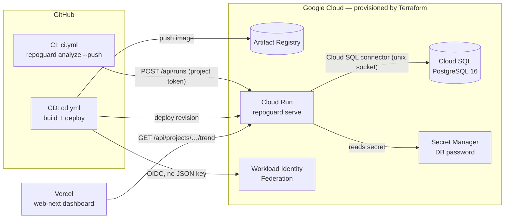
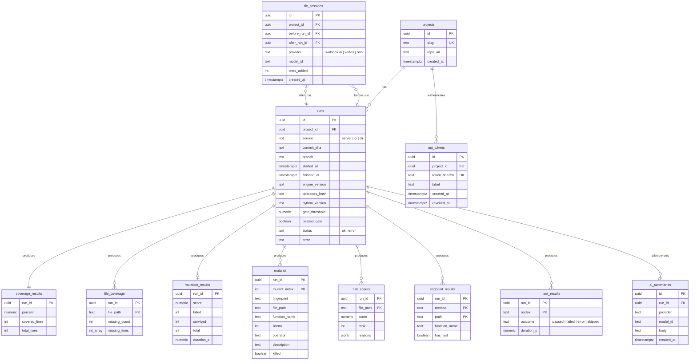

# Data Platform Plan — measurement history, Postgres, Terraform on GCP

> **Status: design only (Phase 17 in `PENDING.md`). Nothing here is built yet.**
> Every number quoted below comes from `CLAUDE.md §7` (measured), and is used
> only as example data. No number in this document is a prediction.

---

## 1. Why a database now

TestMind AI measures one snapshot: coverage, mutation score, gaps, risk.
Each run writes `repoguard-out/*.json` and forgets. That is enough for a
single analysis, and it stays the contract between agents (`CLAUDE.md §4`).

Two facts make a database necessary, not decorative:

1. **Cloud Run's filesystem is ephemeral.** The deployed service
   (`docs/DEPLOY.md`) writes `repoguard-out/` inside a container that
   disappears when the instance scales to zero. On the cloud, history does
   not exist without external storage.
2. **Everything "data-driven" in QA is a time series.** What AI QA tools
   actually use historical data for:

| Practice | What it needs from history | Our equivalent |
|---|---|---|
| Self-healing tests | Past snapshots of a locator/element to match the broken one against | Stable mutant fingerprints: the same weak spot tracked across runs |
| Risk-based test prioritization | Per-file failure/defect rate over time + code churn | `risk_scores` per run + git churn, calibrated against where mutants actually survive |
| Flaky-test detection | Many outcomes of the same test on the same commit | `test_results` per run, keyed by commit |
| Quality trend / regression alerts | A metric per commit | `runs` + `coverage_results` + `mutation_results` per commit |

The product's core claim is *"coverage lies; mutation score tells the
truth"* (demo-repo: 65.1% coverage vs 20.25% mutation). History turns that
from a one-off screenshot into a tracked quantity per commit.

**Scope honesty:** the "self-healing" analogue here is for the *test suite*
(finding where it keeps failing to catch bugs), not DOM-locator healing.
Locator healing would belong to `visual.py` and is out of scope.

---

## 2. Principles (inherited from `CLAUDE.md`, not negotiable)

- **The engine measures; the database only stores.** No metric is computed
  by SQL and written back as a measurement. Derived values (deltas, trends,
  gaps) live in *views*, recomputed from raw rows on every read.
- **Persistence is optional and inert.** With `REPOGUARD_DATABASE_URL`
  unset, the engine behaves byte-for-byte as today. Persistence runs *after*
  measurement and cannot change a number.
- **Layering.** `core.py` gets no DB code. A new `repoguard_engine/store/`
  depends only on `core`'s dataclasses. `pipeline.py` calls it; `cli.py`,
  `web/server.py` and `mcp_server.py` stay thin adapters.
- **Comparability.** Every run stores `engine_version` and
  `operators_hash` (hash of the mutation operator set). Trends are only
  drawn between runs with the same `operators_hash` — a score change caused
  by changing the instrument is not a change in the thing measured.
- **Store raw, derive late.** E.g. the fix-loop "delta" is never stored;
  it is `after.score − before.score` from two stored runs.

---

## 3. Target architecture



Two sources of runs:

| Source | Who measures | How it arrives |
|---|---|---|
| `server` | Cloud Run itself (`/api/analyze?persist=true`) on the bundled `demo-repo` | Direct write |
| `ci` | Any repo's GitHub Actions running `repoguard analyze` on its own code, per commit | `POST /api/runs` with a per-project token |

The `ci` source is the real data-driven story: one measured row per commit,
for any repository, with no code upload to our service.

---

## 4. Database design

### 4.1 Engine changes the schema depends on

The schema can only store what the engine measures. Today the engine
discards two things history needs:

| Gap | Today | Change (small, in `core.py`) |
|---|---|---|
| Per-mutant outcome | `run_mutation` keeps only `surviving_mutant_ids` (positional indexes) | Return `mutants: [{index, file, function, lineno, operator, description, killed}]`. Kept **out** of the compact MCP response (`CLAUDE.md §4`). |
| Stable mutant identity | Index depends on file and site order; shifts when code changes | `fingerprint = sha1(file · enclosing function · operator description · ordinal within that function)`. Survives edits elsewhere in the file; changes if that function is edited — accepted, documented limitation. |
| Per-test outcome | `pytest -q --tb=no`, only the exit code is read | Add `--junitxml=repoguard-out/junit.xml`, parse with stdlib `xml.etree`. No new dependency; no effect on coverage numbers. |

Both changes must pass the §7 determinism checks unchanged (16/79 twice).

### 4.2 Entity-relationship diagram



### 4.3 Table notes

| Table | Maps from engine | Notes |
|---|---|---|
| `runs` | `PipelineResult` + git/CI env | One row per measurement. Index `(project_id, started_at DESC)` and `(project_id, commit_sha)`. |
| `coverage_results` | `CoverageResult` | `numeric(5,2)` — same precision the engine reports, no rounding drift. |
| `file_coverage` | `CoverageResult.missing_lines` | Postgres `int[]`; SQLite stores JSON text (same SQLAlchemy type decorator). |
| `mutation_results` | `MutationResult` | Null row when mutation was not requested (`include_mutation=False`). |
| `mutants` | new per-mutant list (§4.1) | Index on `fingerprint` for cross-run tracking. |
| `risk_scores` | `list[RiskScore]` | `rank` is the engine's sort order, stored, not recomputed. |
| `endpoint_results` | `list[EndpointInfo]` | `file`, `function`, `method`, `path`, `has_test`. |
| `test_results` | new `junit.xml` parse (§4.1) | Enables flaky-test detection. |
| `fix_sessions` | `repoguard fix` before/after runs | Delta is a view, never a column. |
| `ai_summaries` | `narrative.generate_summary` | **Advisory prose.** No view or query joins it into a metric (`CLAUDE.md §9`). |
| `api_tokens` | — | Only the SHA-256 of the token is stored; plaintext shown once at creation. |

Schema creation: `metadata.create_all()` at startup (idempotent, creates
only what's missing). Adopt Alembic the first time a column must change —
not before; for a two-day build it's a part with no job yet.

### 4.4 Views (all derived values live here)

```sql
-- Trend per commit: the "coverage lies" gap over time
CREATE VIEW v_run_trend AS
SELECT r.project_id, r.id AS run_id, r.commit_sha, r.started_at,
       r.operators_hash,
       c.percent                 AS coverage_pct,
       m.score                   AS mutation_pct,
       c.percent - m.score       AS coverage_minus_mutation_pp
FROM runs r
JOIN coverage_results c ON c.run_id = r.id
LEFT JOIN mutation_results m ON m.run_id = r.id
WHERE r.status = 'ok';

-- Which kinds of bugs the suite misses (latest run per project)
CREATE VIEW v_survival_by_operator AS
SELECT r.project_id, mu.operator,
       COUNT(*)                                   AS total,
       COUNT(*) FILTER (WHERE NOT mu.killed)      AS survived,
       ROUND(100.0 * COUNT(*) FILTER (WHERE NOT mu.killed) / COUNT(*), 2)
                                                  AS survival_pct
FROM mutants mu
JOIN runs r ON r.id = mu.run_id
WHERE r.id = (SELECT id FROM runs r2
              WHERE r2.project_id = r.project_id AND r2.status = 'ok'
              ORDER BY started_at DESC LIMIT 1)
GROUP BY r.project_id, mu.operator;

-- Persistent survivors: weak spots the suite has never caught
CREATE VIEW v_persistent_survivors AS
SELECT r.project_id, mu.fingerprint,
       MIN(mu.file_path)      AS file_path,
       MIN(mu.function_name)  AS function_name,
       MIN(mu.description)    AS description,
       COUNT(*)               AS runs_seen,
       MIN(r.started_at)      AS first_seen
FROM mutants mu
JOIN runs r ON r.id = mu.run_id
GROUP BY r.project_id, mu.fingerprint
HAVING BOOL_AND(NOT mu.killed);

-- Flaky tests: same commit, different outcomes
CREATE VIEW v_flaky_tests AS
SELECT r.project_id, r.commit_sha, t.nodeid,
       ARRAY_AGG(DISTINCT t.outcome) AS outcomes, COUNT(*) AS runs
FROM test_results t
JOIN runs r ON r.id = t.run_id
WHERE r.commit_sha IS NOT NULL
GROUP BY r.project_id, r.commit_sha, t.nodeid
HAVING COUNT(DISTINCT t.outcome) > 1;

-- Fix-loop effect, from two stored measurements
CREATE VIEW v_fix_effect AS
SELECT f.id, f.provider, f.model_id, f.tests_added,
       mb.score AS before_pct, ma.score AS after_pct,
       ma.score - mb.score AS delta_pp
FROM fix_sessions f
JOIN mutation_results mb ON mb.run_id = f.before_run_id
JOIN mutation_results ma ON ma.run_id = f.after_run_id;
```

Worked example with the measured §7 numbers: before 20.25% (16/79),
after the reference tests 89.87% (71/79) → `delta_pp = 69.62`;
`coverage_minus_mutation_pp` goes from 44.85 to 10.13.

---

## 5. Risk model v2 — calibrated, not invented

Today `compute_risk` is a one-parameter model:
`risk = uncovered_lines / non_blank_lines`. `PENDING.md` Phase 4 describes
`complexity × churn × (1 − detection)`, which is not what the code does.

History allows the model to be *tested* instead of asserted:

1. **Observable to predict:** per file, the fraction of mutants that survive
   in the *next* run (`mutants` table). It is measured, not a proxy.
2. **Baseline:** Spearman rank correlation between today's `risk` and that
   observable, across all stored runs.
3. **Candidate terms**, added one at a time: git churn (commits touching the
   file in the last N days, from `git log`), mutant density (mutants per
   line).
4. **Acceptance rule (parsimony):** a term stays only if it raises the rank
   correlation on held-out runs by a margin fixed *before* looking at the
   result. Otherwise the simpler model stays.

**Honest limit:** with only `demo-repo` (4 files) there is not enough data
to calibrate anything. During the hackathon this ships as the *pipeline*
that makes calibration possible — not as a calibrated model. Any claim of
improved prediction waits for real multi-repo data.

---

## 6. Charts (web-next dashboard)

Six views, each backed by one view from §4.4. Numbers shown are always
read from the API, never computed in the browser beyond formatting.

| # | Chart | Type | Source | Question it answers |
|---|---|---|---|---|
| 1 | Coverage vs mutation score per commit | Two-line chart, shaded gap | `v_run_trend` | Is the suite getting better at catching bugs, or just running more lines? |
| 2 | Survival by mutation operator | Horizontal bars, sorted | `v_survival_by_operator` | Which bug kinds (boundary `<`/`<=`, arithmetic, `return None`…) slip through? |
| 3 | File risk over time | Heatmap (file × run) | `risk_scores` | Where is risk concentrating? |
| 4 | Before/after fix loop | Slope chart per `fix_sessions` row | `v_fix_effect` | Did the AI-written tests actually move the score? By how much? |
| 5 | Persistent survivors | Table, sorted by `runs_seen` | `v_persistent_survivors` | Which weak spots have never been caught? (feeds the fix loop's priorities) |
| 6 | Flaky tests | Table | `v_flaky_tests` | Which tests are untrustworthy signals? |

Rules: a trend line breaks (new series) when `operators_hash` changes;
empty states say "no runs yet", never a zero.

Library: web-next has no chart dependency today. **Recharts** for charts
1–4 (saves hand-writing axes/tooltips under a deadline; confirm React 19
compatibility at install). Charts 5–6 are plain tables. Follow the repo's
dataviz guidance for colors and light/dark themes when implementing.

---

## 7. API additions (`web/server.py`, thin over `store/`)

| Method | Path | Auth | Returns |
|---|---|---|---|
| `GET` | `/api/analyze?…&persist=true&project=<slug>` | — | Same body as today, plus `run_id` when persisted |
| `POST` | `/api/runs` | `Authorization: Bearer <project token>` | `{run_id}` — ingests a CI-measured result |
| `GET` | `/api/projects` | — | Project list |
| `GET` | `/api/projects/{slug}/runs?limit=50` | — | Run list |
| `GET` | `/api/projects/{slug}/trend` | — | Chart 1 |
| `GET` | `/api/projects/{slug}/operators` | — | Chart 2 |
| `GET` | `/api/projects/{slug}/risk-heatmap` | — | Chart 3 |
| `GET` | `/api/projects/{slug}/fix-effect` | — | Chart 4 |
| `GET` | `/api/projects/{slug}/survivors` | — | Chart 5 |
| `GET` | `/api/projects/{slug}/flaky` | — | Chart 6 |

`POST /api/runs` stores what the client measured; it never recomputes.
Rows keep `source='ci'` and `engine_version` so client-reported and
server-measured runs are always distinguishable.

CLI: `repoguard analyze <repo> --push <url>` reads the token from
`REPOGUARD_TOKEN` and git metadata from `GITHUB_SHA` / `GITHUB_REF_NAME`
(or `git rev-parse` locally).

MCP: optionally one new tool `get_history(project, limit)` with a compact
response. Existing tools are not renamed or removed (`CLAUDE.md §8`).

---

## 8. Infrastructure as code (Terraform)

Today `docs/DEPLOY.md` is a sequence of manual `gcloud` commands and CD
authenticates with a long-lived JSON key. Terraform codifies that setup,
adds the database, and removes the key.

```
infra/terraform/
├── versions.tf      providers: hashicorp/google, hashicorp/random (pin at init)
├── backend.tf       GCS remote state (bucket created once by hand — see step B1)
├── variables.tf     project_id, region, service_name, db_tier, github_repo
├── apis.tf          run, artifactregistry, sqladmin, secretmanager, iam, iamcredentials, sts
├── registry.tf      Artifact Registry (docker)
├── sql.tf           Cloud SQL Postgres 16, database, user
├── secrets.tf       random_password → Secret Manager
├── iam.tf           runtime SA (cloudsql.client, secretAccessor) + deployer SA
├── wif.tf           Workload Identity pool + GitHub OIDC provider, restricted to this repo
├── run.tf           Cloud Run v2 service, Cloud SQL volume, env, public invoker
└── outputs.tf       service_url, sql_connection_name, wif_provider, deployer_sa
```

Key decisions:

| Decision | Choice | Why |
|---|---|---|
| DB network path | Public IP, **no authorized networks**, Cloud SQL connector via unix socket `/cloudsql/<conn>` | No VPC connector to pay for or wire; still unreachable except through IAM-authenticated connector |
| Tier | `db-f1-micro` (Enterprise edition), `deletion_protection = false` | Cheapest shared-core tier for a demo; confirm current price in the GCP pricing calculator; `terraform destroy` after the event |
| Image ownership | Terraform owns the service; CD owns the image. `lifecycle { ignore_changes = [template[0].containers[0].image] }` | Otherwise every `terraform apply` rolls back CD's latest deploy |
| Request timeout | 900 s, 2 vCPU / 2 GiB | A full mutation run on demo-repo takes several minutes (`CLAUDE.md §9`); the 300 s default would cut it |
| CD auth | Workload Identity Federation; `cd.yml` uses `workload_identity_provider` + `service_account` | **Already done** as part of Phase 13, ahead of this phase — see `docs/DEPLOY.md`. Terraform (B1 below) should import the existing pool/provider, not recreate them |
| Frontend | Stays on Vercel, no Terraform | Phase 14's decision stands; only the backend gets IaC |

The app composes its URL from env vars Terraform sets:
`postgresql+psycopg://$DB_USER:$DB_PASSWORD@/$DB_NAME?host=/cloudsql/$SQL_CONNECTION_NAME`
(`DB_PASSWORD` injected from Secret Manager, never in Terraform outputs).

CI addition (`.github/workflows/infra-ci.yml`, path-filtered to `infra/**`):
`terraform fmt -check` and `terraform validate` — both need no credentials.
`plan`/`apply` stay manual for the hackathon.

---

## 9. Stack summary

| Layer | Technology | New? | Justification |
|---|---|---|---|
| Measurement | Existing engine (pytest, coverage.py, AST mutation) | No | — |
| Persistence | SQLAlchemy 2 (Core) | **New**, optional `[db]` extra | One code path for SQLite (local, tests) and Postgres (cloud) |
| Driver | `psycopg[binary]` 3 | **New**, `[db]` extra | Postgres driver; supports the Cloud SQL unix socket |
| Database | Cloud SQL PostgreSQL 16 (cloud) · SQLite (local) | **New** | Arrays, `jsonb`, `FILTER` aggregates for the views |
| API | FastAPI (existing `repoguard serve`) | No | New read/ingest routes only |
| Frontend | Next.js `web-next/` on Vercel + Recharts | Recharts **new** | Charts 1–4 |
| Infra | Terraform + GCS state | **New** | Reproducible GCP setup, replaces manual `DEPLOY.md` steps |
| Auth (CD) | Workload Identity Federation | **New** | No long-lived keys |
| Auth (ingest) | Per-project bearer token, SHA-256 stored | **New** | Minimum needed so only real CI jobs write runs |

Without the `[db]` extra installed, or with `REPOGUARD_DATABASE_URL` unset,
nothing changes for existing users, CI or the MCP server.

---

## 10. Build steps (two-day hackathon order)

Ordered so each block is demoable on its own. Estimates are guesses, not
measurements; the cut line is explicit.

| Block | Steps | Est. | Done when |
|---|---|---|---|
| **A1 — Store** | `store/models.py` (tables §4.2), `store/repository.py` (`save_run`, read queries), `[db]` extra, SQLite tests | 3 h | Round-trip test green on SQLite |
| **A2 — Engine data** | Per-mutant outcomes + fingerprints, `junit.xml` parse (§4.1); `pipeline.py` persists when URL set | 2 h | §7 checks unchanged: 65.1%, 16/79 twice |
| **B1 — Terraform** | State bucket (one `gcloud storage buckets create`), all of §8, `infra-ci.yml` | 3 h | `fmt`/`validate` green; human runs `apply` (~10–15 min, Cloud SQL creation is slow) |
| **B2 — CD on WIF** | ~~Switch `cd.yml` auth~~ already done (Phase 13); remaining: Cloud Run gets DB env + socket | 1 h | Deploy green, `/api/projects` returns `[]` from Postgres |
| **A3 — API + ingest** | §7 routes, `--push` in CLI, CI step pushing each commit's run | 2 h | A commit on `main` appears as a new row |
| **C1 — Charts** | Charts 1, 2, 4 first; 5, 6 as tables; 3 last | 3 h | Dashboard shows before/after demo-repo from stored runs |
| ✂ *cut line* | Everything below is first to drop if time runs short | | |
| **C2 — Heatmap** | Chart 3 | 1 h | |
| **D — User accounts** | Google Identity Platform sign-in in web-next; FastAPI verifies ID tokens; `users` + `project_members` tables; token management UI | 3–4 h | Only members see a project's runs |

Blocks A and B are independent and can run in parallel.

On user accounts: commodity work, low differentiation. The per-project
ingest token (block A3) already covers the one access need the demo has.
Do D only if everything above the cut line is done and verified.

---

## 11. Verification

New `scripts/verify.py phase17`:

| Check | Expected |
|---|---|
| Persistence off: `repoguard analyze ./demo-repo` | Identical to §7 (65.1%, 20.25% 16/79, 4 files with gaps); `repoguard-out/*.json` byte-identical to a run on `main` |
| Persistence on (temp SQLite): pipeline with mutation | Stored `coverage_results.percent = 65.1`, `mutation_results` 16/79 = 20.25 — equal to the returned result, no rounding drift |
| Determinism | Two persisted runs → same `mutants` rows (same fingerprints, same `killed`) |
| After-reference run | Copy `docs/expected-after-tests/*.py`, persist, remove them: stored 71/79 = 89.87; `v_fix_effect.delta_pp = 69.62` |
| Postgres | Same round-trip test in CI against a `postgres:16` service container |
| Terraform | `terraform fmt -check && terraform validate` green |

A PASS on the SQLite round-trip is not proof Postgres works — that is why
the Postgres service-container job exists as a separate, independent check.

---

## 12. Open questions for the team

1. Is a GCP billing account available for Cloud SQL during the event?
   (Cloud Run alone scales to zero; Cloud SQL bills while it exists.)
2. Should `/api/analyze?persist=true` be public on the demo URL, or
   token-gated like `/api/runs`?
3. Keep the public, unauthenticated read routes after the hackathon, or
   put Cloud Run IAM in front (`DEPLOY.md`, "Known limitation")?
