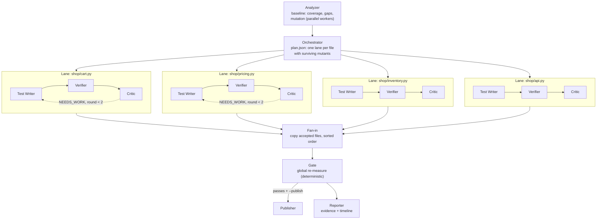

# Multi-Agent Swarm — parallel test-writing agents (implementation plan)

> **Status: planned in detail (Phase 18 in `PENDING.md`), nothing built yet.**
> Today `repoguard fix` runs a sequential loop (`watson_agent/orchestrator.py`)
> — and as of Phase 11, that loop has actually been run live and succeeded:
> `repoguard fix demo-repo --provider vertex` (`gemini-3.8-flash`) took
> demo-repo from 20.25% (16/79) to **89.87% (71/79)** mutation score, real
> credentials, independently re-measured. That is now the swarm's real H1/H2
> baseline, not a hypothetical. §14 below (Session 20) has the corrected,
> step-by-step build plan a planning pass produced after reading the actual
> code, including 4 real bugs the original design below missed and one hard
> limit: demo-repo's mutation ceiling is 71/79, so the swarm can only *tie*
> on quality here (§14 R2) — a harder fixture would be needed to prove H2
> beats the sequential loop, not just matches it.

---

## 1. Goal and the hypotheses it must prove

Rebuild the swarm Bob was designed to run: one Test Writer per source file,
all in parallel, each audited by an independent Critic, with a Gate that
re-measures before anything is published.

Parallelism and extra agents are not goals by themselves. Two claims have to
hold, and both are measurable with the engine we already have:

| Hypothesis | Measured by | Keep the swarm only if |
|---|---|---|
| **H1 — speed:** parallel lanes cut wall-clock time roughly in proportion to the number of files | Wall-clock time of `fix` at `--workers 1` vs `--workers N`, same repo, same model | Time drops measurably |
| **H2 — quality:** a verify step plus an independent critic kills at least as many mutants as today's loop | Final mutation score from the Gate's global re-measure, swarm vs sequential | Score ≥ the sequential loop's real 71/79 — on demo-repo specifically that's already the ceiling (`docs/expected-after-tests` also tops out at 71/79), so H2 there can only show a tie; compare surviving-mutant *fingerprints* too, not just the count (§14 R2) |

If H2 fails, the sequential loop stays the default and the swarm stays behind
a flag. The benchmark harness is shared with Phase 16
([`MULTICLOUD_AI.md`](MULTICLOUD_AI.md#benchmarking-models)).

---

## 2. Bob then, today, target

| | IBM Bob (retired) | Today (`watson_agent/`) | Target (Phase 18) |
|---|---|---|---|
| Shape | 9 modes in `.bob/custom_modes.yaml`: Orchestrator, Analyzer, Fixer, Gate, Visual Agent, Reporter, Test Writer, Critic, Publisher | One loop, `run_fix_loop()` | Orchestrator + parallel lanes (Writer → Verifier → Critic per file) + Gate + Publisher + Reporter |
| Parallel | Designed ("one Test Writer per source file, run in parallel"), never run end to end | No, file by file | Yes, two levels (§5) |
| Coordination | Files in `repoguard-out/` | Function calls in one process | Files in `repoguard-out/swarm/<run_id>/` (§6) + a thread pool |
| Critic | Separate mode, could edit tests, verdict APPROVED / NEEDS-WORK | Same model, same write tool as the writer, free-text notes | Read-only, structured JSON verdict, optionally a different model/provider |
| Retry | "Gate fails after two Test Writer rounds" → blocker | None | Up to 2 rounds per lane, driven by measured survivors |
| "tests/ only" | Node.js hook + prose rule | Hard check in `write_test_file` | Same hard check, narrowed to the lane's own file |
| Status | `.bob/DEPRECATED.md` | Built, run live for real (Phase 11: 89.87%, 71/79) | Planned in detail (§14), not built |

### Mapping Bob's modes to the new agents

| Bob mode | New agent | LLM? | Notes |
|---|---|---|---|
| `orchestrator` | **Orchestrator** | No | Plans from measured data (§4.1). An LLM ordering files adds nothing a sort by surviving mutants doesn't already give. |
| `analyzer` | **Analyzer** | No | The engine, with parallel mutation workers |
| `test-writer` (+ `fixer`) | **Test Writer** ×N | Yes | One per file, parallel, own sandbox |
| — (new) | **Verifier** ×N | No | Scoped mutation run inside the lane's sandbox: which target mutants did the new test kill? |
| `critic` | **Critic** ×N | Yes | Read-only; returns a verdict, doesn't edit |
| `gate` | **Gate** | No | One global, deterministic re-measure after fan-in |
| `publisher` | **Publisher** | No | Today's `_publish()` (git + gh) |
| `reporter` | **Reporter** | No | Evidence report + lane timeline |
| `visual-agent` | — | — | Out of scope for Phase 18 |

The LLM agents are the ones whose job needs judgment (writing and reviewing
tests). Everything that produces a number stays deterministic
(`AGENTS.md §4`: the AI decides, the engine measures).

---

## 3. Problems in today's loop the swarm must fix

Found by reading `watson_agent/orchestrator.py` and `core.py`; each one
limits quality regardless of parallelism.

| # | Problem | Evidence | Fix in the swarm |
|---|---|---|---|
| 1 | The writer gets bare positional mutant IDs, with no description of what each mutant changed | `writer_prompt` passes `surviving_mutant_ids` (a list of ints) | Each lane's task lists its mutants with file, function, line, operator and the mutated line (§4.2) |
| 2 | Every file's writer gets the surviving IDs of the **whole repo** | Same list for every file | Mutants filtered to the lane's file |
| 3 | A file with full line coverage but surviving mutants is never picked | `compute_risk` scores `uncovered / lines`; a fully covered file gets 0 and sorts last. `MAX_FILES_PER_RUN = 3` also skips one of demo-repo's 4 modules. **Update (Session 20):** the real Phase 11 run used only 3 files and still reached the 71/79 ceiling, so don't claim the cap costs quality *on demo-repo* — keep "plan by survivors, no cap" for correctness on repos where it would matter, not as a demonstrated demo-repo win | Plan by surviving mutants per file (§4.1); no fixed 3-file cap |
| 4 | The critic isn't independent | Same model and the same `write_test_file` tool as the writer; free-text output | Read-only tools, structured verdict (§4.4) |
| 5 | No feedback before the final measure | One `run_pipeline` after all files | Per-lane Verifier after each round |
| 6 | `run_mutation` can't be scoped to one file: given a file path it silently finds 0 mutants and returns `total = 0` instead of an error | `rglob("*.py")` on a file path returns nothing (checked on `shop/cart.py`); also exposed through MCP — `mcp_server.tool_run_mutation`'s docstring already promises "subdirectory or file" scoping that doesn't work | S1 accepts a file path, and an empty mutant set becomes an explicit error (`NoMutantsError`, not `RuntimeError` — `cli.py`'s `fix` command labels every `RuntimeError` as "Gate failed") |
| 7 | **(Session 20)** Mutant pytest runs never set `PYTHONDONTWRITEBYTECODE=1` | Neither the baseline pytest in `run_mutation` (`core.py`) nor `measure_coverage` passes it. Confirmed by finding real `.pyc` files under `demo-repo/shop/__pycache__` that then get copied into every mutant tempdir | Same env dict fix already used elsewhere in this repo — pass `env={**os.environ, "PYTHONDONTWRITEBYTECODE": "1"}` to both subprocess calls |
| 8 | **(Session 20)** The baseline-passes check runs in place; mutants run in a tempdir copy | A test that depends on its own path/location can pass the in-place baseline and then fail in *every* tempdir copy — every mutant scores "killed" regardless of the mutation itself. This is the same false-100% bug class `run_mutation()`'s baseline guard was built to catch, reappearing one layer up, undetected by that guard because the baseline itself looked green | A "sham mutant" control: before real mutants, run one `_run_mutant` with the file's *original, unmodified* source in an isolated copy. If that scores "killed", raise — the suite fails in isolation with no mutation applied, so real scores would be inflated |
| 9 | **(Session 20)** Timeouts and copy errors count as "killed" | `_run_mutant` returns `True` (killed) on `TimeoutExpired` or any exception. Parallel workers add CPU contention, making this more likely, not less | Track outcome as `killed \| survived \| timeout \| error` (shares the per-mutant record from Phase 17 A2/S2); scoring stays backward-compatible (non-survived still counts as killed) but timeout/error counts are now visible and reviewable, not silently folded into "killed" |

---

## 4. Agents



### 4.1 Orchestrator (deterministic)

- Input: the Analyzer's baseline (coverage, gaps, per-mutant outcomes).
- Output: `plan.json`, one lane per source file that has ≥ 1 surviving mutant
  or uncovered lines, ordered by surviving-mutant count, then risk score.
- Stop rules carried over from Bob: a lane is **BLOCKED** if killing a
  mutant would need a source change, and the run publishes nothing if the
  Gate shows no improvement.

### 4.2 Test Writer (LLM, one per lane, parallel)

- Task (`task.json`): the file, its uncovered lines, and its surviving
  mutants with `id`, `function`, `lineno`, `operator` and the mutated line.
  This needs the per-mutant records planned in
  [`DATA_PLATFORM.md` §4.1](DATA_PLATFORM.md#41-engine-changes-the-schema-depends-on),
  a shared prerequisite.
- Tools: `read_source_file`, `write_test_file` (write narrowed to **one
  owned path**, `tests/test_<module>_swarm.py` — the guard rejects source
  files, other lanes' files, and anything outside `tests/`), and `run_tests`
  (narrowed the same way — see `watson_agent/tools.py`, added in Phase 11's
  anti-hallucination fix; every lane needs the same grounding the sequential
  loop now has, or it will reproduce the same hallucination bug per-lane).
  Owned-path naming uses the *full* relative path with separators turned
  into `_` (`shop/cart.py` → `test_shop_cart_swarm.py`) to avoid collisions
  between same-named files in different packages.
- Prompt: today's `TEST_WRITER_PROMPT`, plus the mutant list and, in round
  2, the Verifier's list of mutants still alive.
- Rule from `AGENTS.md §4`: a test that fails on the original code is wrong
  unless there's evidence of a real bug, in which case it's marked
  `xfail(reason="possible bug: ...")`.

### 4.3 Verifier (deterministic, per lane)

Runs inside the lane's sandbox after each writer round, **in this order**
(run the suite first, deliberately — `run_mutation()` now raises
`RuntimeError` on a red baseline, so the Verifier should hit that failure
directly and report it, not have the scoped mutation run catch it
indirectly):

1. The full suite must pass on unmodified source (else the round is rejected
   and reported as a suite failure, not a mutation result).
2. Scoped mutation run on **all** of the lane's file's mutants, not only the
   previously-surviving ones — `run_mutation(paths_to_mutate=<file>)`, which
   needs S1's file-path support (§3 #6). Running all of them (not just
   targets) also covers the case where a swarm run overwrites an existing
   owned file from a previous run.
3. Coverage on the sandbox, for the lane's missing lines.
4. Writes `verify-<round>.json`: `newly_killed`, `still_alive`, and
   `regressed` (killed at baseline, alive now — only possible if a lane's
   test somehow weakens coverage of its own file, but must be checked).

**Join key:** mutant IDs from a file-scoped run are positional and start
over at 0 — they do **not** match the global baseline's IDs. The join
between the baseline, a lane's Verifier, and the Gate must use the stable
per-mutant `fingerprint` from Phase 17 A2 / this doc's §14 S2, not the
index.

A lane is ACCEPT-eligible only if the suite is green, `regressed == []`,
and there is at least one new kill or newly-covered line — otherwise it's
`NO_GAIN` and isn't fanned in. These numbers are **feedback for the lane**,
not results. The only reported numbers come from the Gate (§4.5).

### 4.4 Critic (LLM, per lane, read-only)

- Reads the lane's test file, the source file and `verify-<round>.json`.
- No write tool. Returns JSON:

```json
{
  "verdict": "APPROVED | NEEDS_WORK | BLOCKED",
  "weaknesses": [
    {"test": "test_discount_boundary", "issue": "asserts is not None instead of the value", "mutant_ids": [12]}
  ],
  "blocker": null
}
```

- `NEEDS_WORK` with round < 2 sends the weaknesses and the still-alive
  mutants back to the writer. Round 2's result is final either way.
- Independence: the critic can use a different model or provider than the
  writer (§7). Whether that catches more weak tests is part of H2, not an
  assumption.

### 4.5 Gate, Publisher, Reporter (deterministic)

- **Fan-in:** copy each lane's accepted file into the real `tests/`, in
  sorted path order. Lanes own disjoint *files*, so there's no text merge
  conflict — but **not** no runtime conflict: `shop/api.py` has module-level
  singletons (`_inventory = Inventory()`, `_cart = Cart()`), so two lane
  files that each pass alone in their own sandbox can still fail when run
  together. Fan-in must be **incremental**: add accepted files one at a
  time in sorted order into a fresh gate sandbox, running the full suite
  after each addition; if adding a file turns the suite red, drop that lane
  as `REJECTED_AT_FANIN` and record what it conflicted with. Also run a
  stability check (suite passes 3× forward, once in reverse file order,
  and each owned file alone) before trusting the merge — flaky tests are
  exactly what the sham-mutant control (§3 #8) can't catch.
- **Gate:** one global `run_pipeline(include_mutation=True)` on the merged
  repo (which includes the same sham-mutant baseline guard). This is the
  only measurement reported as the result. Pass requires a green suite,
  coverage at/above threshold, **and** `killed > baseline.killed` — a tie
  is not a pass on its own merits, though see §14 R2 for why demo-repo
  specifically can only tie.
- **Publisher:** today's `_publish()`, only if the Gate passes and the score
  improved.
- **Reporter:** today's `_write_evidence()`, extended with the per-lane
  table and `timeline.jsonl`.

---

## 5. Parallelism

### Level 1 — mutation workers (engine, no AI)

Each mutant already runs in its own temp copy of the repo
(`core._run_mutant`), so mutants are independent. Run them in a
`ThreadPoolExecutor` (each thread only waits on a `pytest` subprocess, so
threads are enough), then collect results **sorted by mutant index**. The
result must be byte-identical to the sequential run: 16/79 on demo-repo,
same surviving IDs. Measured previously in a Linux container: 79 mutants in
53 s — **not yet re-measured on Windows**, which is where this project's
current development happens; re-measure and record both before treating H1
numbers as comparable across environments. `run_mutation`'s subprocess call
also needs `PYTHONDONTWRITEBYTECODE=1` passed explicitly in its `env=`
(§3 #7) — today it relies on the caller's ambient environment, which is
fragile.

This level also speeds up every existing command (`analyze --mutation`,
`gate`, CI's `phase3`), with or without the swarm.

### Level 2 — agent lanes

- One lane per planned file, run in a `ThreadPoolExecutor(max_workers=N)`.
  LLM calls are network-bound, so threads fit.
- `N` defaults to `min(lanes, 4)`: bounded by provider rate limits and cost,
  not CPU.
- **Isolation:** each lane works in its own sandbox copy of the repo (same
  technique as `_run_mutant`). A lane's writes and measurements never touch
  another lane's files or the real repo until fan-in.
- Lane failures are contained: an error or timeout marks that lane `FAILED`
  in `result.json`; the other lanes continue.

### Why threads and not separate processes or MCP subagents

Everything runs in one Python process that already imports the engine, so
threads plus per-lane sandboxes give real concurrency without a message bus.
Running each agent as a separate MCP client is still possible (§8), but it
adds a protocol round trip per tool call and doesn't make anything more
parallel.

---

## 6. Communication contract (the blackboard)

Same principle as Bob's (`AGENTS.md §4`): agents don't share memory; they
communicate through files, which also makes every run auditable.

**Two real problems with putting this under `<target-repo>/repoguard-out/`,
found in Session 20's planning pass:** `run_mutation(".")` scans every `.py`
file under the repo root, so any `.py` file snapshotted into the blackboard
(e.g. a lane's draft test) would itself become a mutation target and change
the Gate's `total` count. And `_run_mutant` copies the *whole* repo per
mutant — including the blackboard — multiplying copy cost with every run's
own history. Two fixes, both required: test-file snapshots are saved with a
non-`.py` extension (`writer-N.test.py.txt`, never `.py`), and the
blackboard directory itself is added to `core.COPY_IGNORE` (a new shared
exclusion set, alongside `__pycache__`/`.pytest_cache`, used by both the
mutation copytree and lane sandboxing).

```
<target-repo>/repoguard-out/swarm/<run_id>/
├── plan.json                 Orchestrator: lanes, order, targets per lane
├── lanes/<module>/
│   ├── task.json             Writer input: file, uncovered lines, mutants (§4.2)
│   ├── writer-1.json         Tool calls made, file written, round 1
│   ├── verify-1.json         Verifier: killed / still alive after round 1 (by fingerprint, not index — §4.3)
│   ├── critic-1.json         Critic verdict, round 1
│   ├── writer-2.json         Only if NEEDS_WORK
│   ├── verify-2.json
│   ├── critic-2.json
│   ├── final.test.py.txt     The lane's final test content, checked by sha256 at fan-in
│   └── result.json           ACCEPTED | NO_GAIN | BLOCKED | FAILED, final owned file
├── gate.json                 Global re-measure (the reported numbers)
└── timeline.jsonl            One event per line: lane, agent, start/end, status
```

Every JSON file carries a `"schema": "repoguard.swarm.<kind>/v1"` field.
Writes are atomic (write `x.tmp`, then `os.replace`, atomic on Windows on
the same volume). Each lane writes only under its own `lanes/<id>/`; the
only file with concurrent writers is `timeline.jsonl`, guarded by a
`threading.Lock`. This contract is load-bearing, not just an audit log: a
round-2 writer prompt is rebuilt by reading `verify-1.json`/`critic-1.json`
back from disk, and fan-in copies test content from `final.test.py.txt`
(sha256-checked against `result.json`) — which is what lets a lane's
sandbox be deleted as soon as that lane finishes, rather than kept around
until the whole run ends.

`timeline.jsonl` is what the web UI streams to show agents working in
parallel, and what the benchmark reads for H1's wall-clock numbers.

---

## 7. AI providers per role

Built on Phase 16's `ChatProvider` (`chat(messages, tools) -> dict`,
[`MULTICLOUD_AI.md`](MULTICLOUD_AI.md#proposed-architecture)):

```bash
export REPOGUARD_AI_PROVIDER=watsonx          # default for every role
export REPOGUARD_WRITER_PROVIDER=watsonx      # optional per-role override
export REPOGUARD_CRITIC_PROVIDER=vertex       # e.g. critic on a different provider
```

Phase 16 is **not a blocker**: without it, both roles use watsonx.ai with
their own prompts, exactly as today. Phase 16 adds the option of a critic
on a different model, and Phase 16's open question (per-call provider
override) gets answered here: per role.

---

## 8. Entry points

| Surface | Change |
|---|---|
| CLI | `repoguard fix <repo> --swarm [--workers N] [--rounds 2] [--publish]`. Without `--swarm`, today's sequential loop runs unchanged, and it stays as the comparison baseline. |
| Engine | `run_mutation(..., workers=N)`; `repoguard analyze --mutation --workers N` |
| Web | `/api/stream` emits `lane_started`, `lane_verified`, `lane_done`, `gate` events from `timeline.jsonl`; web-next gets a lanes view (one row per agent lane, live status) |
| MCP | Optional new tool `run_swarm(repo_path, workers, detail=False)`, compact by default. No existing tool renamed or removed (`AGENTS.md §8`). |
| External swarm | The 9 MCP tools already let any MCP client (e.g. Claude Code with subagents) run its own swarm; document a recipe, no code needed |

---

## 9. Code layout

```
repoguard_engine/swarm/
├── __init__.py
├── plan.py          Orchestrator: baseline → plan.json
├── sandbox.py       Per-lane repo copy, cleanup guaranteed (try/finally)
├── guard.py         Owned-path write guard (narrows watson_agent/tools.write_test_file)
├── lane.py          Writer → Verifier → Critic → (revise) state machine
├── verify.py        Scoped mutation + suite-on-original check
├── blackboard.py    Read/write the §6 files
└── runner.py        ThreadPool fan-out, fan-in, Gate, Publisher, Reporter
```

Reused as-is: `watson_agent/prompts.py` (extended), `watson_agent/tools.py`
(`read_source_file`), `_publish()` and `_write_evidence()` (moved to be
shared), `pipeline.run_pipeline`, `core.run_mutation`. Layering: `swarm/`
depends on `pipeline`/`core` and the provider layer; `cli.py`,
`web/server.py` and `mcp_server.py` stay thin adapters.

---

## 10. Build order (superseded — see §14)

The original estimate-only table below is kept for history. §14 (Session
20) replaces it with a step-by-step plan written after reading the actual
current code (including the not-yet-merged `run_tests` tool), each step
with exact files and a real `verify.py` check — use §14, not this table,
when actually building.

| Block | Work | Est. | Done when |
|---|---|---|---|
| **S1** | Parallel mutation workers (`workers=N`), results ordered by index; `paths_to_mutate` accepts a single file; zero mutants is an error | 2 h | `workers=1` and `workers=4` both give 16/79, same surviving IDs; wall time recorded |
| **S2** | Per-mutant records (shared with Phase 17 A2) | 1.5 h | Each mutant has id, file, function, lineno, operator, killed |
| **S3** | Sandbox + owned-path guard, with unit tests | 2 h | A lane can't write source, another lane's file, or outside `tests/` |
| **S4** | Lane state machine + thread pool + blackboard files | 3 h | Lanes run concurrently; `timeline.jsonl` shows overlap |
| **S5** | Read-only critic with JSON verdict; round-2 feedback | 1 h | NEEDS_WORK triggers exactly one revision |
| **S6** | Fan-in, Gate, Publisher, Reporter | 1.5 h | Gate is the only reported number |
| **S7** | Stub provider end-to-end test (no credentials, §11) | 1.5 h | Swarm reaches the documented "after" numbers |
| ✂ *cut line* | | | |
| **S8** | SSE lane events + web-next lanes view | 3 h | Parallel agents visible live in the dashboard |
| **S9** | Per-role providers (needs Phase 16) | 1 h | Critic on a different provider |
| **S10** | "Swarm over MCP" recipe for external clients | 1 h | Doc only |

---

## 11. Verification (`scripts/verify.py phase18`)

| Check | Expected |
|---|---|
| Mutation determinism under parallelism | `workers=1` and `workers=4` on demo-repo: both 20.25% (16/79), identical surviving IDs; both wall times printed |
| Guard | Writing source, another lane's owned file, or a path outside `tests/` raises `SourceEditRejected` |
| Sandbox cleanup | No lane sandbox left on disk after the run, including after a lane failure |
| Stub end-to-end, no credentials | A scripted provider whose writer for each module writes the matching `docs/expected-after-tests/test_<module>_complete.py` content to its owned file, and whose critic approves. Run on a temp copy of demo-repo; the Gate must measure the documented "after" numbers (71 passed, 100% coverage, 89.87% = 71/79). This exercises planning, lanes, guard, fan-in and Gate end to end. |
| Real run (human-gated) | `repoguard fix demo-repo --swarm` with real watsonx.ai credentials, same as Phase 11 |
| H1 / H2 benchmark | Sequential vs swarm, same model and repo: wall time and final mutation score, both from real runs |

A PASS on the stub test proves the plumbing, not the AI. H2 can only be
answered by the real, credentialed runs.

---

## 12. Risks and limits

- **Cost and rate limits** grow with `--workers`: N lanes × up to 2 rounds ×
  2 LLM agents. `--workers` is capped, and the default stays small.
- **LLM output is not deterministic.** Two swarm runs can write different
  tests. Each run's *measurement* is still deterministic; the report always
  comes from the Gate.
- **Overlapping tests.** Two lanes can test the same behavior (e.g. `api.py`
  exercising `cart.py`). That's redundant but harmless, since files never
  conflict.
- **Cloud Run CPU.** The Phase 17 plan gives the service 2 vCPU; parallel
  mutation beyond 2 workers won't speed up there.
- **Not a claim yet.** Until H1 and H2 are measured, the README describes
  the swarm as planned, not as a result.

---

## 13. Dependencies on other phases

| Phase | Relationship |
|---|---|
| 11 — first live `repoguard fix` | Gives the real sequential baseline (89.87%, 71/79) the swarm is compared against — done |
| 16 — `ChatProvider`, Vertex AI | Optional: enables per-role providers (S9) — done |
| 17 — data platform | Shares S2 (per-mutant records); swarm runs can be stored as `fix_sessions` rows for the before/after chart |
| **Not yet merged** | Phase 18 can't branch until `feat/11-gemini3-antihallucination` (the `run_tests` tool, `watson_agent/tools.py`) lands on `main` — the lane Verifier and both writer/critic toolsets depend on it existing (§14 R1) |

---

## 14. Session 20 planning pass — corrected step-by-step build plan

A planning pass (isolated worktree, read-only) went through the actual
current code — including the not-yet-merged `run_tests` tool on
`feat/11-gemini3-antihallucination` — rather than re-deriving the plan from
this doc alone. §§3, 4.2, 4.3, 4.5, 5, 6 above already carry its
corrections inline. This section is the step-by-step build order it
produced, replacing §10, and the full risk list, replacing/extending §12.

Every step lands on its own `feat/18-swarm-*` branch/PR (`AGENTS.md §11`),
adds a `verify.py` key, and must keep `phase3` (16/79), `phase16`,
`multicloud`, and every prior `phase18-*` check passing. The sequential
`repoguard fix` stays the default throughout — `--swarm` is opt-in from S6
onward, and nothing before S6 touches the CLI surface at all.

### Step 0 — groundwork, no behavior change

- `watson_agent/orchestrator.py`: parameterize `_run_chat_stage(model,
  system, user, repo, *, schemas=TOOL_SCHEMAS, registry=TOOL_REGISTRY)`,
  returning `StageResult(content, tool_calls, wall_s)`; `run_fix_loop` keeps
  identical behavior via `.content`. Add keyword-only `model: ChatProvider |
  None = None` injection (not exposed on the CLI) so tests can inject a
  scripted provider. Add `wall_s` per stage + a total to `FixResult` and
  `_write_evidence` — the real Phase 11 evidence recorded no wall time, and
  H1 needs one.
- New `repoguard_engine/testing/scripted_provider.py` (never wired into
  `get_provider()`, so `multicloud`'s "unknown provider fails loud" check
  still holds): a `ScriptedProvider(script)` implementing `ChatProvider.chat`
  that decides role from the system prompt and returns canned tool calls,
  recording every prompt for tests to assert on. First script,
  `reference_writer`: for lane file `shop/<m>.py`, calls `write_test_file`
  with `docs/expected-after-tests/test_<m>_complete.py`'s content, then
  `run_tests`, then returns text.
- `scripts/verify.py`: new `check_phase18_seq_stub` — copy demo-repo to a
  tempdir (skip `__pycache__`/`.pytest_cache`/`repoguard-out`/
  `watson-evidence`), run `run_fix_loop(tmp, model=ScriptedProvider(...))`,
  assert the after-numbers and that timing fields exist. **The expected
  number isn't known in advance** (depends on which 3 files the risk-based
  planner picks) — measure it once for real and pin it with a comment,
  don't guess. This gives the *existing* sequential loop its first
  credential-free regression test, before anything else changes.

### Step 1 (S1) — engine: parallel workers, file scope, zero-mutant error, env/copy fixes, sham-mutant control

`core.py`:
- `run_mutation(repo, paths_to_mutate=".", tests_dir="tests", *, workers:
  int = 1, executor: Executor | None = None)`; `ThreadPoolExecutor(workers)
  .map(...)` (or a passed-in `executor`) — `.map` preserves input order, so
  surviving IDs stay identical to the sequential run.
- `if mutate_root.is_file(): py_files = [mutate_root]` (must be a `.py`
  outside `tests_dir`); exclude `repoguard-out`/`watson-evidence` from
  `py_files`; zero mutants raises `NoMutantsError(ValueError)` — deliberately
  **not** a `RuntimeError` subclass, since `cli.py`'s `fix` labels every
  `RuntimeError` as "Gate failed".
- Pass `env={**os.environ, "PYTHONDONTWRITEBYTECODE": "1"}` to both the
  baseline pytest in `run_mutation` and to `measure_coverage` (§3 #7).
- New shared `COPY_IGNORE = shutil.ignore_patterns("__pycache__",
  ".pytest_cache", "repoguard-out", "watson-evidence", ".git")`, used by
  `_run_mutant`'s `copytree` (this changes the measurement path, so 16/79
  must be re-verified in the same PR) and later by lane sandboxing (S3).
- **Sham-mutant control** (§3 #8): before real mutants, run one
  `_run_mutant` with the file's unmodified source; if it reports "killed",
  raise — the suite fails in an isolated copy with no mutation applied, so
  scores would be inflated. Costs one extra pytest run.
- Also: `pipeline.run_pipeline(..., mutation_workers=1)`, `cli analyze
  --workers`, `mcp_server.tool_run_mutation(workers=1)` (unchanged compact
  output; `{"error": ...}` on `NoMutantsError`).

Verify (`phase18-s1`, on a clean temp demo-repo copy):
1. `workers=1` and `workers=4` on `shop` both give `20.25 16 63 79`,
   identical `surviving_mutant_ids` — print both wall times.
2. File-scoped runs on each of `shop/{api,cart,inventory,pricing}.py`: each
   total > 0, **Σtotal == 79 and Σkilled == 16** (proves file scoping
   without needing S2).
3. `paths_to_mutate="shop/__init__.py"` raises `NoMutantsError`.
4. **Reproduce the false-positive class directly**: add a test asserting
   `"repoguard_mutant_" not in __file__`. Today this reports 79/79 killed;
   after the fix, `run_mutation` must raise instead.
5. No `__pycache__` anywhere under the temp copy after the run.
6. `phase3` still passes.

### Step 2 (S2) — per-mutant records (shared with Phase 17 A2)

- Each transformer records the `lineno` it mutates. `_Mutant` gains
  `operator`, `lineno`, `function` (parent map), `original_line`, and
  `fingerprint = sha1(file · function · description · ordinal-in-function)`
  — matching `docs/DATA_PLATFORM.md` §4.1 exactly (shared schema).
  Fingerprints are stable specifically *because* lanes can never edit
  source, which is what makes them a valid join key between the baseline, a
  lane's Verifier, and the Gate (§4.3's join-key note).
- `_run_mutant` returns `killed | survived | timeout | error` (§3 #9);
  scoring unchanged (non-survived still counts as killed), so 16/79 holds.
- `MutationResult.mutants: list[MutantRecord]` → `mutation.json`; dashboard
  and MCP compact output unchanged, records only appear with `detail=True`.

Verify (`phase18-s2`): 79 records, 16 killed, no null fields, unique
fingerprints; two runs give identical record lists; per-file scoped-run
fingerprints are a subset of the full run's with matching `killed` values;
`timeout == 0` and `error == 0` on demo-repo (print them — investigate,
don't pin, if either is nonzero).

### Step 3 (S3) — sandbox + owned-path guard

New `swarm/sandbox.py`: `lane_sandbox(repo, lane_id)` context manager —
`tempfile.mkdtemp(prefix=f"repoguard_lane_{lane_id}_")` + `copytree(...,
ignore=core.COPY_IGNORE)`, cleanup in `finally` with a Windows-safe rmtree
`onerror` handler (clear read-only bit, retry) that still checks
`exists()` afterward and records a leak rather than silently swallowing it.
Sandboxes live in the OS temp dir, never inside the target repo. **Import
probe**: inside the sandbox, run `sys.executable -c "import shop; print(
shop.__file__)"` — the resolved path must be inside the sandbox, or raise
`SandboxLeak` (an editable install would otherwise let sandboxed code
import the *original* source — a pre-existing hazard for plain mutation
too, see R8 below).

New `swarm/guard.py`: `writer_toolset(sandbox, owned)` → `(schemas,
registry)` — `read_source_file` (rooted at the sandbox), `write_test_file`
(wrapper requiring `resolve(target) == resolve(owned)`, else
`SourceEditRejected` naming the owned path, then delegating to the real
`tools.write_test_file` as a second guard layer), `run_tests` (same
narrowing). `critic_toolset` gets only `read_source_file` + `run_tests`.
**`watson_agent/tools.py` itself is not modified** — narrowing its guard by
wrapping keeps `AGENTS.md §8`'s "ask before changing the write guard" rule
intact; this only adds a *stricter* layer on top.

Verify (`phase18-s3`): owned write succeeds; `SourceEditRejected` for
`shop/cart.py`, another lane's owned file, `tests/conftest.py`,
`tests/../shop/cart.py`, `../x.py`, and an absolute path into the real
repo's `tests/`; a sha256 manifest of the real demo-repo is unchanged
before/after; import probe resolves inside the sandbox; sandbox is gone
after both a normal exit and an exception inside the context manager;
`phase16` still passes.

### Step 4 (S4) — plan, blackboard, Verifier, lane state machine, thread pool

Python API only in this step — no CLI flag yet (that's S6), nothing touches
the real `tests/`.

- `swarm/plan.py`: `build_plan(baseline) -> Plan` — one lane per file with
  ≥1 surviving mutant or uncovered line, sorted by `(−survivors, −risk,
  path)`, no cap; snapshots a sha256 manifest of the real `tests/`.
- `swarm/blackboard.py`: as corrected in §6 above (atomic writes, one
  writer per file, `timeline.jsonl` behind a lock, `.test.py.txt`
  snapshots, `COPY_IGNORE` includes the blackboard dir).
- `swarm/verify.py` (the lane Verifier): as corrected in §4.3 (suite first,
  then all-mutants scoped run joined by fingerprint, then coverage).
- `swarm/lane.py`: states `WRITING(r) → VERIFYING(r) → [CRITIQUING(r), S5]
  → ACCEPTED | NO_GAIN | FAILED | BLOCKED`, revise → `WRITING(r+1)` while
  `r < rounds`. In S4, revise triggers on a red suite or non-empty
  `still_alive`. **Best round wins**: green first, then most kills, then
  lower round number — a worse round 2 never replaces round 1. Each lane
  gets its own provider instance from a `provider_factory` (SDK clients'
  thread-safety across lanes hasn't been verified — R14).
- `swarm/runner.py`: `run_lanes(repo, plan, provider_factory, workers,
  rounds, mutation_workers)`. **All sandboxes created serially, up front**,
  before any lane starts (so no `copytree` races a blackboard write). Lanes
  run in `ThreadPoolExecutor(workers)`. **One shared** mutation pool
  (`ThreadPoolExecutor(mutation_workers)`, default `os.cpu_count()`) passed
  to every Verifier — caps concurrent pytest processes at lanes × 1 pool
  instead of lanes × its-own-pool, and avoids a nested-pool deadlock. Each
  lane wrapped in `try/except Exception` → `FAILED`; a runner-level
  `finally` cleans up every sandbox regardless.

Verify (`phase18-s4`, `ScriptedProvider` on a temp demo-repo copy,
`workers=4`): 4 lanes all ACCEPTED round 1, `regressed == []`,
`newly_killed > 0` each (print and pin after first real measurement);
`timeline.jsonl` shows ≥2 lanes with overlapping start/end; the real
`tests/` manifest is unchanged and no recorded sandbox path still exists
(check recorded paths, not a glob — concurrent runs share the temp dir); a
failing-writer script → that lane `FAILED` after 2 rounds, others
`ACCEPTED`; an exception-raising script → that lane `FAILED`, others
unaffected; `workers=1` and `workers=4` give identical `verify-1.json`
records.

### Step 5 (S5) — read-only critic with JSON verdict (S9 folded in)

- `prompts.py`: new `SWARM_CRITIC_PROMPT` (no write tool, must call
  `run_tests`, replies only with the §4.4 JSON) and a `SWARM_WRITER_ADDENDUM`
  — the sequential `CRITIC_PROMPT`/`TEST_WRITER_PROMPT` are untouched.
- `lane.py`: parser takes the first JSON object, validates the verdict
  enum; on failure, re-ask once ("JSON only"), then record
  `verdict: UNPARSEABLE` and don't revise. Revise on `NEEDS_WORK` or a red
  suite while `r < rounds`. **Acceptance always comes from the Verifier;
  the critic is advisory only.** S9 folds in here: `provider_factory(role)`
  reads `REPOGUARD_WRITER_PROVIDER`/`REPOGUARD_CRITIC_PROVIDER`, falling
  back to `--provider` then `REPOGUARD_AI_PROVIDER`.

Verify (`phase18-s5`): NEEDS_WORK then APPROVED → exactly 2 writer calls,
round-2 prompt contains the round-1 weakness text; NEEDS_WORK twice → still
exactly 2 rounds (cap respected); garbage output → UNPARSEABLE, 1 round;
critic's tool schema is exactly `{read_source_file, run_tests}`; a scripted
critic calling `write_test_file` gets "no such tool" and the file's sha256
is unchanged.

### Step 6 (S6) — fan-in, Gate, Publisher, Reporter, `--swarm` CLI flag

- `swarm/fanin.py`: as corrected in §4.5 (abort on a changed `tests/`
  manifest; incremental gate-sandbox merge one file at a time, dropping
  conflicts as `REJECTED_AT_FANIN`; stability check — 3× forward, once
  reversed file order, each owned file alone — dropping lanes
  reverse-sorted until green if it fails; copy surviving files into the
  real `tests/` from sha256-checked blackboard snapshots).
- Gate: `run_pipeline(real_repo, include_mutation=True,
  mutation_workers=M)` (includes S1's sham control + baseline guard, the
  only reported numbers). On any raise: roll back (delete fan-in's files,
  restore any overwritten file from snapshot), write `gate.json {error}`,
  exit 1. Pass = green suite + coverage ≥ threshold + `killed >
  baseline.killed`. `gate.json` also records (informational only, not
  pass/fail): per-file attribution (`baseline_killed`,
  `lane_isolated_killed`, `gate_killed`), the union-of-lane-kills vs.
  Gate's-kills delta, timeout/error counts, suite wall time.
- Move `_publish`/`_write_evidence` to `watson_agent/evidence.py`;
  `orchestrator.py` re-imports them (sequential behavior identical). New
  Reporter writes `watson-evidence/NN-swarm.md`: lane table (status,
  rounds, new kills, verdict, wall_s) + H1 phase timings.
- CLI: `repoguard fix --swarm [--workers N (default min(lanes,4))]
  [--rounds 2] [--mutation-workers M] [--publish]`. `--mutation-workers`
  also applies to the *sequential* loop, so an H1 comparison is apples to
  apples (R3). Without `--swarm`, the code path is byte-for-byte unchanged.

Verify (`phase18-s6`): a conflict script (lane A adds to `shop.api._cart`
at import time, lane B asserts an empty cart; each passes alone) → after
fan-in, the later-sorted lane is `REJECTED_AT_FANIN`, Gate is green, real
`tests/` has only the accepted files; changing `tests/` mid-run → fan-in
aborts, manifest unchanged; forcing the Gate to raise (monkeypatch
`run_pipeline`) → rollback fires, manifest unchanged; `repoguard fix --help`
shows `--swarm`; `phase18-seq-stub` still passes.

### Step 7 (S7) — credential-free end-to-end run, `phase18` aggregate + CI

Run on a clean temp demo-repo copy with `reference_writer` + an APPROVED
critic. `run_swarm(workers=4)` must give `gate.json` with **71 passed,
coverage 100.0, mutation 89.87 (71/79)**, all 4 lanes `ACCEPTED`, no
sandboxes left, real demo-repo untouched, lane overlap in the timeline.
`workers=1` must give an identical Gate and identical surviving
fingerprints. (Caveat: owned-file naming changes pytest's file order vs.
the documented `*_complete.py` layout; the reference files' autouse reset
fixture should make the numbers match regardless — if they don't,
investigate, don't re-pin.) Add a `phase18` CI job; check its runtime on a
2 vCPU runner (R11).

### Step 8 — real runs, H1/H2 benchmark (human-gated, credentialed, separate from the above)

New `scripts/bench_swarm.py` (same pattern as `verify.py`). Both arms use
`--provider vertex`/`gemini-3.8-flash`, a fresh demo-repo copy per run, and
**the same `--mutation-workers M`** (fairness, R3). 3 runs per arm,
recording total + per-phase wall time, Gate killed/79, surviving
fingerprints, LLM call count. **Keep the swarm only if**: H1 — median swarm
wall time < median sequential wall time; H2 — every swarm run reaches
≥71/79, survivors reported against the sequential run's 8. README numbers
come only from these real runs.

### Risks and open decisions (R1–R15)

Flagged rather than decided silently — each needs a call before or during
the relevant step:

| # | Risk / decision | Notes |
|---|---|---|
| R1 | `run_tests` isn't merged yet | Phase 18's base depends on `feat/11-gemini3-antihallucination` landing on `main` first |
| R2 | demo-repo can't demonstrate H2 | 71/79 is the ceiling (matches the hand-written reference tests too) — decide: accept a tie as success, or add a second, harder fixture (touching demo-repo is an `AGENTS.md §8` ask-first item) |
| R3 | H1 fairness | S1 speeds up the *sequential* loop too — compare at equal `--mutation-workers`. The real Phase 11 run recorded no wall time; sequential needs a re-run once Step 0's timing lands |
| R4 | The swarm may genuinely be slower | Extra Verifier mutation runs, a second round, fan-in checks, and the slowest lane sets the critical path — on a 4-file repo, H1 could fail for real |
| R5 | Rate limits, no retry/backoff | Up to N lanes × 2 agents × 2 rounds of calls; watsonx free-tier 429s are already documented (Phase 16) with no retry wrapper on either provider — needs one, and how each SDK signals a 429 still needs checking |
| R6 | Timeouts counted as kills | CPU contention under parallel workers can inflate scores; S2 makes the count visible — decide whether a nonzero timeout count should fail the Gate |
| R7 | `NoMutantsError` on a trivial whole-repo `analyze` | Changes today's silent `0.0` result — decide on scope (probably fine, but a real behavior change) |
| R8 | Editable installs defeat both sandboxes and mutant copies | The import probe (S3) detects it; decide between refusing to run or forcing `PYTHONPATH` |
| R9 | New `COPY_IGNORE` (includes `.git`) changes the measurement path | 16/79 and 71/79 must be re-verified once it's added, not assumed unaffected |
| R10 | An owned file already exists from an earlier swarm run | Plan: overwrite it, protected by the `regressed == []` check; alternative is refusing outright |
| R11 | CI time for `phase18` on 2 vCPU runners | Cloud Run's own 2 vCPU cap (Phase 17) also limits real mutation-worker parallelism there |
| R12 | `BLOCKED` lanes with green tests | Keep their tests (recommended) or drop them — undecided |
| R13 | `_publish()` on a target that's a subfolder of *this* repo | demo-repo lives inside `ibm-bob-mcp-agent-guard` itself — branch/commit would happen in the outer repo. Pre-existing issue, not new to the swarm |
| R14 | Windows specifics | rmtree failures hidden today by `ignore_errors`, `MAX_PATH` limits, Ctrl-C can't interrupt an in-flight LLM call — cleanup relies on per-lane `finally` + a runner-level `finally` |
| R15 | Cross-lane "compensation" must never let a broken lane through | Acceptance is per-lane, based only on its own sandbox (original tests + its file) — a lane red alone never reaches fan-in. The Gate's attribution numbers are informational only, since legitimate cross-module kills exist (e.g. `api` tests killing `cart` mutants) |
