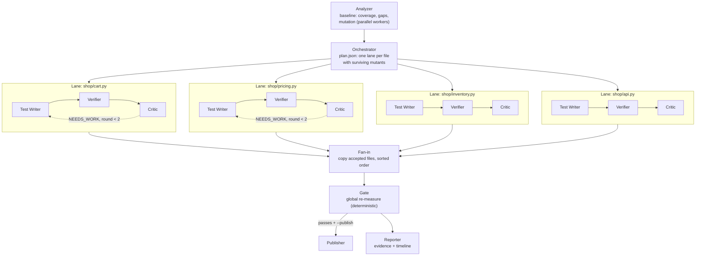

# Multi-Agent Swarm — parallel test-writing agents (implementation plan)

> **Status: design only (Phase 18 in `PENDING.md`). Nothing here is built yet.**
> Today `repoguard fix` runs a sequential loop (`watson_agent/orchestrator.py`).
> This document plans the return to a real parallel multi-agent swarm, the
> design IBM Bob had in `.bob/custom_modes.yaml`, rebuilt in-process on
> watsonx.ai (and Vertex AI once Phase 16 lands).

---

## 1. Goal and the hypotheses it must prove

Rebuild the swarm Bob was designed to run: one Test Writer per source file,
all in parallel, each audited by an independent Critic, with a Gate that
re-measures before anything is published.

Parallelism and extra agents are not goals by themselves. Two claims have to
hold, and both are measurable with the engine we already have:

| Hypothesis | Measured by | Keep the swarm only if |
|---|---|---|
| **H1 — speed:** parallel lanes cut wall-clock time roughly in proportion to the number of files | Wall-clock time of `fix` at `--workers 1` vs `--workers N`, same repo, same model | Time drops measurably |
| **H2 — quality:** a verify step plus an independent critic kills more mutants than today's loop | Final mutation score from the Gate's global re-measure, swarm vs sequential | Score ≥ the sequential loop's |

If H2 fails, the sequential loop stays the default and the swarm stays behind
a flag. The benchmark harness is shared with Phase 16
([`MULTICLOUD_AI.md`](MULTICLOUD_AI.md#benchmarking-models)).

---

## 2. Bob then, today, target

| | IBM Bob (retired) | Today (`watson_agent/`) | Target (Phase 18) |
|---|---|---|---|
| Shape | 9 modes in `.bob/custom_modes.yaml`: Orchestrator, Analyzer, Fixer, Gate, Visual Agent, Reporter, Test Writer, Critic, Publisher | One loop, `run_fix_loop()` | Orchestrator + parallel lanes (Writer → Verifier → Critic per file) + Gate + Publisher + Reporter |
| Parallel | Designed ("one Test Writer per source file, run in parallel"), never run end to end | No, file by file | Yes, two levels (§5) |
| Coordination | Files in `repoguard-out/` | Function calls in one process | Files in `repoguard-out/swarm/<run_id>/` (§6) + a thread pool |
| Critic | Separate mode, could edit tests, verdict APPROVED / NEEDS-WORK | Same model, same write tool as the writer, free-text notes | Read-only, structured JSON verdict, optionally a different model/provider |
| Retry | "Gate fails after two Test Writer rounds" → blocker | None | Up to 2 rounds per lane, driven by measured survivors |
| "tests/ only" | Node.js hook + prose rule | Hard check in `write_test_file` | Same hard check, narrowed to the lane's own file |
| Status | `.bob/DEPRECATED.md` | Built, never run live (Phase 11) | Design |

### Mapping Bob's modes to the new agents

| Bob mode | New agent | LLM? | Notes |
|---|---|---|---|
| `orchestrator` | **Orchestrator** | No | Plans from measured data (§4.1). An LLM ordering files adds nothing a sort by surviving mutants doesn't already give. |
| `analyzer` | **Analyzer** | No | The engine, with parallel mutation workers |
| `test-writer` (+ `fixer`) | **Test Writer** ×N | Yes | One per file, parallel, own sandbox |
| — (new) | **Verifier** ×N | No | Scoped mutation run inside the lane's sandbox: which target mutants did the new test kill? |
| `critic` | **Critic** ×N | Yes | Read-only; returns a verdict, doesn't edit |
| `gate` | **Gate** | No | One global, deterministic re-measure after fan-in |
| `publisher` | **Publisher** | No | Today's `_publish()` (git + gh) |
| `reporter` | **Reporter** | No | Evidence report + lane timeline |
| `visual-agent` | — | — | Out of scope for Phase 18 |

The LLM agents are the ones whose job needs judgment (writing and reviewing
tests). Everything that produces a number stays deterministic
(`AGENTS.md §4`: the AI decides, the engine measures).

---

## 3. Problems in today's loop the swarm must fix

Found by reading `watson_agent/orchestrator.py` and `core.py`; each one
limits quality regardless of parallelism.

| # | Problem | Evidence | Fix in the swarm |
|---|---|---|---|
| 1 | The writer gets bare positional mutant IDs, with no description of what each mutant changed | `writer_prompt` passes `surviving_mutant_ids` (a list of ints) | Each lane's task lists its mutants with file, function, line, operator and the mutated line (§4.2) |
| 2 | Every file's writer gets the surviving IDs of the **whole repo** | Same list for every file | Mutants filtered to the lane's file |
| 3 | A file with full line coverage but surviving mutants is never picked | `compute_risk` scores `uncovered / lines`; a fully covered file gets 0 and sorts last. `MAX_FILES_PER_RUN = 3` also skips one of demo-repo's 4 modules | Plan by surviving mutants per file (§4.1); no fixed 3-file cap |
| 4 | The critic isn't independent | Same model and the same `write_test_file` tool as the writer; free-text output | Read-only tools, structured verdict (§4.4) |
| 5 | No feedback before the final measure | One `run_pipeline` after all files | Per-lane Verifier after each round |
| 6 | `run_mutation` can't be scoped to one file: given a file path it silently finds 0 mutants and returns `total = 0` instead of an error | `rglob("*.py")` on a file path returns nothing (checked on `shop/cart.py`) | S1 accepts a file path, and an empty mutant set becomes an explicit error |

---

## 4. Agents



### 4.1 Orchestrator (deterministic)

- Input: the Analyzer's baseline (coverage, gaps, per-mutant outcomes).
- Output: `plan.json`, one lane per source file that has ≥ 1 surviving mutant
  or uncovered lines, ordered by surviving-mutant count, then risk score.
- Stop rules carried over from Bob: a lane is **BLOCKED** if killing a
  mutant would need a source change, and the run publishes nothing if the
  Gate shows no improvement.

### 4.2 Test Writer (LLM, one per lane, parallel)

- Task (`task.json`): the file, its uncovered lines, and its surviving
  mutants with `id`, `function`, `lineno`, `operator` and the mutated line.
  This needs the per-mutant records planned in
  [`DATA_PLATFORM.md` §4.1](DATA_PLATFORM.md#41-engine-changes-the-schema-depends-on),
  a shared prerequisite.
- Tools: `read_source_file` and `write_test_file`, with the write narrowed
  to **one owned path**, `tests/test_<module>_swarm.py`. The guard rejects
  source files, other lanes' files, and anything outside `tests/`.
- Prompt: today's `TEST_WRITER_PROMPT`, plus the mutant list and, in round
  2, the Verifier's list of mutants still alive.
- Rule from `AGENTS.md §4`: a test that fails on the original code is wrong
  unless there's evidence of a real bug, in which case it's marked
  `xfail(reason="possible bug: ...")`.

### 4.3 Verifier (deterministic, per lane)

Runs inside the lane's sandbox after each writer round:

1. The full suite must pass on unmodified source (else the round is rejected).
2. Scoped mutation run on the lane's file only
   (`run_mutation(paths_to_mutate=<file>)`, which needs S1's file-path support: §3 #6).
3. Writes `verify-<round>.json`: which target mutants are now killed, which
   still survive.

These numbers are **feedback for the lane**, not results. The only reported
numbers come from the Gate (§4.5).

### 4.4 Critic (LLM, per lane, read-only)

- Reads the lane's test file, the source file and `verify-<round>.json`.
- No write tool. Returns JSON:

```json
{
  "verdict": "APPROVED | NEEDS_WORK | BLOCKED",
  "weaknesses": [
    {"test": "test_discount_boundary", "issue": "asserts is not None instead of the value", "mutant_ids": [12]}
  ],
  "blocker": null
}
```

- `NEEDS_WORK` with round < 2 sends the weaknesses and the still-alive
  mutants back to the writer. Round 2's result is final either way.
- Independence: the critic can use a different model or provider than the
  writer (§7). Whether that catches more weak tests is part of H2, not an
  assumption.

### 4.5 Gate, Publisher, Reporter (deterministic)

- **Fan-in:** copy each lane's accepted file into the real `tests/`, in
  sorted path order. Lanes own disjoint files, so there are no merge
  conflicts by construction.
- **Gate:** one global `run_pipeline(include_mutation=True)` on the merged
  repo. This is the only measurement reported as the result.
- **Publisher:** today's `_publish()`, only if the Gate passes and the score
  improved.
- **Reporter:** today's `_write_evidence()`, extended with the per-lane
  table and `timeline.jsonl`.

---

## 5. Parallelism

### Level 1 — mutation workers (engine, no AI)

Each mutant already runs in its own temp copy of the repo
(`core._run_mutant`), so mutants are independent. Run them in a
`ThreadPoolExecutor` (each thread only waits on a `pytest` subprocess, so
threads are enough), then collect results **sorted by mutant index**. The
result must be byte-identical to the sequential run: 16/79 on demo-repo,
same surviving IDs. Measured today, sequential: 79 mutants in 53 s on this
container. That's the baseline for H1 at the engine level.

This level also speeds up every existing command (`analyze --mutation`,
`gate`, CI's `phase3`), with or without the swarm.

### Level 2 — agent lanes

- One lane per planned file, run in a `ThreadPoolExecutor(max_workers=N)`.
  LLM calls are network-bound, so threads fit.
- `N` defaults to `min(lanes, 4)`: bounded by provider rate limits and cost,
  not CPU.
- **Isolation:** each lane works in its own sandbox copy of the repo (same
  technique as `_run_mutant`). A lane's writes and measurements never touch
  another lane's files or the real repo until fan-in.
- Lane failures are contained: an error or timeout marks that lane `FAILED`
  in `result.json`; the other lanes continue.

### Why threads and not separate processes or MCP subagents

Everything runs in one Python process that already imports the engine, so
threads plus per-lane sandboxes give real concurrency without a message bus.
Running each agent as a separate MCP client is still possible (§8), but it
adds a protocol round trip per tool call and doesn't make anything more
parallel.

---

## 6. Communication contract (the blackboard)

Same principle as Bob's (`AGENTS.md §4`): agents don't share memory; they
communicate through files, which also makes every run auditable.

```
<target-repo>/repoguard-out/swarm/<run_id>/
├── plan.json                 Orchestrator: lanes, order, targets per lane
├── lanes/<module>/
│   ├── task.json             Writer input: file, uncovered lines, mutants (§4.2)
│   ├── writer-1.json         Tool calls made, file written, round 1
│   ├── verify-1.json         Verifier: killed / still alive after round 1
│   ├── critic-1.json         Critic verdict, round 1
│   ├── writer-2.json         Only if NEEDS_WORK
│   ├── verify-2.json
│   ├── critic-2.json
│   └── result.json           ACCEPTED | BLOCKED | FAILED, final owned file
├── gate.json                 Global re-measure (the reported numbers)
└── timeline.jsonl            One event per line: lane, agent, start/end, status
```

`timeline.jsonl` is what the web UI streams to show agents working in
parallel, and what the benchmark reads for H1's wall-clock numbers.

---

## 7. AI providers per role

Built on Phase 16's `ChatProvider` (`chat(messages, tools) -> dict`,
[`MULTICLOUD_AI.md`](MULTICLOUD_AI.md#proposed-architecture)):

```bash
export REPOGUARD_AI_PROVIDER=watsonx          # default for every role
export REPOGUARD_WRITER_PROVIDER=watsonx      # optional per-role override
export REPOGUARD_CRITIC_PROVIDER=vertex       # e.g. critic on a different provider
```

Phase 16 is **not a blocker**: without it, both roles use watsonx.ai with
their own prompts, exactly as today. Phase 16 adds the option of a critic
on a different model, and Phase 16's open question (per-call provider
override) gets answered here: per role.

---

## 8. Entry points

| Surface | Change |
|---|---|
| CLI | `repoguard fix <repo> --swarm [--workers N] [--rounds 2] [--publish]`. Without `--swarm`, today's sequential loop runs unchanged, and it stays as the comparison baseline. |
| Engine | `run_mutation(..., workers=N)`; `repoguard analyze --mutation --workers N` |
| Web | `/api/stream` emits `lane_started`, `lane_verified`, `lane_done`, `gate` events from `timeline.jsonl`; web-next gets a lanes view (one row per agent lane, live status) |
| MCP | Optional new tool `run_swarm(repo_path, workers, detail=False)`, compact by default. No existing tool renamed or removed (`AGENTS.md §8`). |
| External swarm | The 9 MCP tools already let any MCP client (e.g. Claude Code with subagents) run its own swarm; document a recipe, no code needed |

---

## 9. Code layout

```
repoguard_engine/swarm/
├── __init__.py
├── plan.py          Orchestrator: baseline → plan.json
├── sandbox.py       Per-lane repo copy, cleanup guaranteed (try/finally)
├── guard.py         Owned-path write guard (narrows watson_agent/tools.write_test_file)
├── lane.py          Writer → Verifier → Critic → (revise) state machine
├── verify.py        Scoped mutation + suite-on-original check
├── blackboard.py    Read/write the §6 files
└── runner.py        ThreadPool fan-out, fan-in, Gate, Publisher, Reporter
```

Reused as-is: `watson_agent/prompts.py` (extended), `watson_agent/tools.py`
(`read_source_file`), `_publish()` and `_write_evidence()` (moved to be
shared), `pipeline.run_pipeline`, `core.run_mutation`. Layering: `swarm/`
depends on `pipeline`/`core` and the provider layer; `cli.py`,
`web/server.py` and `mcp_server.py` stay thin adapters.

---

## 10. Build order

Estimates are guesses, not measurements. Blocks above the cut line give a
complete, verifiable swarm without real AI credentials.

| Block | Work | Est. | Done when |
|---|---|---|---|
| **S1** | Parallel mutation workers (`workers=N`), results ordered by index; `paths_to_mutate` accepts a single file; zero mutants is an error | 2 h | `workers=1` and `workers=4` both give 16/79, same surviving IDs; wall time recorded |
| **S2** | Per-mutant records (shared with Phase 17 A2) | 1.5 h | Each mutant has id, file, function, lineno, operator, killed |
| **S3** | Sandbox + owned-path guard, with unit tests | 2 h | A lane can't write source, another lane's file, or outside `tests/` |
| **S4** | Lane state machine + thread pool + blackboard files | 3 h | Lanes run concurrently; `timeline.jsonl` shows overlap |
| **S5** | Read-only critic with JSON verdict; round-2 feedback | 1 h | NEEDS_WORK triggers exactly one revision |
| **S6** | Fan-in, Gate, Publisher, Reporter | 1.5 h | Gate is the only reported number |
| **S7** | Stub provider end-to-end test (no credentials, §11) | 1.5 h | Swarm reaches the documented "after" numbers |
| ✂ *cut line* | | | |
| **S8** | SSE lane events + web-next lanes view | 3 h | Parallel agents visible live in the dashboard |
| **S9** | Per-role providers (needs Phase 16) | 1 h | Critic on a different provider |
| **S10** | "Swarm over MCP" recipe for external clients | 1 h | Doc only |

---

## 11. Verification (`scripts/verify.py phase18`)

| Check | Expected |
|---|---|
| Mutation determinism under parallelism | `workers=1` and `workers=4` on demo-repo: both 20.25% (16/79), identical surviving IDs; both wall times printed |
| Guard | Writing source, another lane's owned file, or a path outside `tests/` raises `SourceEditRejected` |
| Sandbox cleanup | No lane sandbox left on disk after the run, including after a lane failure |
| Stub end-to-end, no credentials | A scripted provider whose writer for each module writes the matching `docs/expected-after-tests/test_<module>_complete.py` content to its owned file, and whose critic approves. Run on a temp copy of demo-repo; the Gate must measure the documented "after" numbers (71 passed, 100% coverage, 89.87% = 71/79). This exercises planning, lanes, guard, fan-in and Gate end to end. |
| Real run (human-gated) | `repoguard fix demo-repo --swarm` with real watsonx.ai credentials, same as Phase 11 |
| H1 / H2 benchmark | Sequential vs swarm, same model and repo: wall time and final mutation score, both from real runs |

A PASS on the stub test proves the plumbing, not the AI. H2 can only be
answered by the real, credentialed runs.

---

## 12. Risks and limits

- **Cost and rate limits** grow with `--workers`: N lanes × up to 2 rounds ×
  2 LLM agents. `--workers` is capped, and the default stays small.
- **LLM output is not deterministic.** Two swarm runs can write different
  tests. Each run's *measurement* is still deterministic; the report always
  comes from the Gate.
- **Overlapping tests.** Two lanes can test the same behavior (e.g. `api.py`
  exercising `cart.py`). That's redundant but harmless, since files never
  conflict.
- **Cloud Run CPU.** The Phase 17 plan gives the service 2 vCPU; parallel
  mutation beyond 2 workers won't speed up there.
- **Not a claim yet.** Until H1 and H2 are measured, the README describes
  the swarm as planned, not as a result.

---

## 13. Dependencies on other phases

| Phase | Relationship |
|---|---|
| 11 — first live `repoguard fix` | Gives the sequential baseline the swarm is compared against |
| 16 — `ChatProvider`, Vertex AI | Optional: enables per-role providers (S9) |
| 17 — data platform | Shares S2 (per-mutant records); swarm runs can be stored as `fix_sessions` rows for the before/after chart |
